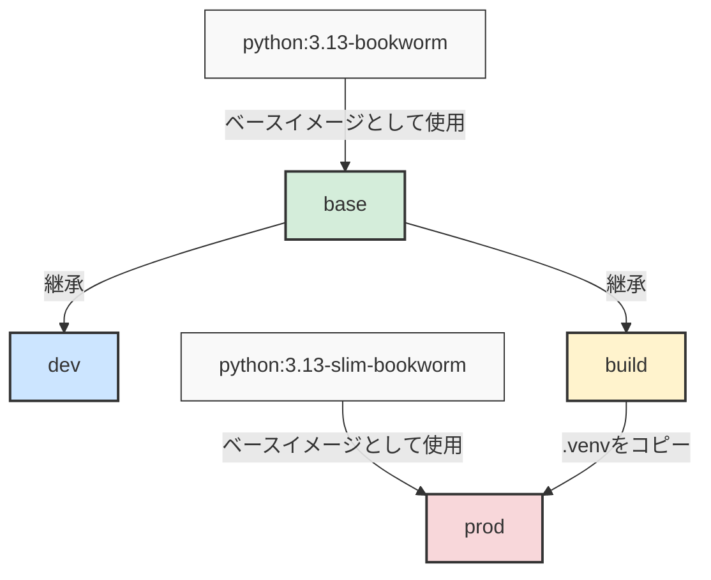
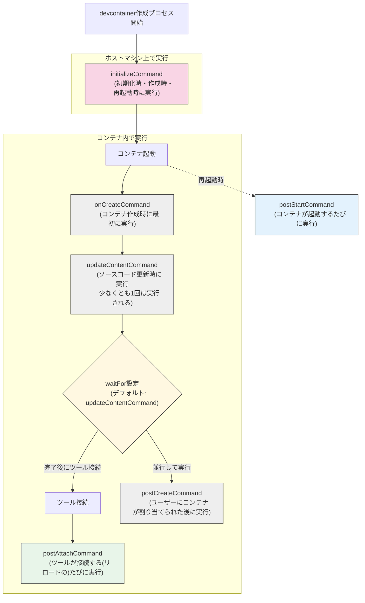

# 概要
開発環境を統一し共通のコーディングルール、言語やライブラリのバージョンのもと開発を行うことはチーム開発を行う際に非常に大切です。
本記事ではそれらを考慮した開発環境を迅速に構築するための一つのプラクティスとして VSCode ✖︎ Dev Container を使った方法を紹介します。

完成した開発環境に関しては以下で公開しておりますのでテンプレートとして使ったり、一つの参考にしていただければと思います。
https://github.com/schnell3526/python-project-with-devcontainer

紹介するプラクティスの強みは以下です。
- 環境構築をコード化することで、手順を明確に定義していること
- **Docker環境があればすぐに利用可能**な、ポータブルな開発環境であること　
- 開発環境を**簡単に破棄＆再作成できる**ため、環境の劣化に悩まされない
- 「この環境でしか動かない」問題を解消し、高い再現性を実現
- linter/formatter の設定を同梱しコードスタイルが統一できる

動作については、Linux (Ubuntu) 環境、MACOS について確認しています。何か不備があればコメントいただければと思います。


:::message
uv 版も作成しました。uv 版を利用する場合は、`feat/uv` にチェックアウトしてください
```bash
git clone https://github.com/schnell3526/python-project-with-devcontainer.git
git switch feat/uv
```
:::

# Dev Container の起動手順
利用にあたり、[Dev Container 拡張](https://marketplace.visualstudio.com/items/?itemName=ms-vscode-remote.remote-containers)のインストールが必要なので無ければインストールしてください。
```shell
code --install-extension ms-vscode-remote.remote-containers
```

設定済みの環境を clone したのちに VSCode で起動してください。
template repository の設定もしているのでこれをベースに新しい環境を作ることも可能です！
```shell
git clone git@github.com:schnell3526/python-project-with-devcontainer.git
code python-project-with-devcontainer
```

「⌘+shift+p」を押下して「Reopen in Container」を選択してください。


これを選択することで以下のような Windown に切り替わったら環境構築完了です。


この環境では VSCode の拡張の設定や linter/formatter の設定が完了しており、Python のコードが自動整形され型注釈が無いコードに対してエディタ上で指摘が入るようになります。

試しに以下のようなファイルを作成するとエディタ上で指摘が入ります。
```python:my_package/tmp.py
def add(a, b):
    return a + b
```

指摘を元に以下のように変更すると指摘が外れます。
この時のルールに関しては、pyproject.toml に設定を書くことでカスタマイズが可能です。
この仕組みを利用することで、複数人で同時に開発を行ってもある程度統制の取れたコードを書くことが仕組み的に可能になります。
```python:my_package/tmp.py
"""tmp.py"""


def add(a: int, b: int) -> int:
    """Adds two integers together."""
    return a + b
```

以降では設定をカスタマイズできるようにするために詳しくコードを追っていきます。

# リポジトリ構成
リポジトリ構成は大まかに以下のようになっています。

```shell
.
|-- .devcontainer
|   `-- devcontainer.json
|-- .gitignore
|-- README.md
|-- docker
|   |-- Dockerfile
|   `-- compose.yaml
|-- my_package
|   |-- __init__.py
|   `-- main.py
|-- poetry.lock
|-- pyproject.toml
`-- tests
    `-- test_main.py
```

|                  |                                                                                |
| ---------------- | ------------------------------------------------------------------------------ |
| `.devcontainer/` | devcontainer の設定ファイル類                                                  |
| `docker/`        | Docker 関連ファイル                                                            |
| `my_package/`    | python パッケージ名 (flat layout を採用しているが src layout を採用してもよい) |
| `pyproject.toml` | python のパッケージの依存関係や linter/formatter の設定をする                  |

以降ではそれぞれの設定ファイルについて詳しく説明していきます。

# [`docker/Dockerfile`](https://github.com/schnell3526/python-project-with-devcontainer/blob/main/docker/Dockerfile#L1)
Dockerfile はマルチステージビルドを利用した 4 ステージ構成を採用しています。
`base`, `dev`, `build` は `python:3.13-bookworm` をベースとしたステージで開発やビルド用途なので無理なイメージサイズの削減はしていません。
`prod` ステージは slim イメージをベースとしてビルドステージでインストールしたパッケージ類をコピーすることでイメージサイズの削減を行っています。



## base ステージ
base ステージでは build, dev ステージともに利用する Poetry のインストールを行なっています。
環境変数の設定を行い python, pip, poetry の制御を行なっています。
設定の意図については省きますがそれぞれ公式ドキュメントを貼ったので適宜確認してください。

| 環境変数                        | 説明                                                                    |                                                                                       |
| ------------------------------- | ----------------------------------------------------------------------- | ------------------------------------------------------------------------------------- |
| `PYTHONUNBUFFERED`              | 値が設定されていれば出力をバッファリングしない                          | [doc](https://docs.python.org/3.13/using/cmdline.html#cmdoption-u)                    |
| `PYTHONDONTWRITEBYTECODE`       | 値が設定されていればプリコンパイル(.pyc の生成)を行わない               | [doc](https://docs.python.org/3.13/using/cmdline.html#envvar-PYTHONDONTWRITEBYTECODE) |
| `PIP_NO_CACHE_DIR`              | pip のキャッシュを設定しない     [^1]                                   | [doc](https://pip.pypa.io/en/stable/cli/pip/#cmdoption-no-cache-dir)                  |
| `PIP_DISABLE_PIP_VERSION_CHECK` | pip の定期的なバージョンチェックを無効に                                | [doc](https://pip.pypa.io/en/stable/cli/pip/#cmdoption-disable-pip-version-check)     |
| `POETRY_VERSION`                | インストールする Poetry のバージョン                                    | [doc](https://python-poetry.org/docs/#installing-with-the-official-installer)         |
| `POETRY_HOME`                   | Poetry のインストール先                                                 | [doc](https://python-poetry.org/docs/#installing-with-the-official-installer)         |
| `POETRY_VIRTUALENVS_IN_PROJECT` | このオプションを有効にすると .venv がプロジェクトルートに作成される[^2] | [doc](https://python-poetry.org/docs/main/configuration#virtualenvsin-project)        |

poetry のインストールにあたり curl のインストールが必要だったのでこのステージでインストールしています。

## dev ステージ
主に Dev Container として利用するためのステージとして利用しています。

開発に必要なツールはこのステージに適宜追加していくと開発環境でツールが使えるようになります。
```shell
RUN apt-get update \
    && apt-get install --no-install-recommends -y \
        htop \
        jq \
        less \
        sudo \
        tmux \
        tree \
        vim \
    && apt-get clean \
    && rm -rf /var/lib/apt/lists/*
```

## build ステージ
build ステージではプロジェクトのビルドを行います。
ポイントは `poetry install` を行う前に、`pyproject.toml` 及び `poetry.lock` のみをコピーしている点です。
```dockerfile
COPY pyproject.toml poetry.lock* ./
```

このようにすることで、インストールするパッケージに変更がないような更新の場合、キャッシュを効かせられるようになりビルド時間を短縮させることができます。

## prod ステージ
prod ステージは本番稼働を想定したステージです。
コンテナを利用してアプリケーションをデプロイする場合、様々なオーバーヘッドが小さくなるためイメージサイズはできるだけ小さいことが望ましいです。
そこで、本番稼働に不必要なファイルを極力排除してイメージの最適化を行なっています。

今回作成したプロジェクトは汎用的な最適化方法として以下を採用しています。
- poetry (パッケージ管理ツール) を本番環境に含めない
- マルチステージビルドを活用して成果物のみをコピーする
- ベースイメージとして slim イメージを利用する

またキャッシュを有効に利用するための工夫として、`my_package` (変更が激しいと予想される) のコピー作業をできるだけ最後に行い、変更が行われてもそれまでのキャッシュが効くように意識しています。

# `.devcontainer/devcontainer.json`
`devcontainer.json` というファイルが Devcontainer の設定ファイルで `.devcontainer/` 以下に置きます。[^3]
設定内容に関しては公式の[ドキュメント](https://containers.dev/implementors/json_reference/#general-properties)を見てください

## `features`
Dev Container に追加したいツールを宣言的に記載することでコンテナに簡単にツールをインストールすることができます。

:::details 例
```json
"features": {
    "ghcr.io/devcontainers/features/aws-cli:1": {},
    "ghcr.io/devcontainers/features/docker-outside-of-docker:1": {},
    "ghcr.io/devcontainers/features/github-cli:1": {},
    "ghcr.io/dhoeric/features/hadolint:1": {}
}
```
:::

`features` で追加できるツールに関しては[このページ](https://containers.dev/features)に一覧があるので適宜参照してください。
公式が開発しているものとコミュニティが開発しているものがあるため、コミュニティのものを利用する場合は各組織のセキュリティ要件に合わせて採用してください。
公開プロジェクトでは公式開発の `aws-cli`、`docker-outside-of-docker`、`github-cli`、コミュニティ開発の `hadolint` を features として Dev Container にインストールしています。

:::details `hadolint` を `features` を使わずにインストールする方法
`hadolint` に関してコミュニティ開発の `features` を使わずにインストールする場合は `Dockerfile` の dev ステージに以下を記載してください。
hadolint のリポジトリから最新のバージョンを取得して `/usr/local/bin/hadolint` としてインストールします。
```dockerfile
RUN CURRENT_VERSION=$(curl -Ls 'https://api.github.com/repos/hadolint/hadolint/releases/latest' | grep 'tag_name' | cut -d'v' -f2 | cut -d'"' -f1) \
    && curl -sL -o /usr/local/bin/hadolint "https://github.com/hadolint/hadolint/releases/download/v${CURRENT_VERSION}/hadolint-Linux-x86_64" \
    && chmod +x /usr/local/bin/hadolint
```
似たような方針で他の CLI ツールもインストールできると思います。
:::

## [Lifecycle scripts](https://containers.dev/implementors/json_reference/#lifecycle-scripts)

lifecycle scripts は Dev Container 作成の特定のタイミングにスクリプト実行を差し込める仕組みで、大まかには以下のようなタイミングで実行されます。


`InitializeCommand` のみ、Dev Container 作成開始直後に**ホストで**実行されます。

## [Variables](https://containers.dev/implementors/json_reference/#variables-in-devcontainerjson)
`devcontainer.json` で使える変数がいくつかあります。詳細はドキュメントを参照してください。

## Customizations
プロダクト固有の設定を記載します、この記事では VSCode の利用を前提としているので VSCode に関しての設定を[紹介](https://containers.dev/supporting#visual-studio-code)します。

大まかには以下の構成となっており、`settings` で settings.json に書いてある内容を書くことで DevContainer 内の開発環境のエディタ設定をすることができます。
また、`extensions` で拡張の ID を指定することで Dev Container 内で利用できる拡張を指定することができます。
```json
"customizations": {
        // Configure properties specific to VS Code.
        "vscode": {
            // Set *default* container specific settings.json values on container create.
            "settings": {},
            "extensions": [],
        }
}
```

ここで設定された、設定は workspace 設定と、ユーザー設定の中間の優先度でありチーム間で VSCode の設定を共有したい場合に非常に便利です。
(ユーザーがデフォルトの設定を気に入らない場合適宜 workspace 設定で上書きできる)

# `pyproject.toml`
エディタ設定により、ruff や mypy の設定はここに記載されたものが利用されるようになっています。
それぞれの設定方法に関しては以下が詳しいので参照してください。　
- [ruff](https://docs.astral.sh/ruff/settings/)
- [mypy](https://mypy.readthedocs.io/en/stable/config_file.html#the-mypy-configuration-file)

[^1]:`NO_CACHE_DIR` に対して `off` の値を設定するとキャッシュが有効になるように思える。これはバグにより以前は falsy な値を設定しないと設定を有効にできなかったためである。現在は値を何かしら設定すれば設定を有効にできるので `on` と設定するのが自然だが後方互換性を考えて `off` を採用した。 [code](https://github.com/pypa/pip/blob/a84b9650a1386e1eb6edef5db0aa7addf2fc2c0c/src/pip/_internal/cli/cmdoptions.py#L689-L715)
[^2]: オプションを無効にすると、`{cache-dir}/virtualenvs` 以下に仮想環境が作成され devcontainer の設定に対して python インタプリタのパスを指定することが難しかったので有効にしている。
[^3]: 正確には `.devcontainer/devcontainer.json`、`.devcontainer.json`、`.devcontainer/<folder>/devcontainer.json`。[doc](https://containers.dev/implementors/spec/#devcontainerjson)
