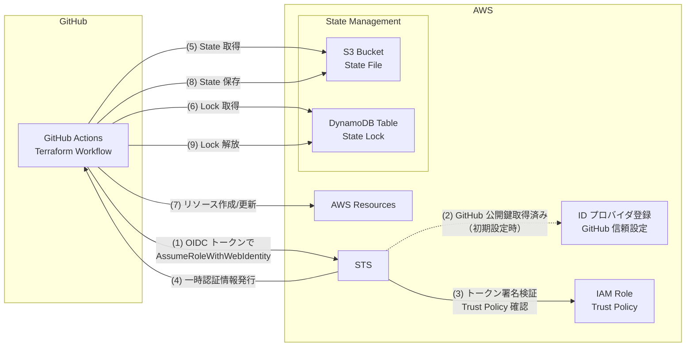

GitHub Actions で Terraform の CI/CD パイプラインを OIDC 認証と State Lock を使って構築します。

:::message alert
本記事では AWS リソースを作成します。AWS 無料利用枠内であればほぼ無料ですが、無料枠を超えている場合や長期間放置した場合は数円程度の料金が発生する可能性があります。
学習目的で構築する場合は、クリーンアップ手順に従って速やかにリソースを削除してください。
:::

# 前提条件・環境

- AWS のアカウントが作成されている
- GitHub アカウントが作成されている

# アーキテクチャ概要

本記事で構築する CI/CD パイプラインの全体構成は以下の通りです。



主要コンポーネントは以下の通りです。

- **GitHub Actions**: Terraform の実行環境（OIDC トークンを発行する実際の ID プロバイダ）
- **ID プロバイダ登録**: AWS に GitHub を信頼する外部 ID プロバイダとして登録（公開鍵情報を保持）
- **STS (Security Token Service)**: OIDC トークンの署名を検証し、一時認証情報を発行
- **IAM Role**: Terraform 実行に必要な権限を定義（Trust Policy で GitHub からの認証を許可）
- **S3 Bucket**: Terraform の state ファイルを保存
- **DynamoDB Table**: state の排他制御 (Lock) を管理

# OIDC 認証の基礎知識

本セクションでは、これから設定する OIDC 認証の仕組みについて、基本概念を説明します。

## OAuth 2.0 と OpenID Connect

### OAuth 2.0（認可）

OAuth 2.0 は **認可（Authorization）** の仕組みで、「権限を与えること」を実現します。

- パスワードを渡さずに、限定的な権限（アクセストークン）を安全に渡す
- ユーザーの**明示的な許可**（同意画面）が必要
- 例：天気アプリに Google カレンダーの読み取り権限だけを与える

### OpenID Connect（認証）

OpenID Connect (OIDC) は、OAuth 2.0 の上に構築された **認証（Authentication）** の仕組みです。

- 「誰であるか」を証明する**ID トークン**を発行
- ID トークンは **JWT 形式**で、**ID プロバイダの署名**付き
- OAuth 2.0 だけだとユーザー認証方法がバラバラだった問題を解決

## 重要な用語

| 用語                   | 説明                                                  |
| ---------------------- | ----------------------------------------------------- |
| **ID プロバイダ**      | ユーザー認証を行うサービス全体（GitHub、Google など） |
| **Issuer（発行者）**   | ID トークン内の `iss` クレーム、発行元の URL          |
| **Audience（対象者）** | トークンが誰宛てに発行されたかを示す                  |
| **ID トークン**        | ユーザーの身元を証明する署名付きトークン              |
| **アクセストークン**   | API へのアクセス権限を示すトークン                    |

## GitHub Actions と AWS の OIDC 連携

本記事で構築する仕組みは、以下の流れで動作します。

```plaintext
GitHub Actions（ID プロバイダ）
    ↓ ID トークン発行（aud: sts.amazonaws.com）
AWS STS（トークンを検証して信頼）
    ↓ 一時的な認証情報を発行
AWS リソースへアクセス
```

### なぜ OIDC を使うのか

**セキュリティ面：**
- AWS アクセスキーの保存が不要
- トークンは期限付き・権限限定的
- 署名により改ざん防止

**開発効率：**
- OpenID Connect で認証方法が標準化
- サービス間連携が簡単に実装できる

### AWS 側の設定の意味

これから行う AWS の設定には、以下の意味があります。

- **ID プロバイダの登録**: GitHub を信頼できる認証元として AWS に登録
- **対象者（Audience）の指定**: このトークンは AWS STS 向けであることを保証
- **IAM Role の信頼ポリシー**: どのリポジトリ・ブランチからの認証を許可するかを定義

# AWS ID プロバイダの設定

## ID プロバイダの作成（コンソール）

AWS コンソールで「IAM」→「ID プロバイダ」→「プロバイダの追加」と選択します。


以下の設定でプロバイダを作成します。

- **プロバイダのタイプ**: OpenID Connect
- **プロバイダの URL**: `https://token.actions.githubusercontent.com`
- **対象者**: `sts.amazonaws.com`

### プロバイダの URL とは

プロバイダの URL は、OIDC トークンの発行元を示す識別子です。GitHub Actions がワークフロー実行時に発行する OIDC トークンには、この URL が発行者 (issuer) として含まれています。

### 初期設定時：AWS が ID プロバイダを登録

AWS IAM で GitHub を ID プロバイダとして登録する際、以下の処理が行われます。

#### OIDC Discovery による設定情報の自動取得

OIDC Discovery とは、ID プロバイダの設定情報を取得する標準的な仕組みです。

AWS は登録時に以下の URL にアクセスして、GitHub Actions の設定情報を取得します。

```
https://token.actions.githubusercontent.com/.well-known/openid-configuration
```

このエンドポイントには JSON 形式で以下のような情報が公開されています。

```json
{
  "issuer": "https://token.actions.githubusercontent.com",
  "jwks_uri": "https://token.actions.githubusercontent.com/.well-known/jwks",
  "subject_types_supported": ["public", "pairwise"],
  "id_token_signing_alg_values_supported": ["RS256"],
  ...
}
```

特に重要なのが `jwks_uri`（JSON Web Key Set の URL）で、ここからトークンの署名検証に必要な**公開鍵**を取得し、AWS 側に保存します。

### 実行時：GitHub Actions から AWS へのアクセス

ワークフロー実行時、AWS STS は以下の流れでトークンを検証します。

#### 1. トークンの発行者を確認

GitHub Actions から受け取った OIDC トークン内の `iss`（発行者）が `https://token.actions.githubusercontent.com` であることを確認します。

#### 2. 保存済みの公開鍵で署名を検証

**初期設定時に保存した公開鍵**を使って、トークンの署名が正しいかを検証します。

- トークンは **JWT（JSON Web Token）形式**で、3つの部分（ヘッダー、ペイロード、署名）から構成
- GitHub の**秘密鍵**で署名されている
- AWS は**公開鍵**で署名を検証することで、トークンが改ざんされていないことを確認

#### 3. Audience を確認

トークン内の `aud`（対象者）が `sts.amazonaws.com` であることを確認します。これにより、このトークンが AWS STS 向けに発行されたものであることを保証します。

### なぜこの仕組みが安全なのか

- **公開鍵暗号方式**により、秘密鍵を持つ GitHub だけがトークンを発行できる
- AWS は公開鍵だけで検証できるため、秘密情報の共有が不要
- OIDC Discovery により、初期設定時に公開鍵を自動的に取得（定期的に更新も可能）
- アクセスキーやシークレットを保存する必要がない

## IAM Role の作成（コンソール）

AWS コンソールで「IAM」→「ロール」→「ロールを作成」と選択します。


### 信頼されたエンティティタイプの選択

「ウェブアイデンティティ」を選択し、以下を設定します。

- **アイデンティティプロバイダー**: `token.actions.githubusercontent.com`（先ほど作成した ID プロバイダ）
- **Audience**: `sts.amazonaws.com`
- **GitHub organization**: GitHub の組織名またはユーザー名（例: `myorg`）
- **GitHub repository**: リポジトリ名（例: `myrepo`）
- **GitHub branch**: ブランチ名（例: `main`）

これらの設定により、AWS は指定した GitHub リポジトリの特定のブランチからのみ、この Role を assume できるように信頼ポリシーを自動生成します。

:::message alert
GitHub organization、repository、branch を指定しないと、**すべての GitHub リポジトリ**からこの Role を assume できてしまうため、必ず指定してください。
:::

このように設定することで以下のような信頼 (Trust) Policy が作成した IAM Role に対して作成されます。

```json
{
    "Version": "2012-10-17",
    "Statement": [
        {
            "Effect": "Allow",
            "Principal": {
                "Federated": "arn:aws:iam::502744902604:oidc-provider/token.actions.githubusercontent.com"
            },
            "Action": "sts:AssumeRoleWithWebIdentity",
            "Condition": {
                "StringEquals": {
                    "token.actions.githubusercontent.com:aud": "sts.amazonaws.com"
                },
                "StringLike": {
                    "token.actions.githubusercontent.com:sub": "repo:myorg/myrepo:ref:refs/heads/main"
                }
            }
        }
    ]
}
```

ステップ2 では何も指定する必要がありません。

ステップ3 の role 名は `terraform-cd-role` とします。

### OIDC トークンの claims とは

先ほどコンソールで入力した GitHub の情報（organization、repository、branch）が、なぜ必要なのかを説明します。

GitHub Actions がワークフロー実行時に発行する OIDC トークンには、以下のような情報（claims）が含まれています。

詳細は [GitHub Actions OIDC 公式ドキュメント](https://docs.github.com/en/actions/reference/security/oidc)を参照してください。

```json
{
  "iss": "https://token.actions.githubusercontent.com",
  "aud": "sts.amazonaws.com",
  "sub": "repo:myorg/myrepo:ref:refs/heads/main",
  "repository": "myorg/myrepo",
  "repository_owner": "myorg",
  "ref": "refs/heads/main",
  "sha": "abc123...",
  "workflow": "Deploy",
  ...
}
```

主要な claims とコンソールで入力した情報の対応：

| Claim            | 説明                            | 例                                            | コンソールの入力項目                        |
| ---------------- | ------------------------------- | --------------------------------------------- | ------------------------------------------- |
| `iss` (Issuer)   | トークンの発行者                | `https://token.actions.githubusercontent.com` | アイデンティティプロバイダー                |
| `aud` (Audience) | トークンの対象者（利用先）      | `sts.amazonaws.com`                           | Audience                                    |
| `sub` (Subject)  | トークンの主体（誰が/どこから） | `repo:owner/repo:ref:refs/heads/main`         | organization + repository + branch から構成 |
| `repository`     | リポジトリの完全名              | `myorg/myrepo`                                | organization + repository                   |
| `ref`            | ブランチや tag の参照           | `refs/heads/main`                             | branch                                      |

AWS は、信頼ポリシーでこれらの claims を検証することで、**指定した GitHub リポジトリの特定のブランチからのみ**認証を許可します。

### sub claim の形式について

`sub` claim（Subject）の形式は、ワークフローの実行コンテキストによって変わります。

[GitHub 公式ドキュメント](https://docs.github.com/en/actions/reference/security/oidc)に記載されている形式：

| 実行コンテキスト       | sub の形式                              | 例                                               |
| ---------------------- | --------------------------------------- | ------------------------------------------------ |
| **特定のブランチ**     | `repo:ORG/REPO:ref:refs/heads/BRANCH`   | `repo:octo-org/octo-repo:ref:refs/heads/main`    |
| **特定のタグ**         | `repo:ORG/REPO:ref:refs/tags/TAG`       | `repo:octo-org/octo-repo:ref:refs/tags/v1.0.0`   |
| **Pull Request**       | `repo:ORG/REPO:pull_request`            | `repo:octo-org/octo-repo:pull_request`           |
| **Environment 使用時** | `repo:ORG/REPO:environment:ENVIRONMENT` | `repo:octo-org/octo-repo:environment:Production` |

コンソール UI で「GitHub branch」に `main` を指定した場合、`sub` は `repo:ORG/REPO:ref:refs/heads/main` の形式になります。

### より柔軟な条件設定（オプション）

作成したロールの「信頼関係」タブから信頼ポリシーを手動編集することで、より柔軟な条件を設定できます。

例えば、以下のような設定が可能です。

```json
// すべてのブランチを許可（開発環境用）
"token.actions.githubusercontent.com:sub": "repo:myorg/myrepo:*"

// Pull Request からの実行を許可
"token.actions.githubusercontent.com:sub": "repo:myorg/myrepo:pull_request"

// GitHub Environments を使った制御（本番環境推奨）
"token.actions.githubusercontent.com:sub": "repo:myorg/myrepo:environment:production"
```

### トークンの流れ

1. GitHub Actions ワークフロー実行開始
2. GitHub Actions が OIDC トークンを生成（上記の claims を含む）
3. ワークフローから `aws-actions/configure-aws-credentials` アクションを使用
4. アクションが OIDC トークンを AWS STS に送信
5. AWS STS が事前に登録した GitHub の公開鍵を使ってトークンを検証
6. 信頼ポリシーの条件（`aud` と `sub`）が一致すれば一時認証情報を発行
7. 以降のステップでその認証情報を使用

## IAM ポリシーの設定（コンソール）

作成した IAM Role に権限ポリシーをアタッチします。まずは State 管理に必要な最小限の権限のみを付与します。

### インラインポリシーの付与

「IAM」→「ロール」→「`terraform-cd-role`」と進んで「インラインポリシーを作成」を選択します。


ポリシーは以下のものを付与します。

```json
{
  "Version": "2012-10-17",
  "Statement": [
    {
      "Sid": "TerraformStateS3Access",
      "Effect": "Allow",
      "Action": [
        "s3:GetObject",
        "s3:PutObject",
        "s3:DeleteObject"
      ],
      "Resource": "arn:aws:s3:::<BUCKET_NAME>/terraform.tfstate"
    },
    {
      "Sid": "TerraformStateS3List",
      "Effect": "Allow",
      "Action": "s3:ListBucket",
      "Resource": "arn:aws:s3:::<BUCKET_NAME>"
    },
    {
      "Sid": "TerraformStateLock",
      "Effect": "Allow",
      "Action": [
        "dynamodb:GetItem",
        "dynamodb:PutItem",
        "dynamodb:DeleteItem"
      ],
      "Resource": "arn:aws:dynamodb:*:*:table/terraform-state-lock"
    },
    {
      "Sid": "DynamoDBTableManagement",
      "Effect": "Allow",
      "Action": [
        "dynamodb:CreateTable",
        "dynamodb:Describe*",
        "dynamodb:List*",
        "dynamodb:DeleteTable",
        "dynamodb:UpdateTable",
        "dynamodb:TagResource"
      ],
      "Resource": "arn:aws:dynamodb:*:*:table/terraform-state-lock"
    }
  ]
}
```

**置き換えが必要な項目**
- `<BUCKET_NAME>`: 次のセクションで作成する S3 バケット名

ポリシー名は `TerraformCICDMinimalPolicy` などわかりやすい名前をつけます。

### 権限の説明

各権限の用途：

| 権限                                                          | 用途                                     |
| ------------------------------------------------------------- | ---------------------------------------- |
| `s3:GetObject`, `s3:PutObject`, `s3:DeleteObject`             | State ファイルの読み書き・削除           |
| `s3:ListBucket`                                               | バケット内のオブジェクト一覧取得         |
| `dynamodb:GetItem`, `dynamodb:PutItem`, `dynamodb:DeleteItem` | State Lock の取得・設定・解放            |
| `dynamodb:CreateTable`, `dynamodb:DeleteTable`                | DynamoDB Table の作成・削除              |
| `dynamodb:Describe*`, `dynamodb:List*`                        | テーブル情報・タグの読み取り（状態確認） |
| `dynamodb:UpdateTable`, `dynamodb:TagResource`                | テーブル設定の更新・タグ付け             |

:::message
この権限設定では State 管理と DynamoDB Table の作成のみが可能です。実際に AWS リソースを Terraform で管理する場合は、管理対象リソースに応じた権限を追加する必要があります。権限の追加方法は「セキュリティ対策」セクションで説明します。
:::

# Terraform State 管理の設定

## S3 Bucket の作成（コンソール）

「Amazon S3」→「バケット」→「バケットを作成」と進んでバケットを作成します。

バケット名のみ任意の名前を指定してそれ以外はデフォルトで構いません。バケット名に関してはグローバルで一意でないといけないので作成エラーが出たら適宜名前を修正してください。

以下の SS では「my-terraform-state-bucket」としています。


## Backend 設定（Terraform コード）

Terraform の state ファイルを S3 に保存するための backend 設定を作成します。

### ディレクトリ構成

GitHub リポジトリに以下のようなディレクトリ構成を作成します。

```plaintext
.
├── .github
│   └── workflows
│       └── terraform.yml
└── terraform
    ├── backend.tf
    └── main.tf
```

### backend.tf の作成

`terraform/backend.tf` を作成します。

```hcl:terraform/backend.tf
terraform {
  backend "s3" {
    bucket  = "<BUCKET_NAME>"
    key     = "terraform.tfstate"
    region  = "ap-northeast-1"
    encrypt = true
  }
}
```

**設定項目の説明：**

| 項目      | 説明                                   | 値                  |
| --------- | -------------------------------------- | ------------------- |
| `bucket`  | 前のセクションで作成した S3 バケット名 | `<BUCKET_NAME>`     |
| `key`     | S3 バケット内の state ファイルのパス   | `terraform.tfstate` |
| `region`  | S3 バケットが存在するリージョン        | `ap-northeast-1`    |
| `encrypt` | state ファイルの暗号化を有効化         | `true`              |

:::message
この段階では DynamoDB による Lock 設定は含めていません。まずは基本的な backend 設定のみを行い、DynamoDB テーブルを GitHub Actions で作成した後、Lock 設定を追加します。
:::

## DynamoDB Table の作成（Terraform コード）

State Lock 用の DynamoDB テーブルを Terraform で作成します。

### main.tf の作成

`terraform/main.tf` を作成します。

```hcl:terraform/main.tf
terraform {
  required_version = "~> 1.13"

  required_providers {
    aws = {
      source  = "hashicorp/aws"
      version = "~> 6.15"
    }
  }
}

provider "aws" {
  region = "ap-northeast-1"
  default_tags {
    tags = {
      ManagedBy = "Terraform"
    }
  }
}

resource "aws_dynamodb_table" "terraform_state_lock" {
  name         = "terraform-state-lock"
  billing_mode = "PAY_PER_REQUEST"
  hash_key     = "LockID"

  attribute {
    name = "LockID"
    type = "S"
  }

  tags = {
    Name = "Terraform State Lock Table"
  }
}
```

**設定のポイント：**

- **hash_key = "LockID"**: Terraform が State Lock に使用する属性名（固定値）
- **billing_mode = "PAY_PER_REQUEST"**: 使用量に応じた課金（小規模利用ではコスト効率が良い）
- **attribute の type = "S"**: String 型

# GitHub Actions ワークフローの実装

`.github/workflows/terraform.yml` を作成して、Terraform の CI/CD パイプラインを構築します。

## ワークフローの全体像

```yaml:.github/workflows/terraform.yml
name: Terraform CI/CD

on:
  push:
    branches:
      - main
  pull_request:
    branches:
      - main

permissions:
  id-token: write
  contents: read
  pull-requests: write

jobs:
  terraform:
    runs-on: ubuntu-24.04

    steps:
      - name: Checkout code
        uses: actions/checkout@v5

      - name: Configure AWS credentials
        uses: aws-actions/configure-aws-credentials@v5
        with:
          role-to-assume: arn:aws:iam::<AWS_ACCOUNT_ID>:role/terraform-cd-role
          aws-region: ap-northeast-1

      - name: Setup Terraform
        uses: hashicorp/setup-terraform@v3
        with:
          terraform_version: 1.13.3

      - name: Terraform Init
        run: terraform -chdir=terraform init

      - name: Terraform Plan
        run: terraform -chdir=terraform plan -no-color
        continue-on-error: true

      - name: Terraform Apply
        if: github.ref == 'refs/heads/main' && github.event_name == 'push'
        run: terraform -chdir=terraform apply -auto-approve
```

**置き換えが必要な項目：**
- `<AWS_ACCOUNT_ID>`: 自分の AWS アカウント ID

## 各ステップの説明

### permissions の設定

```yaml
permissions:
  id-token: write
  contents: read
  pull-requests: write
```

- **id-token: write**: OIDC トークンを取得するために必要
- **contents: read**: リポジトリのコードを読み取るために必要
- **pull-requests: write**: PR にコメントを投稿するために必要（オプション）

### AWS 認証情報の設定

```yaml
- name: Configure AWS credentials
  uses: aws-actions/configure-aws-credentials@v5
  with:
    role-to-assume: arn:aws:iam::<AWS_ACCOUNT_ID>:role/terraform-cd-role
    aws-region: ap-northeast-1
```

`aws-actions/configure-aws-credentials` アクションが以下を行います：

1. GitHub Actions から OIDC トークンを取得
2. AWS STS に対して `AssumeRoleWithWebIdentity` を実行
3. 一時認証情報を取得して環境変数に設定

### Terraform のセットアップと実行

```yaml
- name: Setup Terraform
  uses: hashicorp/setup-terraform@v3
  with:
    terraform_version: 1.13.3

- name: Terraform Init
  run: terraform -chdir=terraform init

- name: Terraform Plan
  run: terraform -chdir=terraform plan -no-color

- name: Terraform Apply
  if: github.ref == 'refs/heads/main' && github.event_name == 'push'
  run: terraform -chdir=terraform apply -auto-approve
```

- **-chdir=terraform**: `terraform/` ディレクトリ内で Terraform コマンドを実行
- **Terraform Init**: Backend の初期化と Provider のダウンロード
- **Terraform Plan**: 変更内容をプレビュー
- **Terraform Apply**: main ブランチへの push 時のみ実行

## DynamoDB Table の作成と Lock 設定

### 初回実行

ここまでのファイル（`terraform/backend.tf`, `terraform/main.tf`, `.github/workflows/terraform.yml`）を commit して main ブランチに push します。

```bash
git add .
git commit -m "Add Terraform configuration and GitHub Actions workflow"
git push origin main
```

GitHub Actions が自動的に実行され、DynamoDB テーブルが作成されます。


### Lock 設定の追加

DynamoDB テーブルが作成されたら、`terraform/backend.tf` に Lock 設定を追加します。

```hcl:terraform/backend.tf
terraform {
  backend "s3" {
    bucket         = "<BUCKET_NAME>"
    key            = "terraform.tfstate"
    region         = "ap-northeast-1"
    dynamodb_table = "terraform-state-lock"
    encrypt        = true
  }
}
```

`dynamodb_table = "terraform-state-lock"` の行を追加しました。

変更を commit して push します。

```bash
git add terraform/backend.tf
git commit -m "Enable state locking with DynamoDB"
git push origin main
```

GitHub Actions が再度実行され、`terraform init -reconfigure` が自動的に実行されて Lock が有効になります。

:::message
初回の `terraform init` では `dynamodb_table` が設定されていないため、backend 設定の変更を検知して自動的に `-reconfigure` が実行されます。
:::

これで State Lock が有効になり、複数人での同時実行が安全に制御されます。

# セキュリティ対策

## IAM 権限の最小化

本記事で設定した IAM ポリシーは、State 管理と DynamoDB Table の作成に必要な最小限の権限のみを付与しています。実際に AWS リソースを Terraform で管理する場合は、管理対象リソースに応じた権限を追加する必要があります。

### 最小権限の原則

セキュリティのベストプラクティスとして、**必要最小限の権限のみを付与する**ことが重要です。

```json
// ❌ 避けるべき例：管理者権限の付与
{
  "Effect": "Allow",
  "Action": "*",
  "Resource": "*"
}

// ✅ 推奨：必要なリソースと Action のみを明示的に指定
{
  "Effect": "Allow",
  "Action": [
    "ec2:DescribeInstances",
    "ec2:RunInstances",
    "ec2:TerminateInstances"
  ],
  "Resource": "*"
}
```

### リソース管理に必要な権限の追加方法

実際のリソースを管理する場合、以下のような流れで権限を追加します。

#### 1. 管理するリソースを特定

例：VPC とサブネットを作成する場合

```hcl:terraform/main.tf
resource "aws_vpc" "main" {
  cidr_block = "10.0.0.0/16"
}

resource "aws_subnet" "public" {
  vpc_id     = aws_vpc.main.id
  cidr_block = "10.0.1.0/24"
}
```

#### 2. 必要な権限を調査

Terraform の AWS Provider ドキュメントや、実際に plan を実行してエラーメッセージから必要な権限を特定します。

VPC とサブネットの場合：
- `ec2:CreateVpc`, `ec2:DescribeVpcs`, `ec2:DeleteVpc`, `ec2:DescribeVpcAttribute`
- `ec2:CreateSubnet`, `ec2:DescribeSubnets`, `ec2:DeleteSubnet`
- `ec2:CreateTags`, `ec2:DescribeTags`

#### 3. IAM ポリシーに追加

```json
{
    "Sid": "VPCManagement",
    "Effect": "Allow",
    "Action": [
        "ec2:CreateVpc",
        "ec2:DeleteVpc",
        "ec2:DescribeVpcs",
        "ec2:DescribeVpcAttribute",
        "ec2:CreateSubnet",
        "ec2:DeleteSubnet",
        "ec2:DescribeSubnets",
        "ec2:CreateTags",
        "ec2:DescribeTags"
    ],
    "Resource": "*"
}
```

:::message
EC2 関連の権限の多くは、Resource レベルでの制限が難しいため `"Resource": "*"` とすることが一般的です。その代わり、Action を厳密に制限します。
:::

#### 4. GitHub Actions で動作確認

権限を追加した後、GitHub Actions から plan/apply を実行して、正しく動作することを確認します。

### 権限エラーへの対処

GitHub Actions で Terraform を実行した際に権限エラーが発生した場合：

1. **エラーメッセージから必要な権限を特定**
   ```
   Error: ... is not authorized to perform: ec2:DescribeVpcs
   ```

2. **IAM ポリシーに権限を追加**

3. **再度実行して確認**

### 権限の定期的な見直し

- 不要になった権限は削除する
- AWS CloudTrail でアクセスログを確認し、実際に使われている権限を把握する
- IAM Access Analyzer を使って過剰な権限がないかチェックする

## State Lock の活用

本記事で設定した DynamoDB Table は、Terraform の State Lock を管理しています。State Lock は複数人が同時に State ファイルを変更するのを防ぐ重要な仕組みです。

### State Lock とは

State Lock は、Terraform の実行中に State ファイルをロックし、他の実行が同時に State を変更できないようにする機能です。

### DynamoDB による Lock の仕組み

Terraform が実行される際、以下の流れで Lock が管理されます。

```plaintext
1. terraform apply 開始
   ↓
2. DynamoDB に Lock レコードを作成
   {
     "LockID": "<bucket>/<key>-md5",
     "Info": "誰が・いつ・どこから実行しているか",
     "Operation": "OperationTypeApply",
     "Who": "GitHubActions",
     "Version": "1.13.3",
     "Created": "2025-01-05T10:30:00Z"
   }
   ↓
3. State ファイルを読み込んで変更を適用
   ↓
4. 完了したら DynamoDB の Lock レコードを削除（ロック解放）
```

### Lock がない場合の問題

State Lock がない場合、以下のような深刻な問題が発生する可能性があります。

```plaintext
Person A: terraform apply 開始（state を読み込み）
Person B: terraform apply 開始（同じ state を読み込み）
Person A: リソース作成完了、state 更新
Person B: リソース作成完了、state 更新 ← Person A の変更を上書き！

結果：
- State ファイルが破損する
- リソースが重複して作成される
- Terraform が実際のインフラと state の整合性を失う
```

### Lock による同時実行の防止

State Lock を使用すると、2番目の実行はロックを取得できずにエラーになります。

```plaintext
Person A: terraform apply 開始 → ロック取得成功
Person B: terraform apply 開始 → ロック取得失敗

Error: Error acquiring the state lock

Lock Info:
  ID:        abc123...
  Path:      my-bucket/terraform.tfstate
  Operation: OperationTypeApply
  Who:       Person A
  Version:   1.13.3
  Created:   2025-01-05 10:30:00 UTC
```

Person B は Person A の実行が完了してロックが解放されるまで待つ必要があります。

### Lock の確認方法

DynamoDB テーブルを確認すると、実行中は Lock レコードが存在し、完了すると削除されることがわかります。

```bash
# AWS CLI で Lock の状態を確認
aws dynamodb scan \
  --table-name terraform-state-lock \
  --region ap-northeast-1
```

実行中は以下のようなレコードが見つかります。

```json
{
  "Items": [
    {
      "LockID": {"S": "my-bucket/terraform.tfstate-md5"},
      "Info": {"S": "{...}"}
    }
  ]
}
```

### Lock が解放されない場合の対処

まれに、Terraform の実行が異常終了して Lock が残ったままになることがあります。

```
Error: Error acquiring the state lock
...
```

この場合、以下のコマンドで強制的にロックを解除できます。

```bash
terraform -chdir=terraform force-unlock <LOCK_ID>
```

:::message alert
`force-unlock` は、他の実行が本当に完了していることを確認してから実行してください。実行中の apply を中断すると、State が破損する可能性があります。
:::

### GitHub Actions での Lock の重要性

本記事で構築した CI/CD パイプラインでは、複数の PR が同時に開かれる可能性があります。State Lock により、各ワークフローが順次実行され、State の整合性が保たれます。

## ワークフロー実行条件の制限

GitHub Actions ワークフローでは、実行条件を適切に制限することで、誤った変更が本番環境に適用されるリスクを軽減できます。

### 現在の設定の説明

本記事で作成したワークフローは、以下の実行条件を設定しています。

```yaml
on:
  push:
    branches:
      - main
  pull_request:
    branches:
      - main
```

この設定により：
- **main ブランチへの push 時**にワークフローが実行される
- **main ブランチへの PR 作成・更新時**にワークフローが実行される

さらに、apply ステップには追加の条件があります。

```yaml
- name: Terraform Apply
  if: github.ref == 'refs/heads/main' && github.event_name == 'push'
  run: terraform -chdir=terraform apply -auto-approve
```

**条件の意味：**
- `github.ref == 'refs/heads/main'`: main ブランチである
- `github.event_name == 'push'`: push イベントである（PR ではない）

つまり、以下のような動作になります。

| イベント            | plan の実行 | apply の実行 |
| ------------------- | ----------- | ------------ |
| PR 作成・更新       | ✅ 実行      | ❌ スキップ   |
| main への直接 push  | ✅ 実行      | ✅ 実行       |
| main への PR マージ | ✅ 実行      | ✅ 実行       |

### この制限の重要性

実行条件の制限は、以下のリスクを防ぐために重要です。

#### 1. 誤った変更の適用を防ぐ

PR の段階では plan のみを実行し、変更内容をレビューで確認できます。

```plaintext
開発者: PR 作成
  ↓
GitHub Actions: terraform plan を実行
  ↓
レビュアー: plan の結果を確認
  ↓
問題なければ PR を承認・マージ
  ↓
GitHub Actions: terraform apply を実行（main ブランチ）
```

#### 2. レビュープロセスの強制

apply を main への push 時のみに制限することで、PR とレビューのプロセスを経ないと変更が適用されないようになります。

```yaml
# ❌ 避けるべき：すべての PR で apply が実行される
- name: Terraform Apply
  run: terraform apply -auto-approve

# ✅ 推奨：main への push 時のみ apply を実行
- name: Terraform Apply
  if: github.ref == 'refs/heads/main' && github.event_name == 'push'
  run: terraform apply -auto-approve
```

#### 3. 変更内容の事前確認

PR で plan が実行されることで、以下を事前に確認できます。

- どのリソースが作成・変更・削除されるか
- 予期しない変更がないか
- State との差分は想定通りか

### ブランチ保護の推奨設定

実行条件の制限を効果的にするため、GitHub のブランチ保護ルールを設定することを強く推奨します。

#### 1. main ブランチへの直接 push を禁止

「Settings」→「Branches」→「Add branch protection rule」で以下を設定します。

- **Branch name pattern**: `main`
- **Require a pull request before merging**: チェック
  - **Require approvals**: チェック（1 人以上の承認を必須にする）

これにより、main ブランチへは必ず PR 経由でのマージが必要になります。

#### 2. Status check を必須にする

terraform plan が成功することを、マージの条件にします。

- **Require status checks to pass before merging**: チェック
  - **Require branches to be up to date before merging**: チェック
  - **Status checks that are required**: `terraform` を選択

これにより、plan が失敗した PR はマージできなくなります。

#### 3. 管理者にも同じルールを適用

- **Do not allow bypassing the above settings**: チェック

管理者であっても、ブランチ保護ルールを迂回できないようにします。

### 設定後の動作

ブランチ保護を設定すると、以下のようなワークフローになります。

```plaintext
1. 開発者が feature ブランチで作業
2. PR を作成
3. GitHub Actions が plan を実行
4. plan が成功 → Status check が緑色に
5. レビュアーが plan の結果と変更内容を確認
6. レビュアーが承認
7. 開発者が PR をマージ
8. main への push がトリガーされ、apply が実行
```

このプロセスにより、**承認されていない変更が本番環境に適用されることを防ぐ**ことができます。

:::message
ブランチ保護ルールは「Settings」から設定できます。個人リポジトリの場合、一部の機能は GitHub Pro が必要になる場合があります。
:::

# CI の充実

ここまでは CD（Continuous Deployment）に焦点を当てて、最低限の実装を行ってきました。このセクションでは、CI（Continuous Integration）を充実させることで、コードの品質向上とレビューの効率化を図ります。

## フォーマットと構文チェック

`.github/workflows/terraform.yml` に以下のステップを追加して、コードの品質チェックを行います。

### 更新後のワークフロー全体

```yaml:.github/workflows/terraform.yml
name: Terraform CI/CD

on:
  push:
    branches:
      - main
  pull_request:
    branches:
      - main

permissions:
  id-token: write
  contents: read
  pull-requests: write

jobs:
  terraform:
    runs-on: ubuntu-24.04

    steps:
      - name: Checkout code
        uses: actions/checkout@v5

      - name: Configure AWS credentials
        uses: aws-actions/configure-aws-credentials@v5
        with:
          role-to-assume: arn:aws:iam::<AWS_ACCOUNT_ID>:role/terraform-cd-role
          aws-region: ap-northeast-1

      - name: Setup Terraform
        uses: hashicorp/setup-terraform@v3
        with:
          terraform_version: 1.13.3

      - name: Terraform Format Check
        run: terraform -chdir=terraform fmt -check -recursive

      - name: Terraform Init
        run: terraform -chdir=terraform init

      - name: Terraform Validate
        run: terraform -chdir=terraform validate

      - name: Terraform Plan
        run: terraform -chdir=terraform plan -no-color
        continue-on-error: true

      - name: Terraform Apply
        if: github.ref == 'refs/heads/main' && github.event_name == 'push'
        run: terraform -chdir=terraform apply -auto-approve
```

### 追加されたステップ

元のワークフローに以下の2つのステップを追加しました。

1. **Terraform Format Check**: コードフォーマットのチェック
2. **Terraform Validate**: HCL の構文チェック

これらのステップについて、順に詳しく説明します。

### terraform fmt によるフォーマットチェック

Terraform のコードフォーマットを統一することで、可読性を向上させ、レビュー時のノイズを減らします。

#### 追加したステップ

```yaml
- name: Terraform Format Check
  run: terraform -chdir=terraform fmt -check -recursive
```

`-check` オプションにより、フォーマットが必要なファイルがある場合はエラーになります。

#### ローカルでのフォーマット修正

開発者はローカルで以下のコマンドを実行してフォーマットを修正できます。

```bash
terraform -chdir=terraform fmt -recursive
```

### terraform validate による構文チェック

`terraform validate` は、HCL の文法エラーや設定の問題を検出します。

#### 追加したステップ

```yaml
- name: Terraform Validate
  run: terraform -chdir=terraform validate
```

`terraform validate` は `terraform init` の後に実行する必要があります。

#### 検出できるエラーの例

- 存在しないリソースへの参照
- 必須パラメータの不足
- 型の不一致
- モジュールの設定ミス

```hcl
# ❌ エラー例：存在しないリソースへの参照
resource "aws_subnet" "example" {
  vpc_id = aws_vpc.nonexistent.id  # このリソースは存在しない
}

# ❌ エラー例：必須パラメータの不足
resource "aws_vpc" "example" {
  # cidr_block が必須だが指定されていない
}
```

#### ワークフローでの実行

すでに上記のワークフロー例に含めています。

```yaml
- name: Terraform Validate
  run: terraform -chdir=terraform validate
```

`terraform validate` は `terraform init` の後に実行する必要があります。

## Plan 結果の可視化

### PR への自動コメント

Terraform の plan 結果を PR にコメントとして投稿することで、レビュアーが変更内容を簡単に確認できます。

`actions/github-script@v7` を使用して実装します。

```yaml
- name: Terraform Plan
  id: plan
  run: |
    terraform -chdir=terraform plan -no-color | tee plan_output.txt
  continue-on-error: true

- name: Comment Plan Result on PR
  if: github.event_name == 'pull_request'
  uses: actions/github-script@v7
  with:
    github-token: ${{ secrets.GITHUB_TOKEN }}
    script: |
      const fs = require('fs');
      const plan = fs.readFileSync('plan_output.txt', 'utf8');

      const output = `### Terraform Plan 結果

      \`\`\`hcl
      ${plan}
      \`\`\`

      *Pushed by: @${{ github.actor }}, Action: \`${{ github.event_name }}\`*`;

      github.rest.issues.createComment({
        issue_number: context.issue.number,
        owner: context.repo.owner,
        repo: context.repo.repo,
        body: output
      });
```

この実装では、plan 結果をファイルに出力してから読み込み、PR にコメントとして投稿します。

#### （参考）コミュニティアクションの使用

コミュニティが提供するアクションを使うこともできます。

```yaml
- name: Terraform Plan
  id: plan
  run: terraform -chdir=terraform plan -no-color -out=tfplan
  continue-on-error: true

- name: Post Plan to PR
  if: github.event_name == 'pull_request'
  uses: robburger/terraform-pr-commenter@v1
  env:
    GITHUB_TOKEN: ${{ secrets.GITHUB_TOKEN }}
  with:
    commenter_type: plan
    commenter_input: ${{ steps.plan.outputs.stdout }}
    commenter_exitcode: ${{ steps.plan.outputs.exitcode }}
```

:::message alert
コミュニティアクションは便利ですが、以下のセキュリティリスクがあります。

- サードパーティのコードを実行するため、悪意のあるコードが含まれる可能性
- メンテナンスが停止しているアクションの場合、脆弱性が修正されないリスク
- アクションの更新により予期しない動作変更が発生する可能性

使用する場合は、アクションのソースコードを確認し、特定のバージョンを指定してください。
:::

#### PR コメントの例

実際の PR では以下のようなコメントが表示されます。


レビュアーは PR のコメントを見るだけで、どのリソースが変更されるかを確認できます。

### Plan 結果の見方

コメントされた plan 結果から、以下を確認します。

| 記号  | 意味                   |
| ----- | ---------------------- |
| `+`   | リソースが作成される   |
| `-`   | リソースが削除される   |
| `~`   | リソースが変更される   |
| `-/+` | リソースが再作成される |

**要注意：**
- `-` や `-/+` がある場合、既存のリソースが削除されるため慎重に確認
- `(known after apply)` は、apply 後にしか値がわからない項目

## さらなる改善（オプション）

### tflint によるベストプラクティスチェック

[tflint](https://github.com/terraform-linters/tflint) は、Terraform のベストプラクティスや AWS 固有の設定ミスを検出するツールです。

```yaml
- name: Setup TFLint
  uses: terraform-linters/setup-tflint@v4
  with:
    tflint_version: latest

- name: Run TFLint
  run: |
    cd terraform
    tflint --init
    tflint --format compact
```

**検出例：**
- 非推奨の構文の使用
- AWS リソースのタイプミス
- 無効な値の設定

### tfsec によるセキュリティスキャン

[tfsec](https://github.com/aquasecurity/tfsec) は、Terraform コードのセキュリティリスクを検出します。

```yaml
- name: Run tfsec
  uses: aquasecurity/tfsec-action@v1
  with:
    working_directory: terraform
```

**検出例：**
- 暗号化されていない S3 バケット
- 公開されている Security Group
- 弱い暗号化アルゴリズムの使用

これらのツールは、コードの品質とセキュリティを向上させるため、プロジェクトの成熟度に応じて導入を検討してください。

# まとめ

本記事では、GitHub Actions と AWS OIDC を使った Terraform の CI/CD パイプラインを構築しました。

## 構築した内容

- **OIDC 認証**: アクセスキー不要で安全な AWS 認証
- **State 管理**: S3 による state ファイルの保存
- **State Lock**: DynamoDB による排他制御
- **CI/CD パイプライン**: PR での plan、main への merge で apply
- **品質チェック**: terraform fmt, validate による自動チェック
- **可視化**: PR への plan 結果の自動コメント

## 重要なポイント

1. **セキュリティ**: IAM 権限は最小限に、信頼ポリシーで実行元を制限
2. **レビュー**: PR で plan を確認してから apply を実行
3. **排他制御**: State Lock により同時実行を防止

## エンタープライズ環境での選択肢

本記事では S3 と DynamoDB を使った State 管理を構築しましたが、実際のエンタープライズ環境では [HCP Terraform](https://www.hashicorp.com/products/terraform)（旧 Terraform Cloud）を採用することもあります。

HCP Terraform を使用すると、以下のメリットがあります。

- **State 管理の SaaS 化**: S3 バケットや DynamoDB テーブルの管理が不要
- **State Lock の自動管理**: 排他制御が自動的に行われる
- **Web UI でのリソース確認**: State の内容を GUI で確認可能
- **チーム管理機能**: ワークスペースごとのアクセス制御
- **Policy as Code**: Sentinel によるポリシー適用
- **リモート実行**: Terraform の実行を HCP Terraform 側で行うことも可能

特に複数チーム・複数環境を管理する場合、HCP Terraform により運用負荷を大幅に削減できます。無料プランでも基本的な機能が利用できるため、チームの規模や要件に応じて検討してください。

## クリーンアップ手順

学習目的で構築した環境をクリーンアップする場合は、以下の手順で削除します。


### 1. Lock の設定を削除

`terraform/backend.tf` の `dynamodb_table` の行をコメントアウトして main にマージします。

```hcl:terraform/backend.tf
terraform {
  backend "s3" {
    bucket = "<BUCKET_NAME>"
    key    = "terraform.tfstate"
    region = "ap-northeast-1"
    # dynamodb_table = "terraform-state-lock"
    encrypt = true
  }
}
```

main にマージすると GitHub Actions が実行され、backend の設定が更新されます。

### 2. DynamoDB の削除

`terraform/main.tf` の `aws_dynamodb_table` リソースをコメントアウトして main にマージします。

```hcl:terraform/main.tf
# resource "aws_dynamodb_table" "terraform_state_lock" {
#   name         = "terraform-state-lock"
#   billing_mode = "PAY_PER_REQUEST"
#   hash_key     = "LockID"

#   attribute {
#     name = "LockID"
#     type = "S"
#   }

#   tags = {
#     Name = "Terraform State Lock Table"
#   }
# }
```

main にマージすると GitHub Actions が実行され、DynamoDB テーブルが削除されます。

### 3. 手動作成リソースの削除

以下のリソースをコンソールから削除します。

**S3 バケット：**
1. 「Amazon S3」→「バケット」→作成したバケットを選択
2. バケット内の terraform.tfstate を削除
3. バケットを削除

**IAM Role：**
1. 「IAM」→「ロール」→「terraform-cd-role」を選択
2. 削除

**ID プロバイダ：**
1. 「IAM」→「ID プロバイダ」→「token.actions.githubusercontent.com」を選択
2. 削除

:::message
削除は上記の順序で行ってください。特に S3 バケットは空にしてから削除する必要があります。
:::
