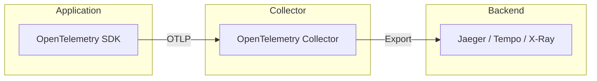
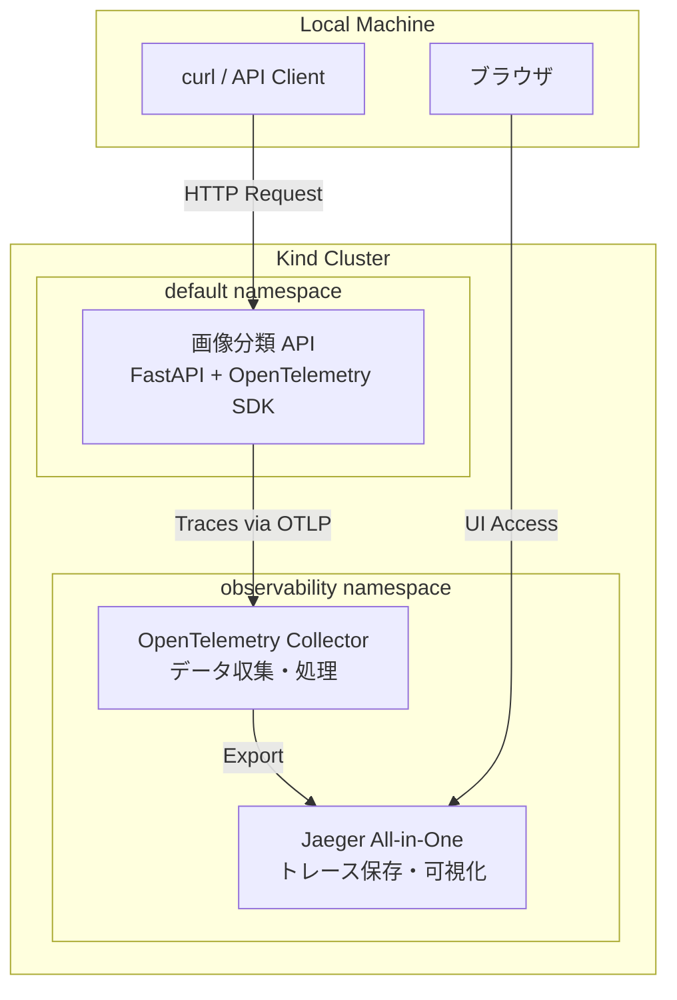

:::message alert
この記事は学習用に Kind (Kubernetes in Docker) を使って OpenTelemetry によるトレーシング環境を構築するためのものです。本番環境導入を見越してはいないので注意してください。
:::

機械学習の推論 API を運用していると、「なぜこのリクエストは遅いのか？」「どの処理がボトルネックになっているのか？」という疑問に直面することがあります。本記事では、画像分類 API を題材に OpenTelemetry を使ったトレーシングの基礎を学び、システム内部のボトルネックを可視化する方法を実践的に解説します。

# トレーシングとは何か

システムのパフォーマンスを理解するためには、オブザーバビリティ（可観測性）と呼ばれる概念が重要です。オブザーバビリティには 3 つの柱があります。

**メトリクス (Metrics)** は、CPU 使用率やメモリ使用量といった数値データを時系列で記録します。「システム全体が重い」ことは分かりますが、「なぜ重いのか」は分かりません。

**ログ (Logs)** は、個々のイベントやエラーメッセージを記録します。特定のエラーが発生したことは分かりますが、リクエスト全体の流れを追うのは困難です。

**トレース (Traces)** は、1 つのリクエストがシステム内をどのように流れ、各処理にどれだけ時間がかかったかを記録します。これにより、ボトルネックの特定やパフォーマンス改善の優先順位付けが可能になります。

トレーシングが解決する具体的な課題を見てみましょう。たとえば、画像分類 API で推論に 2 秒かかっているとします。この 2 秒の内訳は以下のようになっているかもしれません。

- 画像のダウンロード: 1.5 秒
- 前処理（リサイズ、正規化）: 0.1 秒
- モデル推論: 0.3 秒
- 後処理（結果の整形）: 0.1 秒

トレーシングがなければ、「推論が遅い」ことしか分かりません。しかしトレーシングを使えば、実際のボトルネックは画像のダウンロードであり、モデルの最適化よりもキャッシュの導入が効果的だと分かります。

## トレーシングの基本概念

トレーシングを理解するには、3 つの重要な概念を押さえる必要があります。

**Trace (トレース)** は、1 つのリクエストの開始から終了までの全体的な流れを表します。ユーザーが API にリクエストを送信してから、レスポンスが返ってくるまでの一連の処理がトレースとして記録されます。

**Span (スパン)** は、トレース内の個々の処理単位を表します。たとえば「画像の前処理」や「モデル推論」といった処理がそれぞれ 1 つのスパンになります。スパンには開始時刻、終了時刻、処理名、追加のメタデータ（属性）が含まれます。

**Context (コンテキスト)** は、スパン間の親子関係を保持する仕組みです。たとえば「推論処理」というスパンの中に「モデルロード」と「予測実行」という子スパンがある場合、これらの関係性をコンテキストが保持します。

以下の図は、画像分類 API における 1 つのリクエストのトレースを表しています。

```mermaid
gantt
    title 画像分類 API のトレース例
    dateFormat X
    axisFormat %L ms

    section Request
    HTTP Request (Trace)       :0, 2000

    section Spans
    画像ダウンロード             :0, 1500
    前処理                      :1500, 1600
    モデル推論                  :1600, 1900
    後処理                      :1900, 2000
```



この例では、1 つのトレース（HTTP Request）の中に 4 つのスパンがあり、それぞれの処理時間が視覚化されています。画像ダウンロードが 1500ms でボトルネックになっていることが一目で分かります。

# OpenTelemetry とは

OpenTelemetry は、トレーシングやメトリクス、ログといったテレメトリデータを収集するためのオープンソースの標準規格です。2019 年に OpenTracing と OpenCensus という 2 つのプロジェクトが統合されて誕生しました。

OpenTelemetry の最大の特徴は、ベンダーニュートラルであることです。つまり、コードを変更することなく、バックエンドを Jaeger から Zipkin に切り替えたり、AWS X-Ray や Google Cloud Trace に変更したりできます。これにより、特定のベンダーにロックインされることなく、柔軟にトレーシング基盤を構築できます。

OpenTelemetry には、自動計装と手動計装の 2 つのアプローチがあります。自動計装は、フレームワーク（FastAPI、Flask など）やライブラリ（requests、boto3 など）を自動的に計装してくれます。コードをほとんど変更することなくトレーシングを開始できるため、導入のハードルが低くなります。一方、手動計装は、アプリケーション固有のビジネスロジックに対して明示的にスパンを作成します。より詳細な可視化が必要な場合に使用します。

## OpenTelemetry のアーキテクチャ

OpenTelemetry を使ったトレーシングシステムは、以下の 3 つのコンポーネントで構成されます。



**SDK (Software Development Kit)** は、アプリケーションに組み込むライブラリです。トレースやスパンを生成し、コンテキストを伝播させる役割を担います。各プログラミング言語（Python、Go、Java など）に対応した SDK が提供されています。

**Collector (コレクター)** は、テレメトリデータを受け取り、処理し、バックエンドにエクスポートするコンポーネントです。データのフィルタリング、サンプリング、バッチ処理などを行います。Collector を挟むことで、アプリケーションとバックエンドを疎結合に保てます。

**Exporter (エクスポーター)** は、データを特定のバックエンド（Jaeger、Zipkin、Prometheus など）に送信する機能です。OpenTelemetry Protocol (OTLP) という標準プロトコルを使うことで、複数のバックエンドに対応できます。

# 前提条件・環境

本記事では、以下の環境を前提としています。

- Docker がインストールされていること
- Kind がインストールされていること
- kubectl がインストールされていること
- Python 3.11 以上がインストールされていること（ローカルでの開発用）

# 今回構築する環境の全体像

本記事で構築するトレーシング環境の全体構成を以下に示します。



構成要素は以下の通りです。

**画像分類 API** は、FastAPI で実装した推論サーバーです。画像 URL を受け取り、前処理、モデル推論、後処理を経て分類結果を返します。OpenTelemetry SDK を組み込むことで、各処理のトレースを記録します。

**OpenTelemetry Collector** は、API から送信されたトレースデータを受け取り、Jaeger にエクスポートします。今回は簡単のため基本的な設定のみを行いますが、本番環境ではサンプリングやフィルタリングの設定を追加します。

**Jaeger** は、トレースデータを保存・可視化するバックエンドです。All-in-One イメージを使用することで、データベースや UI を含めた環境を 1 つのコンテナで起動できます。

# Kind クラスタのセットアップ

まず、トレーシング環境用の Kind クラスタを作成します。Jaeger UI と API にアクセスできるよう、ポートマッピングを設定します。

```bash
cat <<EOF | kind create cluster --config -
kind: Cluster
apiVersion: kind.x-k8s.io/v1alpha4
name: tracing-cluster
nodes:
  - role: control-plane
    extraPortMappings:
      - containerPort: 30686
        hostPort: 16686
        protocol: TCP
      - containerPort: 30080
        hostPort: 8080
        protocol: TCP
EOF
```

この設定により、以下のポートマッピングが有効になります。

- `localhost:16686` → Jaeger UI (NodePort 30686)
- `localhost:8080` → 画像分類 API (NodePort 30080)

クラスタが正常に起動したことを確認します。

```bash
kubectl cluster-info --context kind-tracing-cluster
```

# トレーシングバックエンドの構築

次に、トレースデータを収集・可視化するための Jaeger と OpenTelemetry Collector をデプロイします。

## Jaeger のデプロイ

Jaeger は、Uber が開発したオープンソースの分散トレーシングシステムです。本番環境では Elasticsearch や Cassandra といった永続化ストレージを使用しますが、今回は学習用として All-in-One イメージを使用します。All-in-One イメージには、Collector、Query、UI、インメモリストレージが含まれています。

まず、observability という名前空間を作成します。

```bash
kubectl create namespace observability
```

次に、Jaeger をデプロイします。

```bash
kubectl apply -f - <<EOF
apiVersion: apps/v1
kind: Deployment
metadata:
  name: jaeger
  namespace: observability
spec:
  replicas: 1
  selector:
    matchLabels:
      app: jaeger
  template:
    metadata:
      labels:
        app: jaeger
    spec:
      containers:
      - name: jaeger
        image: jaegertracing/all-in-one:1.52
        ports:
        - containerPort: 16686
          name: ui
        - containerPort: 4317
          name: otlp-grpc
        - containerPort: 4318
          name: otlp-http
        env:
        - name: COLLECTOR_OTLP_ENABLED
          value: "true"
---
apiVersion: v1
kind: Service
metadata:
  name: jaeger
  namespace: observability
spec:
  type: NodePort
  selector:
    app: jaeger
  ports:
  - port: 16686
    targetPort: 16686
    nodePort: 30686
    name: ui
  - port: 4317
    targetPort: 4317
    name: otlp-grpc
  - port: 4318
    targetPort: 4318
    name: otlp-http
EOF
```

このマニフェストでは、Jaeger の UI を NodePort 30686 で公開しています。また、OTLP (OpenTelemetry Protocol) の gRPC (4317) と HTTP (4318) のポートも公開しています。

デプロイが完了するまで待ちます。

```bash
kubectl wait --namespace observability \
  --for=condition=ready pod \
  --selector=app=jaeger \
  --timeout=300s
```

ブラウザで `http://localhost:16686` にアクセスし、Jaeger UI が表示されることを確認してください。この時点ではまだトレースが送信されていないため、画面は空の状態です。

## OpenTelemetry Collector のデプロイ

OpenTelemetry Collector は、アプリケーションとバックエンドの間に配置されるデータパイプラインです。Collector を使う利点は、アプリケーションコードを変更することなくバックエンドを切り替えられることです。また、データのサンプリングやフィルタリング、複数のバックエンドへの同時エクスポートも可能になります。

まず、Collector の設定を ConfigMap として作成します。

```bash
kubectl apply -f - <<EOF
apiVersion: v1
kind: ConfigMap
metadata:
  name: otel-collector-config
  namespace: observability
data:
  config.yaml: |
    receivers:
      otlp:
        protocols:
          grpc:
            endpoint: 0.0.0.0:4317
          http:
            endpoint: 0.0.0.0:4318

    processors:
      batch:
        timeout: 10s
        send_batch_size: 1024

    exporters:
      otlp:
        endpoint: jaeger:4317
        tls:
          insecure: true
      logging:
        loglevel: debug

    service:
      pipelines:
        traces:
          receivers: [otlp]
          processors: [batch]
          exporters: [otlp, logging]
EOF
```

この設定ファイルでは、以下の 3 つのセクションを定義しています。

**receivers** セクションでは、データの受信方法を定義します。OTLP の gRPC と HTTP の両方を受け付けるように設定しています。

**processors** セクションでは、受信したデータの処理方法を定義します。batch プロセッサは、スパンをまとめて送信することで、ネットワークのオーバーヘッドを削減します。

**exporters** セクションでは、データの送信先を定義します。Jaeger への OTLP エクスポートと、デバッグ用のログ出力を設定しています。

次に、Collector をデプロイします。

```bash
kubectl apply -f - <<EOF
apiVersion: apps/v1
kind: Deployment
metadata:
  name: otel-collector
  namespace: observability
spec:
  replicas: 1
  selector:
    matchLabels:
      app: otel-collector
  template:
    metadata:
      labels:
        app: otel-collector
    spec:
      containers:
      - name: otel-collector
        image: otel/opentelemetry-collector:0.91.0
        ports:
        - containerPort: 4317
          name: otlp-grpc
        - containerPort: 4318
          name: otlp-http
        volumeMounts:
        - name: config
          mountPath: /etc/otel-collector
      volumes:
      - name: config
        configMap:
          name: otel-collector-config
      command:
      - /otelcol
      - --config=/etc/otel-collector/config.yaml
---
apiVersion: v1
kind: Service
metadata:
  name: otel-collector
  namespace: observability
spec:
  selector:
    app: otel-collector
  ports:
  - port: 4317
    targetPort: 4317
    name: otlp-grpc
  - port: 4318
    targetPort: 4318
    name: otlp-http
EOF
```

Collector のデプロイが完了するまで待ちます。

```bash
kubectl wait --namespace observability \
  --for=condition=ready pod \
  --selector=app=otel-collector \
  --timeout=300s
```

Collector のログを確認し、正常に起動していることを確認します。

```bash
kubectl logs -n observability -l app=otel-collector --tail=20
```

`Everything is ready. Begin running and processing data.` というメッセージが表示されれば、Collector が正常に起動しています。

# 画像分類 API の実装

ここからは、トレーシング対象となる画像分類 API を実装します。本記事では、PyTorch の事前学習済みモデル（ResNet18）を使用して、画像を 1000 クラスに分類する API を作成します。

API の仕様は以下の通りです。

- `POST /predict` エンドポイントで画像 URL を受け取り、分類結果を返す
- `GET /health` エンドポイントでヘルスチェックを行う

処理の流れは以下のようになります。

1. 画像 URL を受け取る
2. 画像をダウンロード
3. 前処理（リサイズ、正規化）
4. モデルで推論
5. 後処理（Top-5 の分類結果を取得）
6. 結果を JSON で返す

各ステップにボトルネックが存在する可能性があるため、トレーシングによってどこに時間がかかっているかを可視化します。

## ディレクトリ構成

画像分類 API のディレクトリ構成は以下のようになります。

```
image-classifier/
├── app/
│   ├── __init__.py
│   ├── main.py              # FastAPI アプリケーション
│   ├── inference.py         # 推論ロジック
│   ├── preprocessing.py     # 前処理・後処理
│   └── telemetry.py        # OpenTelemetry 設定
├── Dockerfile
├── requirements.txt
└── k8s/
    └── deployment.yaml
```

## OpenTelemetry なしの実装

まず、OpenTelemetry の計装を行う前に、基本的な API を実装します。これにより、トレーシングを追加する前後でのコードの違いを理解しやすくなります。

### requirements.txt

必要なライブラリを `requirements.txt` に記述します。

```txt:requirements.txt
fastapi==0.109.0
uvicorn[standard]==0.27.0
torch==2.1.2
torchvision==0.16.2
pillow==10.2.0
httpx==0.26.0
```

### main.py

FastAPI アプリケーションのエントリーポイントです。

```python:app/main.py
from fastapi import FastAPI, HTTPException
from pydantic import BaseModel, HttpUrl
from app.inference import ImageClassifier

app = FastAPI(title="Image Classification API")

# モデルの初期化（起動時に1回だけ）
classifier = ImageClassifier()

class PredictRequest(BaseModel):
    image_url: HttpUrl

class PredictResponse(BaseModel):
    predictions: list[dict[str, str | float]]
    processing_time_ms: float

@app.get("/health")
async def health():
    return {"status": "healthy"}

@app.post("/predict", response_model=PredictResponse)
async def predict(request: PredictRequest):
    try:
        result = await classifier.classify(str(request.image_url))
        return result
    except Exception as e:
        raise HTTPException(status_code=500, detail=str(e))
```

### preprocessing.py

画像の前処理と後処理を行うモジュールです。

```python:app/preprocessing.py
import io
import httpx
from PIL import Image
from torchvision import transforms

class ImagePreprocessor:
    def __init__(self):
        self.transform = transforms.Compose([
            transforms.Resize(256),
            transforms.CenterCrop(224),
            transforms.ToTensor(),
            transforms.Normalize(
                mean=[0.485, 0.456, 0.406],
                std=[0.229, 0.224, 0.225]
            )
        ])

    async def download_image(self, url: str) -> Image.Image:
        """画像をダウンロード"""
        async with httpx.AsyncClient(timeout=30.0) as client:
            response = await client.get(url)
            response.raise_for_status()
            return Image.open(io.BytesIO(response.content)).convert("RGB")

    def preprocess(self, image: Image.Image):
        """画像を前処理"""
        return self.transform(image).unsqueeze(0)

class ResultPostprocessor:
    def __init__(self, labels_path: str = None):
        # ImageNet のラベルを読み込む（簡易版）
        self.labels = self._load_labels()

    def _load_labels(self):
        # 実際には imagenet_classes.txt から読み込むが、
        # ここでは簡易的にダミーラベルを使用
        return [f"class_{i}" for i in range(1000)]

    def postprocess(self, output, top_k: int = 5):
        """Top-K の予測結果を取得"""
        probabilities = output.softmax(dim=1)
        top_prob, top_class = probabilities.topk(top_k, dim=1)

        results = []
        for prob, cls in zip(top_prob[0], top_class[0]):
            results.append({
                "class": self.labels[cls.item()],
                "probability": float(prob.item())
            })
        return results
```

### inference.py

モデルの推論を行うモジュールです。

```python:app/inference.py
import time
import torch
from torchvision.models import resnet18, ResNet18_Weights
from app.preprocessing import ImagePreprocessor, ResultPostprocessor

class ImageClassifier:
    def __init__(self):
        self.device = torch.device("cuda" if torch.cuda.is_available() else "cpu")
        self.model = resnet18(weights=ResNet18_Weights.IMAGENET1K_V1)
        self.model.to(self.device)
        self.model.eval()

        self.preprocessor = ImagePreprocessor()
        self.postprocessor = ResultPostprocessor()

    async def classify(self, image_url: str):
        start_time = time.time()

        # 画像ダウンロード
        image = await self.preprocessor.download_image(image_url)

        # 前処理
        input_tensor = self.preprocessor.preprocess(image)
        input_tensor = input_tensor.to(self.device)

        # 推論
        with torch.no_grad():
            output = self.model(input_tensor)

        # 後処理
        predictions = self.postprocessor.postprocess(output)

        processing_time = (time.time() - start_time) * 1000

        return {
            "predictions": predictions,
            "processing_time_ms": processing_time
        }
```

### Dockerfile

API をコンテナ化するための Dockerfile です。

```dockerfile:Dockerfile
FROM python:3.11-slim

WORKDIR /app

# 依存関係のインストール
COPY requirements.txt .
RUN pip install --no-cache-dir -r requirements.txt

# アプリケーションコードのコピー
COPY app/ ./app/

# ポート公開
EXPOSE 8000

# アプリケーション起動
CMD ["uvicorn", "app.main:app", "--host", "0.0.0.0", "--port", "8000"]
```

## コンテナイメージのビルドと Kind への読み込み

Docker イメージをビルドし、Kind クラスタに読み込みます。

```bash
docker build -t image-classifier:v1 ./image-classifier
kind load docker-image image-classifier:v1 --name tracing-cluster
```

イメージが正常に読み込まれたことを確認します。

```bash
docker exec -it tracing-cluster-control-plane crictl images | grep image-classifier
```

## Kubernetes へのデプロイ

API を Kubernetes にデプロイします。

```bash
kubectl apply -f - <<EOF
apiVersion: apps/v1
kind: Deployment
metadata:
  name: image-classifier
  namespace: default
spec:
  replicas: 1
  selector:
    matchLabels:
      app: image-classifier
  template:
    metadata:
      labels:
        app: image-classifier
    spec:
      containers:
      - name: api
        image: image-classifier:v1
        imagePullPolicy: Never
        ports:
        - containerPort: 8000
        resources:
          requests:
            memory: "512Mi"
            cpu: "500m"
          limits:
            memory: "1Gi"
            cpu: "1000m"
---
apiVersion: v1
kind: Service
metadata:
  name: image-classifier
  namespace: default
spec:
  type: NodePort
  selector:
    app: image-classifier
  ports:
  - port: 8000
    targetPort: 8000
    nodePort: 30080
EOF
```

デプロイが完了するまで待ちます。

```bash
kubectl wait --namespace default \
  --for=condition=ready pod \
  --selector=app=image-classifier \
  --timeout=300s
```

## 動作確認

API が正常に動作することを確認します。

```bash
curl -X POST http://localhost:8080/predict \
  -H "Content-Type: application/json" \
  -d '{
    "image_url": "https://upload.wikimedia.org/wikipedia/commons/thumb/3/3a/Cat03.jpg/1200px-Cat03.jpg"
  }'
```

分類結果と処理時間が返ってくれば成功です。

```json
{
  "predictions": [
    {"class": "tabby", "probability": 0.4523},
    {"class": "Egyptian_cat", "probability": 0.2891},
    ...
  ],
  "processing_time_ms": 1523.45
}
```

この時点では、処理全体の時間は分かりますが、各ステップ（ダウンロード、前処理、推論、後処理）の内訳は分かりません。次のセクションで OpenTelemetry を追加し、各処理を可視化します。

# OpenTelemetry の計装

ここからは、画像分類 API に OpenTelemetry を組み込み、トレーシングを有効化します。計装には自動計装と手動計装の 2 つのアプローチがあります。

## 必要なライブラリの追加

まず、OpenTelemetry 関連のライブラリを `requirements.txt` に追加します。

```txt:requirements.txt
fastapi==0.109.0
uvicorn[standard]==0.27.0
torch==2.1.2
torchvision==0.16.2
pillow==10.2.0
httpx==0.26.0

# OpenTelemetry
opentelemetry-api==1.22.0
opentelemetry-sdk==1.22.0
opentelemetry-instrumentation-fastapi==0.43b0
opentelemetry-instrumentation-httpx==0.43b0
opentelemetry-exporter-otlp==1.22.0
```

追加したライブラリの役割を説明します。

`opentelemetry-api` と `opentelemetry-sdk` は、OpenTelemetry のコア機能を提供します。トレースやスパンの生成、コンテキストの伝播などの基本機能が含まれています。

`opentelemetry-instrumentation-fastapi` は、FastAPI を自動計装するためのライブラリです。HTTP リクエストの受信時に自動的にスパンが作成され、リクエストメソッド、パス、ステータスコードなどが記録されます。

`opentelemetry-instrumentation-httpx` は、httpx ライブラリを自動計装します。画像ダウンロード時の HTTP リクエストが自動的にスパンとして記録されます。

`opentelemetry-exporter-otlp` は、トレースデータを OTLP プロトコルで OpenTelemetry Collector に送信するためのエクスポーターです。

## OpenTelemetry の初期化

OpenTelemetry の設定を行う `telemetry.py` を作成します。

```python:app/telemetry.py
from opentelemetry import trace
from opentelemetry.sdk.trace import TracerProvider
from opentelemetry.sdk.trace.export import BatchSpanProcessor
from opentelemetry.exporter.otlp.proto.grpc.trace_exporter import OTLPSpanExporter
from opentelemetry.sdk.resources import Resource, SERVICE_NAME, SERVICE_VERSION
from opentelemetry.instrumentation.fastapi import FastAPIInstrumentor
from opentelemetry.instrumentation.httpx import HTTPXClientInstrumentor

def setup_telemetry(app, service_name: str = "image-classifier"):
    """OpenTelemetry の初期化"""

    # リソース情報の設定
    resource = Resource(attributes={
        SERVICE_NAME: service_name,
        SERVICE_VERSION: "1.0.0",
    })

    # TracerProvider の設定
    provider = TracerProvider(resource=resource)

    # OTLP Exporter の設定
    otlp_exporter = OTLPSpanExporter(
        endpoint="otel-collector.observability.svc.cluster.local:4317",
        insecure=True
    )

    # BatchSpanProcessor の追加
    processor = BatchSpanProcessor(otlp_exporter)
    provider.add_span_processor(processor)

    # グローバルな TracerProvider として設定
    trace.set_tracer_provider(provider)

    # 自動計装の有効化
    FastAPIInstrumentor.instrument_app(app)
    HTTPXClientInstrumentor().instrument()

    return provider
```

この設定ファイルでは、以下の処理を行っています。

**リソース情報の設定** では、サービス名とバージョンを指定します。これにより、Jaeger UI でどのサービスからのトレースかを識別できます。

**TracerProvider の設定** では、トレースを生成するためのプロバイダーを作成します。リソース情報を紐付けることで、すべてのスパンにサービス情報が含まれます。

**OTLP Exporter の設定** では、トレースデータの送信先を指定します。Kubernetes のサービス名を使って OpenTelemetry Collector に接続します。`insecure=True` は、学習環境のため TLS を無効化しています。

**BatchSpanProcessor の追加** では、スパンをバッチ処理して送信します。これにより、ネットワークのオーバーヘッドを削減できます。

**自動計装の有効化** では、FastAPI と httpx を自動的に計装します。これにより、HTTP リクエストや外部 API 呼び出しが自動的にトレースされます。

## main.py の更新

`main.py` に OpenTelemetry の初期化処理を追加します。

```python:app/main.py
from fastapi import FastAPI, HTTPException
from pydantic import BaseModel, HttpUrl
from app.inference import ImageClassifier
from app.telemetry import setup_telemetry

app = FastAPI(title="Image Classification API")

# OpenTelemetry の初期化
setup_telemetry(app)

# モデルの初期化
classifier = ImageClassifier()

class PredictRequest(BaseModel):
    image_url: HttpUrl

class PredictResponse(BaseModel):
    predictions: list[dict[str, str | float]]
    processing_time_ms: float

@app.get("/health")
async def health():
    return {"status": "healthy"}

@app.post("/predict", response_model=PredictResponse)
async def predict(request: PredictRequest):
    try:
        result = await classifier.classify(str(request.image_url))
        return result
    except Exception as e:
        raise HTTPException(status_code=500, detail=str(e))
```

この変更により、FastAPI アプリケーションが起動時に OpenTelemetry を初期化し、すべての HTTP リクエストが自動的にトレースされるようになります。

## 手動計装の追加

自動計装だけでは、アプリケーション内部の詳細な処理（前処理、推論、後処理など）は可視化されません。これらの処理を可視化するには、手動でスパンを作成する必要があります。

### inference.py の更新

推論処理に手動計装を追加します。

```python:app/inference.py
import time
import torch
from opentelemetry import trace
from torchvision.models import resnet18, ResNet18_Weights
from app.preprocessing import ImagePreprocessor, ResultPostprocessor

tracer = trace.get_tracer(__name__)

class ImageClassifier:
    def __init__(self):
        with tracer.start_as_current_span("model_initialization"):
            self.device = torch.device("cuda" if torch.cuda.is_available() else "cpu")
            self.model = resnet18(weights=ResNet18_Weights.IMAGENET1K_V1)
            self.model.to(self.device)
            self.model.eval()

            self.preprocessor = ImagePreprocessor()
            self.postprocessor = ResultPostprocessor()

    async def classify(self, image_url: str):
        with tracer.start_as_current_span("image_classification") as span:
            span.set_attribute("image.url", image_url)
            start_time = time.time()

            # 画像ダウンロード
            with tracer.start_as_current_span("download_image"):
                image = await self.preprocessor.download_image(image_url)
                span.set_attribute("image.size", f"{image.width}x{image.height}")

            # 前処理
            with tracer.start_as_current_span("preprocess_image"):
                input_tensor = self.preprocessor.preprocess(image)
                input_tensor = input_tensor.to(self.device)

            # 推論
            with tracer.start_as_current_span("model_inference") as inference_span:
                inference_span.set_attribute("model.name", "resnet18")
                inference_span.set_attribute("model.device", str(self.device))
                with torch.no_grad():
                    output = self.model(input_tensor)

            # 後処理
            with tracer.start_as_current_span("postprocess_results"):
                predictions = self.postprocessor.postprocess(output)

            processing_time = (time.time() - start_time) * 1000
            span.set_attribute("processing_time_ms", processing_time)

            return {
                "predictions": predictions,
                "processing_time_ms": processing_time
            }
```

この実装では、以下のスパンを作成しています。

`image_classification` は、分類処理全体を表すルートスパンです。画像 URL や処理時間といった属性を記録します。

`download_image` は、画像ダウンロード処理のスパンです。httpx の自動計装により、実際の HTTP リクエストもサブスパンとして記録されます。

`preprocess_image` は、画像の前処理（リサイズ、正規化）のスパンです。

`model_inference` は、モデルによる推論処理のスパンです。モデル名やデバイス情報を属性として記録します。

`postprocess_results` は、推論結果の後処理（Top-K の抽出）のスパンです。

スパンに属性を追加することで、トレースに豊富なコンテキスト情報を付与できます。たとえば、画像のサイズや処理時間を記録することで、後で分析する際に役立ちます。

## エラー処理のトレース

エラーが発生した場合も、トレースに記録することが重要です。エラー情報を記録することで、どの処理で失敗したかを素早く特定できます。

### preprocessing.py の更新

画像ダウンロード時のエラーをトレースに記録します。

```python:app/preprocessing.py
import io
import httpx
from PIL import Image
from torchvision import transforms
from opentelemetry import trace

tracer = trace.get_tracer(__name__)

class ImagePreprocessor:
    def __init__(self):
        self.transform = transforms.Compose([
            transforms.Resize(256),
            transforms.CenterCrop(224),
            transforms.ToTensor(),
            transforms.Normalize(
                mean=[0.485, 0.456, 0.406],
                std=[0.229, 0.224, 0.225]
            )
        ])

    async def download_image(self, url: str) -> Image.Image:
        """画像をダウンロード"""
        span = trace.get_current_span()
        try:
            async with httpx.AsyncClient(timeout=30.0) as client:
                response = await client.get(url)
                response.raise_for_status()
                span.set_attribute("http.status_code", response.status_code)
                span.set_attribute("http.response_size", len(response.content))
                return Image.open(io.BytesIO(response.content)).convert("RGB")
        except httpx.HTTPStatusError as e:
            span.record_exception(e)
            span.set_status(trace.Status(trace.StatusCode.ERROR, str(e)))
            raise
        except Exception as e:
            span.record_exception(e)
            span.set_status(trace.Status(trace.StatusCode.ERROR, str(e)))
            raise

    def preprocess(self, image: Image.Image):
        """画像を前処理"""
        span = trace.get_current_span()
        try:
            result = self.transform(image).unsqueeze(0)
            span.add_event("preprocessing_completed")
            return result
        except Exception as e:
            span.record_exception(e)
            span.set_status(trace.Status(trace.StatusCode.ERROR, str(e)))
            raise

class ResultPostprocessor:
    def __init__(self, labels_path: str = None):
        self.labels = self._load_labels()

    def _load_labels(self):
        return [f"class_{i}" for i in range(1000)]

    def postprocess(self, output, top_k: int = 5):
        """Top-K の予測結果を取得"""
        span = trace.get_current_span()
        try:
            probabilities = output.softmax(dim=1)
            top_prob, top_class = probabilities.topk(top_k, dim=1)

            results = []
            for prob, cls in zip(top_prob[0], top_class[0]):
                results.append({
                    "class": self.labels[cls.item()],
                    "probability": float(prob.item())
                })

            span.set_attribute("predictions.count", len(results))
            span.add_event("postprocessing_completed", {
                "top_class": results[0]["class"],
                "top_probability": results[0]["probability"]
            })
            return results
        except Exception as e:
            span.record_exception(e)
            span.set_status(trace.Status(trace.StatusCode.ERROR, str(e)))
            raise
```

この実装では、例外が発生した際に `record_exception()` でエラー情報を記録し、`set_status()` でスパンのステータスを ERROR に設定しています。これにより、Jaeger UI でエラーが発生したスパンが赤く表示され、問題箇所を素早く特定できます。

## 再ビルドとデプロイ

OpenTelemetry を組み込んだ API を再ビルドし、デプロイします。

```bash
docker build -t image-classifier:v2 ./image-classifier
kind load docker-image image-classifier:v2 --name tracing-cluster
kubectl set image deployment/image-classifier api=image-classifier:v2 -n default
```

デプロイの完了を待ちます。

```bash
kubectl rollout status deployment/image-classifier -n default
```

これで、画像分類 API がトレーシングに対応しました。次のセクションで、実際にトレースを確認してボトルネックを分析します。

# トレースの可視化とボトルネック分析

OpenTelemetry を組み込んだ API にリクエストを送信し、Jaeger UI でトレースを確認します。

## トレースの生成

まず、API にいくつかリクエストを送信してトレースデータを生成します。

```bash
# 猫の画像で分類
curl -X POST http://localhost:8080/predict \
  -H "Content-Type: application/json" \
  -d '{
    "image_url": "https://upload.wikimedia.org/wikipedia/commons/thumb/3/3a/Cat03.jpg/1200px-Cat03.jpg"
  }'

# 犬の画像で分類
curl -X POST http://localhost:8080/predict \
  -H "Content-Type: application/json" \
  -d '{
    "image_url": "https://upload.wikimedia.org/wikipedia/commons/thumb/d/d9/Labrador_Retriever_chocolate_Hershey_sit_%28cropped%29.jpg/1200px-Labrador_Retriever_chocolate_Hershey_sit_%28cropped%29.jpg"
  }'

# 存在しない画像でエラーを発生させる
curl -X POST http://localhost:8080/predict \
  -H "Content-Type: application/json" \
  -d '{
    "image_url": "https://example.com/nonexistent-image.jpg"
  }'
```

## Jaeger UI でのトレース確認

ブラウザで `http://localhost:16686` にアクセスし、Jaeger UI を開きます。

左側のサイドバーで「Service」ドロップダウンから `image-classifier` を選択し、「Find Traces」ボタンをクリックします。すると、先ほど送信したリクエストのトレース一覧が表示されます。

トレース一覧では、各トレースがいつ実行され、どれだけの時間がかかったかが表示されます。右側には各トレースに含まれるスパンの数も表示されます。レイテンシーが長いトレースや、エラーが発生したトレース（赤色で表示）を簡単に見つけることができます。

トレースを 1 つクリックすると、詳細画面が表示されます。この画面では、トレース全体の時間軸に沿って各スパンがどのように実行されたかが視覚化されます。

## トレース詳細の見方

トレース詳細画面は、以下の要素で構成されています。

画面上部には、トレース全体の実行時間とスパンの総数が表示されます。また、トレースに関連するサービスの数も表示されます。

画面中央には、スパンの階層構造が時系列で表示されます。各スパンは横棒グラフで表現され、棒の長さが実行時間に対応しています。インデントされたスパンは、親スパンの子として実行されたことを示します。

スパンをクリックすると、そのスパンの詳細情報が表示されます。詳細情報には、以下が含まれます。

**Duration** は、スパンの実行時間です。ミリ秒単位で表示されます。

**Tags** は、スパンに付与された属性です。たとえば `image.url` や `model.name` といった、コード内で `set_attribute()` で設定した情報が表示されます。

**Process** は、スパンを生成したサービスの情報です。サービス名やバージョンが含まれます。

**Logs** は、スパン内で記録されたイベントです。`add_event()` で追加した情報や、例外情報が表示されます。

## ボトルネックの特定

実際のトレースを見てみましょう。典型的な画像分類リクエストのトレースは、以下のような構造になっています。

```
POST /predict (2345ms)
└─ image_classification (2340ms)
    ├─ download_image (1850ms)
    │   └─ GET https://upload.wikimedia.org/... (1845ms)
    ├─ preprocess_image (45ms)
    ├─ model_inference (420ms)
    └─ postprocess_results (25ms)
```

このトレースから、以下のことが分かります。

リクエスト全体の処理時間は 2345ms です。そのうち、画像のダウンロードに 1850ms (79%) もの時間がかかっています。これが明確なボトルネックです。

一方、モデルの推論自体は 420ms (18%) であり、思ったほど時間がかかっていません。前処理と後処理はそれぞれ 45ms、25ms と非常に高速です。

この分析から、パフォーマンスを改善するには以下のアプローチが有効だと分かります。

**画像ダウンロードの最適化**が最も効果的です。CDN の使用、画像サイズの削減、キャッシュの導入などが考えられます。たとえば、一度ダウンロードした画像を Redis にキャッシュすることで、2 回目以降のリクエストではダウンロード時間をゼロにできます。

**モデル推論の最適化**は、優先度が低いです。すでに十分高速なため、量子化や TensorRT による最適化は、ダウンロード問題を解決した後に検討すれば良いでしょう。

このように、トレーシングを使うことで、感覚ではなくデータに基づいて最適化の優先順位を決定できます。

## エラー時のトレース分析

次に、存在しない画像 URL を指定した場合のトレースを見てみましょう。

エラーが発生したトレースは、Jaeger UI で赤色のアイコンで表示されます。トレースをクリックすると、どのスパンでエラーが発生したかが一目で分かります。

```
POST /predict (1523ms) [ERROR]
└─ image_classification (1520ms) [ERROR]
    └─ download_image (1515ms) [ERROR]
        └─ GET https://example.com/nonexistent-image.jpg (1510ms) [ERROR]
```

エラーが発生したスパンをクリックすると、詳細情報に以下が表示されます。

**Status** が `ERROR` になっています。

**Tags** に `error: true` が設定されています。

**Logs** セクションに例外情報が記録されています。例外の種類（`httpx.HTTPStatusError`）、メッセージ（`404 Not Found`）、スタックトレースが含まれます。

この情報から、画像のダウンロードで 404 エラーが発生したことが即座に分かります。本番環境では、このようなトレースを収集することで、ユーザーが報告する前にエラーを検知し、原因を特定できます。

## よくあるパフォーマンスパターン

トレーシングを使って複数のリクエストを分析すると、いくつかのパターンが見えてきます。

**特定のスパンが常に遅い場合**は、そのスパンの処理に根本的な問題があります。たとえば、同期的な I/O 処理、非効率なアルゴリズム、リソース不足などが考えられます。対処法としては、非同期化、アルゴリズムの改善、キャッシュの導入、リソースのスケールアップなどがあります。

**全体的に遅いがスパンごとの時間は正常な場合**は、システム全体のリソース不足が疑われます。CPU やメモリが限界に達している可能性があります。対処法としては、Pod のレプリカ数を増やす、リソースリクエストを増やす、オートスケーリングを設定するなどがあります。

**特定の時間帯だけ遅い場合**は、外部サービスの遅延やネットワークの問題が考えられます。対処法としては、タイムアウトの設定、リトライ機構の実装、サーキットブレーカーパターンの導入などがあります。

**エラーが頻発する場合**は、入力のバリデーション不足、外部依存サービスの不安定性、リソース枯渇などが考えられます。対処法としては、入力検証の強化、リトライとフォールバックの実装、アラートの設定などがあります。

# 負荷テストでの活用

トレーシングは、負荷テスト時のパフォーマンス分析にも非常に有効です。ここでは、複数のリクエストを送信し、パフォーマンスの傾向を分析します。

## 負荷テスト用 Pod のデプロイ

Apache Bench (ab) を使って負荷をかけるための Pod をデプロイします。

```bash
kubectl apply -f - <<EOF
apiVersion: v1
kind: Pod
metadata:
  name: loadtest
  namespace: default
spec:
  containers:
  - name: ab
    image: httpd:alpine
    command: ["/bin/sh"]
    args:
    - -c
    - |
      apk add --no-cache curl jq
      echo "Load test pod ready"
      sleep 3600
EOF
```

Pod が起動するまで待ちます。

```bash
kubectl wait --namespace default \
  --for=condition=ready pod \
  --selector= loadtest \
  --timeout=300s
```

## 負荷テストの実行

負荷テスト用の Pod から API にリクエストを送信します。

```bash
# 軽い負荷テスト: 50 リクエストを 5 並列で送信
kubectl exec -it loadtest -- sh -c '
  ab -n 50 -c 5 -p /tmp/payload.json -T application/json \
    http://image-classifier.default.svc.cluster.local:8000/predict
'
```

payload.json は以下の内容で作成します。

```bash
kubectl exec -it loadtest -- sh -c '
  echo "{\"image_url\": \"https://upload.wikimedia.org/wikipedia/commons/thumb/3/3a/Cat03.jpg/1200px-Cat03.jpg\"}" > /tmp/payload.json
'
```

負荷テストが完了すると、Apache Bench が統計情報を出力します。

```
Concurrency Level:      5
Time taken for tests:   45.123 seconds
Complete requests:      50
Failed requests:        0
Total transferred:      12500 bytes
Requests per second:    1.11 [#/sec] (mean)
Time per request:       4512.3 [ms] (mean)
Time per request:       902.5 [ms] (mean, across all concurrent requests)
```

この結果から、平均レスポンスタイムが約 4.5 秒であることが分かります。しかし、この数値だけでは、なぜこれだけ時間がかかっているのかは分かりません。

## 負荷時のトレース分析

Jaeger UI に戻り、負荷テスト中のトレースを確認します。

「Service」で `image-classifier` を選択し、「Lookback」を「Last 1 hour」に設定して「Find Traces」をクリックします。すると、負荷テスト中に生成された 50 個のトレースが表示されます。

トレース一覧の上部に「Compare Traces」ボタンがあります。これをクリックすると、複数のトレースを比較できます。たとえば、最も速いトレースと最も遅いトレースを選択して比較すると、以下のような違いが見えてきます。

**最速のトレース (2.1 秒)**:
```
└─ image_classification (2100ms)
    ├─ download_image (1500ms)
    ├─ preprocess_image (40ms)
    ├─ model_inference (530ms)
    └─ postprocess_results (30ms)
```

**最遅のトレース (6.8 秒)**:
```
└─ image_classification (6800ms)
    ├─ download_image (5900ms)  ← 大幅に遅い
    ├─ preprocess_image (45ms)
    ├─ model_inference (820ms)  ← やや遅い
    └─ postprocess_results (35ms)
```

遅いトレースでは、画像ダウンロードに 5.9 秒もかかっています。これは、ネットワークの輻輳や外部サービスの遅延が原因と考えられます。また、モデル推論も 820ms と通常より遅くなっています。これは、複数のリクエストが同時に処理されることで CPU リソースが競合しているためです。

Jaeger UI の右上には、「Trace Timeline」というビューもあります。これを使うと、時系列でトレースがどのように実行されたかを確認できます。負荷テスト中のトレースをこのビューで見ると、以下のようなパターンが観察できます。

最初の 10 個のリクエストは比較的高速に処理されます。しかし、並列実行数が増えると、徐々にレスポンスタイムが悪化します。これは、CPU やメモリのリソースが不足し始めたことを示唆しています。

このような分析から、以下の改善策が考えられます。

**Pod のレプリカ数を増やす**ことで、並列処理能力を向上させます。

```bash
kubectl scale deployment image-classifier --replicas=3
```

**リソースリクエストを増やす**ことで、各 Pod により多くの CPU とメモリを割り当てます。

**画像ダウンロードのタイムアウトを設定**することで、遅いリクエストが全体を遅延させるのを防ぎます。

**キャッシュを導入**することで、同じ画像の繰り返しダウンロードを避けます。

このように、トレーシングを使うことで、負荷テスト時のボトルネックを正確に特定し、データに基づいた改善策を講じることができます。

# まとめ

本記事では、画像分類 API を題材に OpenTelemetry を使ったトレーシングの基礎を学びました。トレーシングを導入することで、システム内部の処理時間を可視化し、ボトルネックを特定できるようになりました。

## 体験できたこと

**トレーシングの基礎概念**を実践的に理解しました。Trace、Span、Context という 3 つの概念がどのように連携してリクエストの流れを記録するのかを、実際のコードを通して学びました。

**OpenTelemetry による計装**の方法を習得しました。自動計装によって簡単にトレーシングを始められること、そして手動計装によってアプリケーション固有の処理を詳細に可視化できることを理解しました。

**Jaeger UI でのトレース分析**手法を学習しました。トレース一覧からボトルネックを見つけ、詳細画面で各スパンの実行時間や属性を確認し、エラー発生箇所を特定する方法を体験しました。

**ボトルネックの可視化**を実現しました。画像分類 API の例では、推論処理ではなく画像ダウンロードがボトルネックであることが明確になりました。このように、感覚ではなくデータに基づいてパフォーマンス改善の優先順位を決定できるようになります。

**エラー時のトレース分析**も体験しました。例外が発生した際に、どのスパンで、どのようなエラーが発生したかを素早く特定できることを確認しました。

## 本番環境への適用

本記事では学習用に簡易的な構成を使いましたが、本番環境に適用する際には以下の点を考慮する必要があります。

**サンプリング**の設定が重要です。すべてのリクエストをトレースすると、大量のデータが生成されてパフォーマンスに影響します。たとえば、全体の 1% だけをサンプリングすることで、十分な分析精度を保ちながらオーバーヘッドを削減できます。

**永続化ストレージ**の選定も必要です。Jaeger All-in-One はメモリ内にデータを保存するため、再起動するとデータが失われます。本番環境では、Elasticsearch や Cassandra、あるいは Grafana Tempo といったバックエンドを使用します。

**セキュリティ**の考慮も欠かせません。トレースには機密情報が含まれる可能性があるため、TLS による通信の暗号化、認証・認可の設定、個人情報のマスキングなどを実装する必要があります。

**アラート**の設定も重要です。レイテンシーが閾値を超えた場合やエラー率が上昇した場合に通知を受け取ることで、問題を早期に検知できます。

## 次のステップ

今回は単一サービス内のトレーシングを扱いましたが、実際のマイクロサービスアーキテクチャでは、複数のサービス間でトレースを伝播させる必要があります。これを**分散トレーシング**と呼びます。たとえば、API Gateway → 推論サービス → モデルサーバーといった複数のサービスをまたいだリクエストの流れを追跡できます。

OpenTelemetry は、トレースだけでなく**メトリクスとログの統合**もサポートしています。たとえば、トレース ID をログに記録することで、エラーログから関連するトレースを即座に見つけることができます。また、メトリクスとトレースを組み合わせることで、「CPU 使用率が上昇したタイミングでどのリクエストが遅くなったか」といった相関分析が可能になります。

**本番環境での運用**では、AWS X-Ray、Google Cloud Trace、Datadog APM といったマネージドサービスの利用も検討できます。これらのサービスは、OpenTelemetry と互換性があるため、コードを変更することなくバックエンドを切り替えられます。

ML 推論の文脈では、**モデルのバージョン管理とトレーシングの統合**も有用です。トレースにモデルのバージョンや精度を記録することで、モデル更新前後でのパフォーマンスを比較できます。

## クリーンアップ

検証が終わったら、以下のコマンドで環境を削除しましょう。

```bash
kind delete cluster --name tracing-cluster
```

これにより、Kind クラスタとその中のすべてのリソースが削除されます。

トレーシングは、システムのパフォーマンス改善とトラブルシューティングに不可欠なツールです。本記事を通じて、実際にボトルネックが可視化される様子を体験していただけたなら幸いです。ぜひ、ご自身のプロジェクトにも OpenTelemetry を導入して、データドリブンな最適化に挑戦してみてください。
