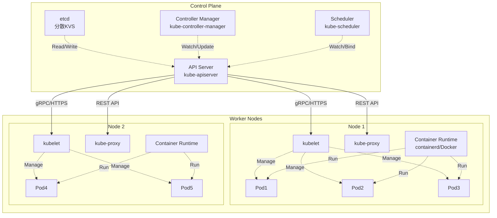
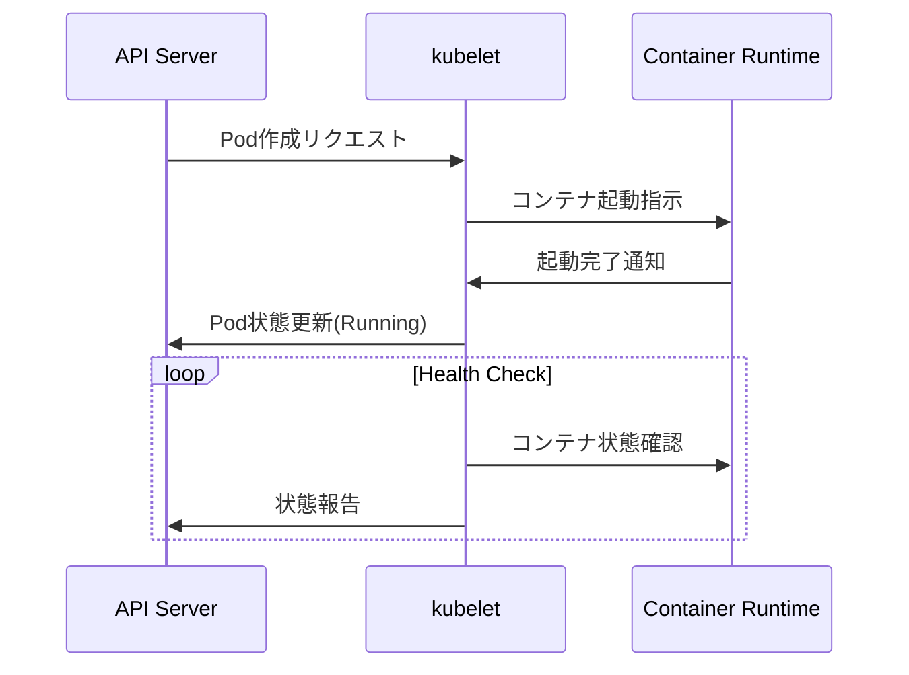
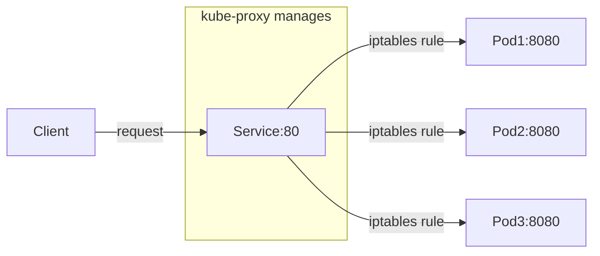
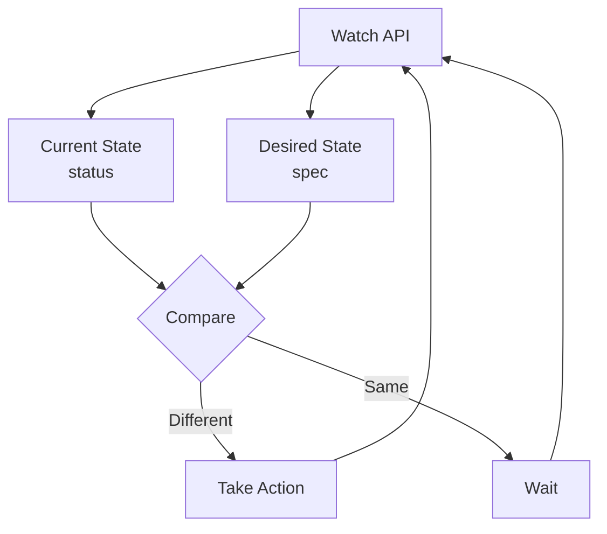

# Kubernetes のアーキテクチャ概説

## Kubernetes クラスタの全体構造

Kubernetes のクラスタは大きく分けて、Controle Plane と Worker Node に分かれる。



### Controle Plane コンポーネント詳解

1. API Server ([kube-apiserver](https://github.com/kubernetes/kubernetes/tree/master/cmd/kube-apiserver))

- 役割: Kubernetesの中枢となるRESTful APIサーバー
- 主な機能
  - すべてのコンポーネント間の通信ハブ
  - 認証・認可・Admission Controlの実行
  - etcdへの唯一のアクセスポイント
  - リソースの検証と永続化

例えば、`kubectl get pods` を実行して pod の一覧を取得する場合、コンポーネント間では以下のようなやり取りが行われている。

```
kubectl get pods
→ HTTPS Request → API Server → etcd (データ取得)
→ Response → kubectl
```

2. etcd

- 役割: 分散型のKey-Valueストア
- 保存データ
  - クラスターの全状態（desired state）
  - ConfigMap、Secret、Service定義
  - RBAC設定、Network Policy
- 特徴
  - Raft合意アルゴリズムによる高可用性
  - デフォルトで3台以上の奇数構成を推奨

3. Controller Manager ([kube-controller-manager](https://github.com/kubernetes/kubernetes/tree/master/cmd/kube-controller-manager))

- 役割: 各種コントローラーを実行する管理プロセス
- 主要コントローラー
  - Deployment Controller: ReplicaSet の管理
  - ReplicaSet Controller: Pod 数の維持
  - Node Controller: ノードの監視
  - Service Account Controller: SA 作成
  - Endpoint Controller: Service/Pod 関連付け
- 動作原理: Control Loop (制御ループ)
```
現在の状態(Current State) → 期待する状態(Desired State)との差分検出
→ 差分を解消するアクション実行 → 繰り返し
```

4. Scheduler ([kube-scheduler](https://github.com/kubernetes/kubernetes/tree/master/cmd/kube-scheduler))

- 役割: Pod を適切な Worker Node に配置する
- 主な機能
  - 新しく作成された Pod を監視
  - リソース要求・制約条件を考慮したNode選択
  - Affinity/Anti-affinity ルールの適用
  - Taints & Tolerations の考慮
- スケジューリングプロセス
  1. **Filtering（フィルタリング）**: 条件を満たさないNodeを除外
  2. **Scoring（スコアリング）**: 残ったNodeに優先度をつけて最適なNodeを選択

```
Pod作成リクエスト → Scheduler → Node選択 → API Server → Kubelet(選択されたNode)
```

### Worker Node コンポーネント詳解

1. **kubelet**

- 役割: Node上で実行される主要なKubernetesエージェント
- 主な機能
  - API Serverと通信してPod仕様を取得
  - Container Runtimeに指示してコンテナを起動/停止
  - Podとコンテナの健全性監視
  - Node状態の報告 (CPU, メモリ, ディスク使用量等)
  - Volume マウント処理
- 動作例



2. **Container Runtime**

- 役割: 実際にコンテナを実行するランタイム
- 主な実装
  - **containerd**: Docker社が開発、軽量で高性能
  - **CRI-O**: Red Hat主導、OCI準拠
  - **Docker Engine**: 従来のDockerデーモン (非推奨)
- 機能
  - イメージのプル（registry からのダウンロード）
  - コンテナの作成・起動・停止・削除
  - ネットワーク設定
  - ストレージマウント

3. **kube-proxy**

- 役割: Kubernetesネットワークの実装を担当
- 主な機能
  - Serviceの仮想IP（ClusterIP）を実現
  - 負荷分散（ServiceのEndpointsへのトラフィック分散）
  - ネットワークルールの管理（iptables / IPVS）
- 動作モード
  - **iptablesモード**: iptablesルールでトラフィック転送（デフォルト）
  - **IPVSモード**: IPVS（IP Virtual Server）を使用、高性能
  - **userspaceモード**: ユーザー空間でProxy実行（非推奨）



## Kubernetes オブジェクトモデル

Kubernetesは、すべてのリソースを「オブジェクト」として扱う宣言的システム。

### オブジェクトの基本構造

すべてのKubernetesオブジェクトは以下の構造を持つ：

```yaml
apiVersion: apps/v1        # APIのバージョン
kind: Deployment          # リソースの種類
metadata:                 # メタデータ（名前、ラベルなど）
  name: nginx-deployment
  namespace: default
  labels:
    app: nginx
spec:                    # 期待する状態（Desired State）
  replicas: 3
  selector:
    matchLabels:
      app: nginx
  template:
    metadata:
      labels:
        app: nginx
    spec:
      containers:
      - name: nginx
        image: nginx:1.21
status:                  # 現在の状態（Current State）※システム管理
  replicas: 3
  readyReplicas: 3
  updatedReplicas: 3
```

### 主要なフィールド説明

1. **apiVersion**
   - リソースが属するAPIグループとバージョン
   - 例: `v1`, `apps/v1`, `extensions/v1beta1`

2. **kind**
   - リソースタイプを指定
   - 例: `Pod`, `Service`, `Deployment`, `ConfigMap`

3. **metadata**
   - `name`: リソース名（namespace内で一意）
   - `namespace`: 所属するnamespace（省略時は`default`）
   - `labels`: キー/バリューペアのメタデータ（Selectorで使用）
   - `annotations`: 任意のメタデータ（ツールが使用）

4. **spec**
   - ユーザーが定義する「期待する状態」
   - リソースタイプごとに異なる構造

5. **status**
   - システムが管理する「現在の状態」
   - ユーザーは直接編集不可（Controller によって更新）

### Control Loop（制御ループ）

Kubernetesの核となる概念：



**制御ループの例（Deployment Controller）**:

1. Deployment の `spec.replicas: 3` を監視
2. 現在のPod数を確認 (status)
3. 期待値と現実値を比較
4. 差分があればReplicaSetを作成/更新してPod数を調整
5. 繰り返し

### よく使用するオブジェクトタイプ

| オブジェクト   | 役割                                        | 例                           |
| -------------- | ------------------------------------------- | ---------------------------- |
| **Pod**        | 最小実行単位（1つ以上のコンテナ）           | アプリケーションプロセス     |
| **Service**    | Pod群への安定したネットワークエンドポイント | ロードバランサー             |
| **Deployment** | Pod のレプリカ管理とローリングアップデート  | Webアプリケーション          |
| **ConfigMap**  | アプリケーション設定データ                  | 環境変数、設定ファイル       |
| **Secret**     | 機密データ（パスワード、証明書など）        | DB接続情報                   |
| **Namespace**  | リソースの論理的分離                        | 環境分離（dev/staging/prod） |

### ラベルとセレクター

オブジェクト間の関連付けに使用：

```yaml
# ラベル付きPod
metadata:
  labels:
    app: nginx
    version: v1.0
    tier: frontend

# Serviceでラベルセレクター使用
spec:
  selector:
    app: nginx      # app=nginx ラベルを持つPodを対象
    tier: frontend
```

## 学習リソース

### 演習・実践
- **[クラスタ状態確認演習](./exercises/01_cluster_inspection.md)**: kubectlを使ったクラスタ探索
- **[コンポーネント障害演習](./exercises/02_component_troubleshoot.md)**: トラブルシューティング実践
- **[オブジェクトモデル演習](./exercises/03_object_model_practice.md)**: 制御ループの体験

### 図解・アーキテクチャ
- **[詳細アーキテクチャ図](./diagrams/cluster_architecture.md)**: 完全なクラスタ構成図
- **[制御ループ図解](./diagrams/control_loop.md)**: Controller動作の詳細解説

### リファレンス
- **[kubectl基本コマンド集](./cheatsheet/kubectl_basics.md)**: 必須コマンドとTips集

### kind環境セットアップ
- **[kindクラスタセットアップガイド](./kind-setup.md)**: kindのインストールと設定
- **[kindクラスタ設定ファイル](./kind-cluster-config.yaml)**: カスタマイズされたクラスタ設定例

## 学習の進め方

1. **理解度確認**: まずREADME.mdの内容を読んで各コンポーネントの役割を理解
2. **実践演習**: `exercises/` 内の演習を順番に実施
3. **深堀り**: `diagrams/` の図解で動作原理を詳しく学習
4. **日常利用**: `cheatsheet/` を参照して実際のクラスタ操作に活用

## 学習目標の達成確認

**基礎編完了の目安**:
- [ ] Control Planeの4つのコンポーネント(etcd, API Server, Controller Manager, Scheduler)の役割を説明できる
- [ ] Worker Nodeの3つのコンポーネント(kubelet, Container Runtime, kube-proxy)の役割を説明できる
- [ ] Kubernetesオブジェクトの基本構造(apiVersion, kind, metadata, spec, status)を理解している
- [ ] kubectl基本コマンドでクラスタ状態を確認できる
- [ ] 制御ループ(Control Loop)の概念と動作を理解している

**確認方法**: 各演習の基礎レベル問題をすべて解答できること

# kind クラスタセットアップガイド

## 前提条件

### 必要なソフトウェア
- **Docker**: コンテナランタイム
- **kubectl**: Kubernetes CLI ツール
- **kind**: Kubernetes IN Docker

### インストール手順

#### 1. Docker のインストール
```bash
# macOS (Homebrew)
brew install --cask docker

# Ubuntu/Debian
sudo apt-get update
sudo apt-get install docker.io

# 起動確認
docker --version
```

#### 2. kubectl のインストール
```bash
# macOS (Homebrew)
brew install kubectl

# Linux
curl -LO "https://dl.k8s.io/release/$(curl -L -s https://dl.k8s.io/release/stable.txt)/bin/linux/amd64/kubectl"
sudo install -o root -g root -m 0755 kubectl /usr/local/bin/kubectl

# 確認
kubectl version --client
```

#### 3. kind のインストール
```bash
# macOS (Homebrew)
brew install kind

# Linux
curl -Lo ./kind https://kind.sigs.k8s.io/dl/v0.20.0/kind-linux-amd64
chmod +x ./kind
sudo mv ./kind /usr/local/bin/kind

# 確認
kind --version
```

## kindクラスタの作成

### 基本的なクラスタ作成

```bash
# シンプルなシングルノードクラスタ
kind create cluster --name my-cluster

# クラスタ確認
kubectl cluster-info --context kind-my-cluster
```

### カスタム設定でのクラスタ作成

```bash
# 設定ファイルを使用したクラスタ作成
kind create cluster --name k8s-training --config kind-cluster-config.yaml

# クラスタ一覧表示
kind get clusters

# ノード確認
kubectl get nodes --context kind-k8s-training
```

### 複数ノード構成の例

```yaml
# multi-node-config.yaml
kind: Cluster
apiVersion: kind.x-k8s.io/v1alpha4
nodes:
- role: control-plane
- role: worker
- role: worker
- role: worker
```

```bash
# 複数ワーカーノードでクラスタ作成
kind create cluster --name multi-node --config multi-node-config.yaml
```

## よく使用するkindコマンド

### クラスタ管理

```bash
# クラスタ作成
kind create cluster --name <CLUSTER_NAME>

# クラスタ削除
kind delete cluster --name <CLUSTER_NAME>

# 全クラスタ一覧
kind get clusters

# クラスタの詳細情報
kind get kubeconfig --name <CLUSTER_NAME>
```

### ノード管理

```bash
# ノード一覧（Dockerコンテナとして）
docker ps --filter "label=io.x-k8s.kind.cluster=<CLUSTER_NAME>"

# ノード内でのコマンド実行
docker exec -it <CLUSTER_NAME>-control-plane bash
docker exec -it <CLUSTER_NAME>-worker bash
```

### イメージ管理

```bash
# ローカルのDockerイメージをkindクラスタに読み込み
docker build -t my-app:latest .
kind load docker-image my-app:latest --name <CLUSTER_NAME>

# 読み込まれたイメージの確認
docker exec -it <CLUSTER_NAME>-control-plane crictl images
```

## トラブルシューティング

### よくある問題と解決策

#### 1. クラスタ作成時のポート競合
```bash
# エラー例: port 6443 is already allocated
# 解決策: 既存のクラスタを確認・削除
kind get clusters
kind delete cluster --name <EXISTING_CLUSTER>
```

#### 2. kubectl コンテキストの問題
```bash
# 現在のコンテキスト確認
kubectl config current-context

# kindクラスタのコンテキストに切り替え
kubectl config use-context kind-<CLUSTER_NAME>
```

#### 3. イメージプルの問題
```bash
# kindクラスタ内でのイメージ確認
docker exec -it <CLUSTER_NAME>-control-plane crictl images

# 必要に応じてイメージを手動で読み込み
kind load docker-image <IMAGE_NAME> --name <CLUSTER_NAME>
```

#### 4. ネットワーク接続の問題
```bash
# kindクラスタのネットワーク確認
docker network ls | grep kind

# コンテナ間の通信確認
docker exec <CLUSTER_NAME>-control-plane ping <CLUSTER_NAME>-worker
```

### ログ確認

```bash
# kindクラスタのログ
kind export logs --name <CLUSTER_NAME> ./kind-logs

# 特定ノードのログ
docker logs <CLUSTER_NAME>-control-plane
docker logs <CLUSTER_NAME>-worker

# Kubernetesコンポーネントのログ
kubectl logs -n kube-system <POD_NAME> --context kind-<CLUSTER_NAME>
```

## パフォーマンス設定

### リソース制限の調整

```yaml
# kind-config.yaml でのリソース制限
kind: Cluster
apiVersion: kind.x-k8s.io/v1alpha4
nodes:
- role: control-plane
  # カスタムイメージまたは追加設定
  extraMounts:
  - hostPath: /tmp
    containerPath: /tmp
- role: worker
  # ワーカーノード固有の設定
```

### Docker設定の調整

```bash
# Docker Desktop でのリソース割り当て確認
# Docker Desktop > Preferences > Resources > Advanced

# コンテナのリソース使用状況確認
docker stats <CLUSTER_NAME>-control-plane <CLUSTER_NAME>-worker
```

## kindネットワーキングの理解

### なぜAPI ServerのIPを確認するのか？

この確認の目的は、**kindクラスター特有のネットワーク構成を理解する**ためです。

#### 学習目的

**1. 本番クラスターとの違いを理解**
- **本番**: API ServerはクラスターIP（例：10.0.1.100:6443）で直接アクセス
- **kind**: Dockerコンテナなので、外部アクセスにはポートフォワーディングが必要

**2. Kubernetesネットワークの基本概念**
```
外部クライアント → 127.0.0.1:6443 → Docker port mapping → 172.18.0.2:6443 (API Server)
```
この流れを理解することで：
- ポートフォワーディングの仕組み
- コンテナネットワークの概念
- Load BalancerやIngress の必要性

**3. トラブルシューティングスキル**
演習中によくある問題：
- 「kubectlが接続できない」→ ポートフォワーディング確認
- 「Pod同士が通信できない」→ 内部IP vs 外部IP の理解
- 「Serviceがアクセスできない」→ ネットワーク層の理解

**4. 実際の運用への準備**
本番環境では：
- API ServerはLoad Balancerの背後
- 複数のAPI Serverインスタンス
- 証明書とTLSの考慮

### API Server エンドポイントの確認手順

#### 基本確認コマンド

```bash
# 1. kubectlで見えるエンドポイント（外部アクセス用）
kubectl cluster-info --context kind-k8s-training | grep "control plane"
# 出力例: https://127.0.0.1:6443

# 2. Docker内部IP（コンテナ間通信用）
docker inspect k8s-training-control-plane --format='{{range .NetworkSettings.Networks}}{{.IPAddress}}{{end}}'
# 出力例: 172.18.0.2

# 3. 内部からのアクセステスト
docker exec k8s-training-worker curl -k -s https://k8s-training-control-plane:6443/version

# 4. kubeconfigの実際のserver設定
kubectl config view --context kind-k8s-training --minify --output jsonpath='{.clusters[0].cluster.server}'
```

#### 詳細な確認スクリプト

```bash
#!/bin/bash
echo "=== kind Network Analysis ==="

echo "1. External endpoint (kubectl):"
kubectl cluster-info --context kind-k8s-training | grep "control plane"

echo -e "\n2. Docker internal IP:"
docker inspect k8s-training-control-plane --format='{{range .NetworkSettings.Networks}}{{.IPAddress}}{{end}}'

echo -e "\n3. Docker network details:"
docker inspect k8s-training-control-plane | jq '.[0].NetworkSettings.Networks'

echo -e "\n4. Internal access test:"
docker exec k8s-training-worker curl -k -s https://k8s-training-control-plane:6443/version | jq .gitVersion

echo -e "\n5. kubeconfig server setting:"
kubectl config view --context kind-k8s-training --minify --output jsonpath='{.clusters[0].cluster.server}'
```

#### 実演での学習ポイント

**よくある間違い例:**
```bash
# ❌ 内部IPで外部からアクセスしようとする
curl -k https://172.18.0.2:6443/version  # 失敗

# ✅ 正しい：適切なエンドポイントを使用
curl -k https://127.0.0.1:6443/version   # 成功
```

**ネットワーク層の理解:**
```bash
# 外部 → kind（ポートフォワード経由）
kubectl get nodes --context kind-k8s-training

# Docker内部ネットワーク（直接通信）
docker exec k8s-training-control-plane kubectl get nodes
```

### 本番環境との比較

| 項目                | kind環境                      | 本番環境                   |
| ------------------- | ----------------------------- | -------------------------- |
| API Server アクセス | 127.0.0.1:6443 (port forward) | Load Balancer IP:443       |
| 内部通信            | Docker bridge network         | Pod/Service network        |
| 高可用性            | 単一コンテナ                  | 複数API Serverインスタンス |
| 証明書              | 自己署名（学習用）            | 正規CA発行                 |
| ネットワーク分離    | Docker network                | VLAN/Subnet分離            |
| 外部アクセス        | localhost port mapping        | Ingress/LoadBalancer       |

## 本番との違いと注意点

### kindクラスタの制限
- シングルマシン上でのシミュレーション
- 永続化されないデータ（クラスタ削除で消失）
- 限定的なネットワーク機能
- ロードバランサーの動作が異なる

### 学習用途での活用
- ローカル開発・テスト環境として最適
- CI/CDパイプラインでの使用
- Kubernetesの概念学習に適している
- アップグレードやダウングレードが簡単

## 次のステップ

1. **基本操作の習得**: `kubectl` コマンドでクラスタ操作
2. **演習の実施**: 各演習ファイルでの実践学習
3. **高度な設定**: カスタムCNI、Ingress Controller等
4. **アプリケーションデプロイ**: 実際のワークロード実行
