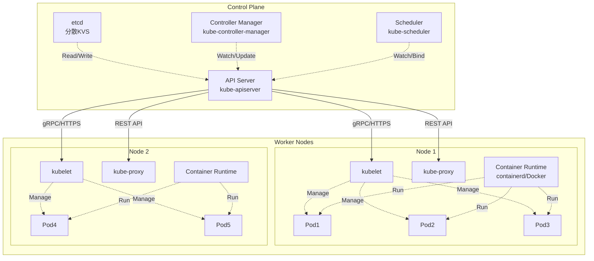
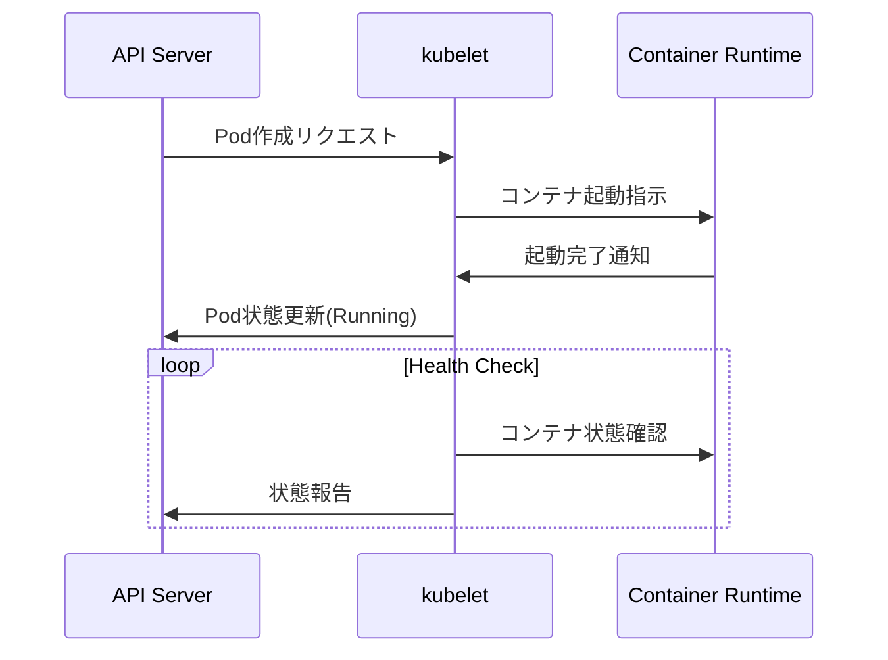
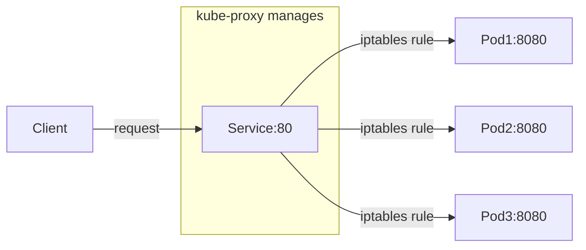
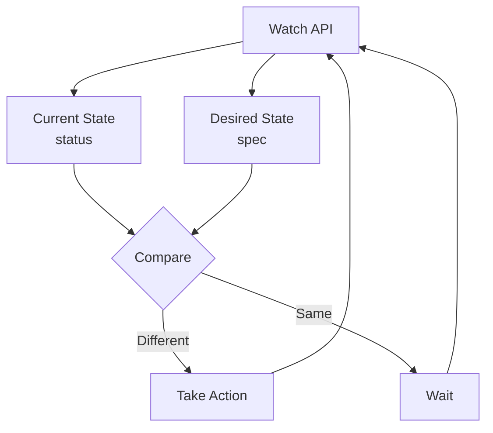

# Kubernetes のアーキテクチャ概説

## Kubernetes クラスタの全体構造

Kubernetes のクラスタは大きく分けて、Controle Plane と Worker Node に分かれる。



### Controle Plane コンポーネント詳解

1. API Server ([kube-apiserver](https://github.com/kubernetes/kubernetes/tree/master/cmd/kube-apiserver))

- 役割: Kubernetesの中枢となるRESTful APIサーバー
- 主な機能
  - すべてのコンポーネント間の通信ハブ
  - 認証・認可・Admission Controlの実行
  - etcdへの唯一のアクセスポイント
  - リソースの検証と永続化

例えば、`kubectl get pods` を実行して pod の一覧を取得する場合、コンポーネント間では以下のようなやり取りが行われている。

```
kubectl get pods
→ HTTPS Request → API Server → etcd (データ取得)
→ Response → kubectl
```

2. etcd

- 役割: 分散型のKey-Valueストア
- 保存データ
  - クラスターの全状態（desired state）
  - ConfigMap、Secret、Service定義
  - RBAC設定、Network Policy
- 特徴
  - Raft合意アルゴリズムによる高可用性
  - デフォルトで3台以上の奇数構成を推奨

3. Controller Manager ([kube-controller-manager](https://github.com/kubernetes/kubernetes/tree/master/cmd/kube-controller-manager))

- 役割: 各種コントローラーを実行する管理プロセス
- 主要コントローラー
  - Deployment Controller: ReplicaSet の管理
  - ReplicaSet Controller: Pod 数の維持
  - Node Controller: ノードの監視
  - Service Account Controller: SA 作成
  - Endpoint Controller: Service/Pod 関連付け
- 動作原理: Control Loop (制御ループ)
```
現在の状態(Current State) → 期待する状態(Desired State)との差分検出
→ 差分を解消するアクション実行 → 繰り返し
```

4. Scheduler ([kube-scheduler](https://github.com/kubernetes/kubernetes/tree/master/cmd/kube-scheduler))

- 役割: Pod を適切な Worker Node に配置する
- 主な機能
  - 新しく作成された Pod を監視
  - リソース要求・制約条件を考慮したNode選択
  - Affinity/Anti-affinity ルールの適用
  - Taints & Tolerations の考慮
- スケジューリングプロセス
  1. **Filtering（フィルタリング）**: 条件を満たさないNodeを除外
  2. **Scoring（スコアリング）**: 残ったNodeに優先度をつけて最適なNodeを選択

```
Pod作成リクエスト → Scheduler → Node選択 → API Server → Kubelet(選択されたNode)
```

### Worker Node コンポーネント詳解

1. **kubelet**

- 役割: Node上で実行される主要なKubernetesエージェント
- 主な機能
  - API Serverと通信してPod仕様を取得
  - Container Runtimeに指示してコンテナを起動/停止
  - Podとコンテナの健全性監視
  - Node状態の報告 (CPU, メモリ, ディスク使用量等)
  - Volume マウント処理
- 動作例



2. **Container Runtime**

- 役割: 実際にコンテナを実行するランタイム
- 主な実装
  - **containerd**: Docker社が開発、軽量で高性能
  - **CRI-O**: Red Hat主導、OCI準拠
  - **Docker Engine**: 従来のDockerデーモン (非推奨)
- 機能
  - イメージのプル（registry からのダウンロード）
  - コンテナの作成・起動・停止・削除
  - ネットワーク設定
  - ストレージマウント

3. **kube-proxy**

- 役割: Kubernetesネットワークの実装を担当
- 主な機能
  - Serviceの仮想IP（ClusterIP）を実現
  - 負荷分散（ServiceのEndpointsへのトラフィック分散）
  - ネットワークルールの管理（iptables / IPVS）
- 動作モード
  - **iptablesモード**: iptablesルールでトラフィック転送（デフォルト）
  - **IPVSモード**: IPVS（IP Virtual Server）を使用、高性能
  - **userspaceモード**: ユーザー空間でProxy実行（非推奨）



## Kubernetes オブジェクトモデル

Kubernetesは、すべてのリソースを「オブジェクト」として扱う宣言的システム。

### オブジェクトの基本構造

すべてのKubernetesオブジェクトは以下の構造を持つ：

```yaml
apiVersion: apps/v1        # APIのバージョン
kind: Deployment          # リソースの種類
metadata:                 # メタデータ（名前、ラベルなど）
  name: nginx-deployment
  namespace: default
  labels:
    app: nginx
spec:                    # 期待する状態（Desired State）
  replicas: 3
  selector:
    matchLabels:
      app: nginx
  template:
    metadata:
      labels:
        app: nginx
    spec:
      containers:
      - name: nginx
        image: nginx:1.21
status:                  # 現在の状態（Current State）※システム管理
  replicas: 3
  readyReplicas: 3
  updatedReplicas: 3
```

### 主要なフィールド説明

1. **apiVersion**
   - リソースが属するAPIグループとバージョン
   - 例: `v1`, `apps/v1`, `extensions/v1beta1`

2. **kind**
   - リソースタイプを指定
   - 例: `Pod`, `Service`, `Deployment`, `ConfigMap`

3. **metadata**
   - `name`: リソース名（namespace内で一意）
   - `namespace`: 所属するnamespace（省略時は`default`）
   - `labels`: キー/バリューペアのメタデータ（Selectorで使用）
   - `annotations`: 任意のメタデータ（ツールが使用）

4. **spec**
   - ユーザーが定義する「期待する状態」
   - リソースタイプごとに異なる構造

5. **status**
   - システムが管理する「現在の状態」
   - ユーザーは直接編集不可（Controller によって更新）

### Control Loop（制御ループ）

Kubernetesの核となる概念：



**制御ループの例（Deployment Controller）**:

1. Deployment の `spec.replicas: 3` を監視
2. 現在のPod数を確認 (status)
3. 期待値と現実値を比較
4. 差分があればReplicaSetを作成/更新してPod数を調整
5. 繰り返し

### よく使用するオブジェクトタイプ

| オブジェクト   | 役割                                        | 例                           |
| -------------- | ------------------------------------------- | ---------------------------- |
| **Pod**        | 最小実行単位（1つ以上のコンテナ）           | アプリケーションプロセス     |
| **Service**    | Pod群への安定したネットワークエンドポイント | ロードバランサー             |
| **Deployment** | Pod のレプリカ管理とローリングアップデート  | Webアプリケーション          |
| **ConfigMap**  | アプリケーション設定データ                  | 環境変数、設定ファイル       |
| **Secret**     | 機密データ（パスワード、証明書など）        | DB接続情報                   |
| **Namespace**  | リソースの論理的分離                        | 環境分離（dev/staging/prod） |

### ラベルとセレクター

オブジェクト間の関連付けに使用：

```yaml
# ラベル付きPod
metadata:
  labels:
    app: nginx
    version: v1.0
    tier: frontend

# Serviceでラベルセレクター使用
spec:
  selector:
    app: nginx      # app=nginx ラベルを持つPodを対象
    tier: frontend
```

## 学習リソース

### 演習・実践
- **[クラスタ状態確認演習](./exercises/01_cluster_inspection.md)**: kubectlを使ったクラスタ探索
- **[コンポーネント障害演習](./exercises/02_component_troubleshoot.md)**: トラブルシューティング実践
- **[オブジェクトモデル演習](./exercises/03_object_model_practice.md)**: 制御ループの体験

### 図解・アーキテクチャ
- **[詳細アーキテクチャ図](./diagrams/cluster_architecture.md)**: 完全なクラスタ構成図
- **[制御ループ図解](./diagrams/control_loop.md)**: Controller動作の詳細解説

### リファレンス
- **[kubectl基本コマンド集](./cheatsheet/kubectl_basics.md)**: 必須コマンドとTips集

### kind環境セットアップ
- **[kindクラスタセットアップガイド](./kind-setup.md)**: kindのインストールと設定
- **[kindクラスタ設定ファイル](./kind-cluster-config.yaml)**: カスタマイズされたクラスタ設定例

## 学習の進め方

1. **理解度確認**: まずREADME.mdの内容を読んで各コンポーネントの役割を理解
2. **実践演習**: `exercises/` 内の演習を順番に実施
3. **深堀り**: `diagrams/` の図解で動作原理を詳しく学習
4. **日常利用**: `cheatsheet/` を参照して実際のクラスタ操作に活用

## 学習目標の達成確認

**基礎編完了の目安**:
- [ ] Control Planeの4つのコンポーネント(etcd, API Server, Controller Manager, Scheduler)の役割を説明できる
- [ ] Worker Nodeの3つのコンポーネント(kubelet, Container Runtime, kube-proxy)の役割を説明できる
- [ ] Kubernetesオブジェクトの基本構造(apiVersion, kind, metadata, spec, status)を理解している
- [ ] kubectl基本コマンドでクラスタ状態を確認できる
- [ ] 制御ループ(Control Loop)の概念と動作を理解している

**確認方法**: 各演習の基礎レベル問題をすべて解答できること

# kind クラスタセットアップガイド

## 前提条件

### 必要なソフトウェア
- **Docker**: コンテナランタイム
- **kubectl**: Kubernetes CLI ツール
- **kind**: Kubernetes IN Docker

### インストール手順

#### 1. Docker のインストール
```bash
# macOS (Homebrew)
brew install --cask docker

# Ubuntu/Debian
sudo apt-get update
sudo apt-get install docker.io

# 起動確認
docker --version
```

#### 2. kubectl のインストール
```bash
# macOS (Homebrew)
brew install kubectl

# Linux
curl -LO "https://dl.k8s.io/release/$(curl -L -s https://dl.k8s.io/release/stable.txt)/bin/linux/amd64/kubectl"
sudo install -o root -g root -m 0755 kubectl /usr/local/bin/kubectl

# 確認
kubectl version --client
```

#### 3. kind のインストール
```bash
# macOS (Homebrew)
brew install kind

# Linux
curl -Lo ./kind https://kind.sigs.k8s.io/dl/v0.20.0/kind-linux-amd64
chmod +x ./kind
sudo mv ./kind /usr/local/bin/kind

# 確認
kind --version
```

## kindクラスタの作成

### 基本的なクラスタ作成

```bash
# シンプルなシングルノードクラスタ
kind create cluster --name my-cluster

# クラスタ確認
kubectl cluster-info --context kind-my-cluster
```

### カスタム設定でのクラスタ作成

```bash
# 設定ファイルを使用したクラスタ作成
kind create cluster --name k8s-training --config kind-cluster-config.yaml

# クラスタ一覧表示
kind get clusters

# ノード確認
kubectl get nodes --context kind-k8s-training
```

### 複数ノード構成の例

```yaml
# multi-node-config.yaml
kind: Cluster
apiVersion: kind.x-k8s.io/v1alpha4
nodes:
- role: control-plane
- role: worker
- role: worker
- role: worker
```

```bash
# 複数ワーカーノードでクラスタ作成
kind create cluster --name multi-node --config multi-node-config.yaml
```

## よく使用するkindコマンド

### クラスタ管理

```bash
# クラスタ作成
kind create cluster --name <CLUSTER_NAME>

# クラスタ削除
kind delete cluster --name <CLUSTER_NAME>

# 全クラスタ一覧
kind get clusters

# クラスタの詳細情報
kind get kubeconfig --name <CLUSTER_NAME>
```

### ノード管理

```bash
# ノード一覧（Dockerコンテナとして）
docker ps --filter "label=io.x-k8s.kind.cluster=<CLUSTER_NAME>"

# ノード内でのコマンド実行
docker exec -it <CLUSTER_NAME>-control-plane bash
docker exec -it <CLUSTER_NAME>-worker bash
```

### イメージ管理

```bash
# ローカルのDockerイメージをkindクラスタに読み込み
docker build -t my-app:latest .
kind load docker-image my-app:latest --name <CLUSTER_NAME>

# 読み込まれたイメージの確認
docker exec -it <CLUSTER_NAME>-control-plane crictl images
```

## トラブルシューティング

### よくある問題と解決策

#### 1. クラスタ作成時のポート競合
```bash
# エラー例: port 6443 is already allocated
# 解決策: 既存のクラスタを確認・削除
kind get clusters
kind delete cluster --name <EXISTING_CLUSTER>
```

#### 2. kubectl コンテキストの問題
```bash
# 現在のコンテキスト確認
kubectl config current-context

# kindクラスタのコンテキストに切り替え
kubectl config use-context kind-<CLUSTER_NAME>
```

#### 3. イメージプルの問題
```bash
# kindクラスタ内でのイメージ確認
docker exec -it <CLUSTER_NAME>-control-plane crictl images

# 必要に応じてイメージを手動で読み込み
kind load docker-image <IMAGE_NAME> --name <CLUSTER_NAME>
```

#### 4. ネットワーク接続の問題
```bash
# kindクラスタのネットワーク確認
docker network ls | grep kind

# コンテナ間の通信確認
docker exec <CLUSTER_NAME>-control-plane ping <CLUSTER_NAME>-worker
```

### ログ確認

```bash
# kindクラスタのログ
kind export logs --name <CLUSTER_NAME> ./kind-logs

# 特定ノードのログ
docker logs <CLUSTER_NAME>-control-plane
docker logs <CLUSTER_NAME>-worker

# Kubernetesコンポーネントのログ
kubectl logs -n kube-system <POD_NAME> --context kind-<CLUSTER_NAME>
```

## パフォーマンス設定

### リソース制限の調整

```yaml
# kind-config.yaml でのリソース制限
kind: Cluster
apiVersion: kind.x-k8s.io/v1alpha4
nodes:
- role: control-plane
  # カスタムイメージまたは追加設定
  extraMounts:
  - hostPath: /tmp
    containerPath: /tmp
- role: worker
  # ワーカーノード固有の設定
```

### Docker設定の調整

```bash
# Docker Desktop でのリソース割り当て確認
# Docker Desktop > Preferences > Resources > Advanced

# コンテナのリソース使用状況確認
docker stats <CLUSTER_NAME>-control-plane <CLUSTER_NAME>-worker
```

## kindネットワーキングの理解

### なぜAPI ServerのIPを確認するのか？

この確認の目的は、**kindクラスター特有のネットワーク構成を理解する**ためです。

#### 学習目的

**1. 本番クラスターとの違いを理解**
- **本番**: API ServerはクラスターIP（例：10.0.1.100:6443）で直接アクセス
- **kind**: Dockerコンテナなので、外部アクセスにはポートフォワーディングが必要

**2. Kubernetesネットワークの基本概念**
```
外部クライアント → 127.0.0.1:6443 → Docker port mapping → 172.18.0.2:6443 (API Server)
```
この流れを理解することで：
- ポートフォワーディングの仕組み
- コンテナネットワークの概念
- Load BalancerやIngress の必要性

**3. トラブルシューティングスキル**
演習中によくある問題：
- 「kubectlが接続できない」→ ポートフォワーディング確認
- 「Pod同士が通信できない」→ 内部IP vs 外部IP の理解
- 「Serviceがアクセスできない」→ ネットワーク層の理解

**4. 実際の運用への準備**
本番環境では：
- API ServerはLoad Balancerの背後
- 複数のAPI Serverインスタンス
- 証明書とTLSの考慮

### API Server エンドポイントの確認手順

#### 基本確認コマンド

```bash
# 1. kubectlで見えるエンドポイント（外部アクセス用）
kubectl cluster-info --context kind-k8s-training | grep "control plane"
# 出力例: https://127.0.0.1:6443

# 2. Docker内部IP（コンテナ間通信用）
docker inspect k8s-training-control-plane --format='{{range .NetworkSettings.Networks}}{{.IPAddress}}{{end}}'
# 出力例: 172.18.0.2

# 3. 内部からのアクセステスト
docker exec k8s-training-worker curl -k -s https://k8s-training-control-plane:6443/version

# 4. kubeconfigの実際のserver設定
kubectl config view --context kind-k8s-training --minify --output jsonpath='{.clusters[0].cluster.server}'
```

#### 詳細な確認スクリプト

```bash
#!/bin/bash
echo "=== kind Network Analysis ==="

echo "1. External endpoint (kubectl):"
kubectl cluster-info --context kind-k8s-training | grep "control plane"

echo -e "\n2. Docker internal IP:"
docker inspect k8s-training-control-plane --format='{{range .NetworkSettings.Networks}}{{.IPAddress}}{{end}}'

echo -e "\n3. Docker network details:"
docker inspect k8s-training-control-plane | jq '.[0].NetworkSettings.Networks'

echo -e "\n4. Internal access test:"
docker exec k8s-training-worker curl -k -s https://k8s-training-control-plane:6443/version | jq .gitVersion

echo -e "\n5. kubeconfig server setting:"
kubectl config view --context kind-k8s-training --minify --output jsonpath='{.clusters[0].cluster.server}'
```

#### 実演での学習ポイント

**よくある間違い例:**
```bash
# ❌ 内部IPで外部からアクセスしようとする
curl -k https://172.18.0.2:6443/version  # 失敗

# ✅ 正しい：適切なエンドポイントを使用
curl -k https://127.0.0.1:6443/version   # 成功
```

**ネットワーク層の理解:**
```bash
# 外部 → kind（ポートフォワード経由）
kubectl get nodes --context kind-k8s-training

# Docker内部ネットワーク（直接通信）
docker exec k8s-training-control-plane kubectl get nodes
```

### 本番環境との比較

| 項目                | kind環境                      | 本番環境                   |
| ------------------- | ----------------------------- | -------------------------- |
| API Server アクセス | 127.0.0.1:6443 (port forward) | Load Balancer IP:443       |
| 内部通信            | Docker bridge network         | Pod/Service network        |
| 高可用性            | 単一コンテナ                  | 複数API Serverインスタンス |
| 証明書              | 自己署名（学習用）            | 正規CA発行                 |
| ネットワーク分離    | Docker network                | VLAN/Subnet分離            |
| 外部アクセス        | localhost port mapping        | Ingress/LoadBalancer       |

## 本番との違いと注意点

### kindクラスタの制限
- シングルマシン上でのシミュレーション
- 永続化されないデータ（クラスタ削除で消失）
- 限定的なネットワーク機能
- ロードバランサーの動作が異なる

### 学習用途での活用
- ローカル開発・テスト環境として最適
- CI/CDパイプラインでの使用
- Kubernetesの概念学習に適している
- アップグレードやダウングレードが簡単

## 次のステップ

1. **基本操作の習得**: `kubectl` コマンドでクラスタ操作
2. **演習の実施**: 各演習ファイルでの実践学習
3. **高度な設定**: カスタムCNI、Ingress Controller等
4. **アプリケーションデプロイ**: 実際のワークロード実行

# 演習1: クラスタ状態確認

## 目標
kindクラスターを作成してkubectlコマンドでKubernetesクラスタの構成要素を確認し、アーキテクチャの理解を深める。

## 前提条件
- Docker がインストール済み
- kubectl コマンドがインストール済み
- kind がインストール済み (https://kind.sigs.k8s.io/docs/user/quick-start/)

## kindクラスターのセットアップ

### 1. kindクラスター作成

```bash
# シングルノードクラスター作成
kind create cluster --name k8s-training

# クラスター情報確認
kind get clusters
kubectl cluster-info --context kind-k8s-training
```

### 2. 複数ノードクラスター（推奨）

より実際のクラスターに近い環境で学習するため、複数ノード構成を推奨します：

```yaml
# kind-multi-node.yaml
kind: Cluster
apiVersion: kind.x-k8s.io/v1alpha4
nodes:
- role: control-plane
- role: worker
- role: worker
```

```bash
# 複数ノードクラスター作成
kind create cluster --name k8s-training --config kind-multi-node.yaml

# kubectlコンテキストを設定
kubectl cluster-info --context kind-k8s-training
```

## 演習内容

### 1. kindクラスタ情報の確認

```bash
# kindクラスタ一覧
kind get clusters

# kindクラスタ情報の表示
kubectl cluster-info --context kind-k8s-training

# クライアント/サーバーのバージョン確認
kubectl version --context kind-k8s-training

# APIサーバーのリソース一覧
kubectl api-resources --context kind-k8s-training

# kindクラスタのDockerコンテナ確認
docker ps --filter "label=io.x-k8s.kind.cluster=k8s-training"
```

**確認ポイント**:
- API ServerのエンドポイントがDocker内部のIPであること
- Kubernetesのバージョン
- kindによってDockerコンテナとしてノードが起動していること
- 利用可能なリソースタイプ

### 2. kindノード情報の確認

```bash
# ノード一覧表示
kubectl get nodes --context kind-k8s-training

# 詳細情報を表示
kubectl get nodes -o wide --context kind-k8s-training

# kindノードのDockerコンテナ確認
docker exec -it k8s-training-control-plane ls -la /
docker exec -it k8s-training-worker ls -la /

# 特定ノードの詳細確認（ノード名例: k8s-training-control-plane）
kubectl describe node k8s-training-control-plane --context kind-k8s-training
```

**確認ポイント**:
- kindではノード名にクラスタ名のプレフィックスが付くこと
- Control PlaneとWorker Nodeの識別（node-role.kubernetes.io/control-plane ラベル）
- ノードの状態（Ready/NotReady）
- 各ノードのリソース容量（Dockerコンテナのリソース）
- Container Runtimeがcontainerdであること

### 3. kindシステムPodの確認

```bash
# kube-system namespace のPod確認
kubectl get pods -n kube-system --context kind-k8s-training

# Control Planeコンポーネントの確認（kindは静的Pod）
kubectl get pods -n kube-system -o wide --context kind-k8s-training | grep -E "(etcd|apiserver|controller|scheduler)"

# kindのControl Planeコンテナ内で静的Pod確認
docker exec k8s-training-control-plane ls -la /etc/kubernetes/manifests/

# DaemonSetの確認（kube-proxy、kindnet等）
kubectl get daemonsets -n kube-system --context kind-k8s-training

# kindのCNI（kindnet）確認
kubectl get pods -n kube-system -l app=kindnet --context kind-k8s-training
```

**確認ポイント**:
- kindではControl PlaneコンポーネントがDockerコンテナ内の静的Podとして動作
- etcd、API Server、Controller Manager、Schedulerがcontrol-planeノードに集約
- kindnetがCNIとして動作していること
- 各ノードで実行されているkube-proxy

### 4. kindコンポーネントステータス確認

```bash
# イベント確認
kubectl get events --sort-by='.metadata.creationTimestamp' --context kind-k8s-training

# Control Plane Podのログ確認
kubectl logs -n kube-system kube-apiserver-k8s-training-control-plane --context kind-k8s-training
kubectl logs -n kube-system kube-controller-manager-k8s-training-control-plane --context kind-k8s-training
kubectl logs -n kube-system kube-scheduler-k8s-training-control-plane --context kind-k8s-training
kubectl logs -n kube-system etcd-k8s-training-control-plane --context kind-k8s-training

# kindのDockerコンテナログも確認可能
docker logs k8s-training-control-plane
docker logs k8s-training-worker
```

### 5. ネームスペース確認

```bash
# 全ネームスペース表示
kubectl get namespaces

# 各ネームスペースのリソース確認
kubectl get all -n kube-system
kubectl get all -n default
```

## 演習問題

### 基礎レベル
1. kindクラスタにはControl Planeノードが何台ありますか？
2. kindのWorker NodeのDockerコンテナ名を特定してください。
3. kube-systemネームスペースで動作中のPod数を数えてください。
4. kindで使用されているCNIプラグインは何ですか？

### 中級レベル
5. etcdがどのノードで動作しているか特定し、Dockerコンテナ内での場所を確認してください。
6. kube-proxyがすべてのノードで動作していることを確認してください。
7. kind環境でのAPI Serverのエンドポイント（Docker内部IP）を特定してください。
8. kindのControl Planeコンテナ内の/etc/kubernetes/manifests/を確認してください。

### 上級レベル
9. kindクラスタのDockerネットワーク設定を確認してください。
10. Control PlaneコンテナとWorkerコンテナ間の通信経路を調べてください。
11. kindクラスタの証明書がDockerコンテナ内のどこに保存されているか確認してください。

## 解答例とヒント

<details>
<summary>解答例を表示</summary>

### 基礎レベル解答
```bash
# 1. kindクラスタのControl Plane数
kubectl get nodes --selector=node-role.kubernetes.io/control-plane --context kind-k8s-training

# 2. kindのWorkerコンテナ名
docker ps --filter "label=io.x-k8s.kind.cluster=k8s-training" --filter "label=io.x-k8s.kind.role=worker"

# 3. kube-system Pod数
kubectl get pods -n kube-system --no-headers --context kind-k8s-training | wc -l

# 4. CNIプラグイン確認
kubectl get pods -n kube-system -l app=kindnet --context kind-k8s-training
```

### 中級レベル解答
```bash
# 5. etcd場所とコンテナ内確認
kubectl get pods -n kube-system -o wide | grep etcd --context kind-k8s-training
docker exec k8s-training-control-plane ls -la /etc/kubernetes/manifests/etcd.yaml

# 6. kube-proxy確認
kubectl get daemonsets -n kube-system kube-proxy --context kind-k8s-training
kubectl get pods -n kube-system -l k8s-app=kube-proxy -o wide --context kind-k8s-training

# 7. API Serverエンドポイント（Docker内部IP）
kubectl cluster-info --context kind-k8s-training
docker inspect k8s-training-control-plane | jq '.[0].NetworkSettings.Networks'

# 8. 静的Pod manifestファイル確認
docker exec k8s-training-control-plane ls -la /etc/kubernetes/manifests/
```

### 上級レベル解答
```bash
# 9. kindのDockerネットワーク
docker network inspect kind
docker inspect k8s-training-control-plane | jq '.[0].NetworkSettings'

# 10. ノード間通信確認
docker exec k8s-training-control-plane ping k8s-training-worker
docker exec k8s-training-worker ping k8s-training-control-plane

# 11. 証明書の場所
docker exec k8s-training-control-plane ls -la /etc/kubernetes/pki/
```

</details>

## kindクラスタのクリーンアップ

演習完了後、リソースを解放するためにクラスタを削除：

```bash
# クラスタ削除
kind delete cluster --name k8s-training

# 削除確認
kind get clusters
docker ps --filter "label=io.x-k8s.kind.cluster=k8s-training"
```

## 次のステップ
- コンポーネント障害演習 (`02_component_troubleshoot.md`)
- オブジェクトモデル演習 (`03_object_model_practice.md`)
- kindクラスター設定のカスタマイズ学習

# 演習2: コンポーネント障害シナリオ

## 目標
kindクラスターでKubernetesコンポーネントの障害を想定したトラブルシューティング演習を通じて、各コンポーネントの役割と依存関係を理解する。

## 前提条件
- 演習1で作成したkindクラスターが動作していること
- Docker とkubectl、kindがインストール済み

## 注意事項
**この演習はkind学習用クラスターでのみ実施してください。本番環境では実行しないでください。**

## kindクラスター準備

演習1を実施していない場合は、以下でクラスターを作成：

```bash
# 複数ノードクラスター作成
kind create cluster --name k8s-training --config - <<EOF
kind: Cluster
apiVersion: kind.x-k8s.io/v1alpha4
nodes:
- role: control-plane
- role: worker
- role: worker
EOF
```

## 障害シナリオ集

### シナリオ1: kindでのkubelet障害シミュレーション
**状況**: Worker NodeのDockerコンテナ内でkubeletプロセスに問題が発生

**事前準備**:
```bash
# テスト用Podを作成（DaemonSetと異なりeviction対象になる）
kubectl run test-nginx --image=nginx --context kind-k8s-training
kubectl run test-busybox --image=busybox:latest --command --context kind-k8s-training -- sleep 3600

# Podがworker nodeに配置されることを確認
kubectl get pods -o wide --context kind-k8s-training
```

**障害の作成**:
```bash
# Worker nodeコンテナ内でkubeletプロセスを停止
docker exec k8s-training-worker systemctl stop kubelet
```

**現象**:
```bash
# Nodeが NotReady になる
kubectl get nodes --context kind-k8s-training

# 約5分後にテスト用Podが Terminating になる（DaemonSet Podは残る）
kubectl get pods -o wide --context kind-k8s-training
# test-nginx      0/1     Terminating   0          6m   10.244.2.x   k8s-training-worker
# test-busybox    0/1     Terminating   0          6m   10.244.2.x   k8s-training-worker

# DaemonSet Pod（kube-proxy, kindnetなど）は Running のまま
kubectl get pods -n kube-system -o wide --context kind-k8s-training | grep k8s-training-worker
```

**これらの現象が発生する理由**:
kubeletプロセスが停止すると、以下の流れで NodeがNotReady状態になり、Pod がTerminating状態になります：

1. **ヘルスチェックの停止**: kubeletはKubernetes APIサーバーに対して定期的（デフォルトで10秒間隔）にハートビート（NodeStatus更新）を送信しますが、プロセス停止によりこれが行われなくなります。

2. **NodeのNotReady状態への移行**: Control PlaneのNode Controllerが、指定時間内（デフォルト40秒）にNodeStatusの更新を受信しない場合、当該NodeをNotReady状態としてマークし、自動的にTaintを付与します：
   ```
   node.kubernetes.io/unreachable:NoSchedule
   node.kubernetes.io/unreachable:NoExecute
   ```

3. **Taint-based Evictionによる段階的なPod退避**: 現在のKubernetes（1.13以降）では、PodはデフォルトでToleration（耐性）を持っており、unreachable NodeのTaintを一定時間我慢します：
   ```yaml
   tolerations:
   - key: node.kubernetes.io/unreachable
     operator: Exists
     effect: NoExecute
     tolerationSeconds: 300  # 5分間は我慢
   ```

4. **300秒経過後のTerminating状態への移行**: 5分経過後、TolerationのタイムアウトによりPodはTerminating状態になります。ただし、**DaemonSet PodはNode固有の処理を担当するため、eviction対象外**となり Running状態を維持します。

**重要な注意点 - Terminating状態でのスタック**:
kubeletが停止している状況では、以下の問題が発生します：

- **Node ControllerはAPI操作のみ**: Node ControllerはPodにDeletionTimestampを設定してTerminating状態にマークしますが、実際にコンテナを停止・削除する処理は各Nodeのkubeletが担当します。
- **kubeletが応答不能**: kubeletが停止していると、Terminating状態のPodは実際には削除されず、コンテナは動き続けます。
- **Split-brain状態のリスク**: 新しいPodが他のNodeで起動されるため、同じアプリケーションが複数Node上で同時実行される可能性があります。
- **手動介入が必要**: kubeletが復旧するか、強制削除（`kubectl delete pod --force --grace-period=0`）による手動介入が必要になります。

**これらの値が設定されている理由**:

- **10秒間隔（node-status-update-frequency）**: Node状態の適時監視とネットワーク負荷のバランス
- **40秒（node-monitor-grace-period）**: 一時的なネットワーク遅延や高負荷を考慮した誤判定防止
- **300秒（tolerationSeconds）**: 実際の障害と一時的な通信断を区別し、不要なPod移動を防ぐ安全マージン

**実際の動作確認**:
```bash
# 実際に付与されるtaintの確認
kubectl get node k8s-training-worker -o yaml --context kind-k8s-training | yq '.spec.taints'
# 結果例:
# - effect: NoSchedule
#   key: node.kubernetes.io/unreachable
#   timeAdded: "2025-09-07T03:00:47Z"
# - effect: NoExecute
#   key: node.kubernetes.io/unreachable
#   timeAdded: "2025-09-07T03:00:52Z"
```

**Pod Evictionの仕組み変更履歴**:
- **Kubernetes 1.6**: TaintBasedEvictions feature gate導入（Alpha、デフォルト無効）
- **Kubernetes 1.12以前**: `--pod-eviction-timeout`（デフォルト5分）でPodを強制削除
- **Kubernetes 1.13**: TaintBasedEvictions がBeta昇格（デフォルト有効）、`--pod-eviction-timeout`は**無視される**ように変更
  - **参考**: [Kubernetes Enhancement #166: Taint Based Eviction](https://github.com/kubernetes/enhancements/issues/166)
  - **参考**: [Stack Overflow: Pods not moved on host failure](https://stackoverflow.com/questions/59911861/pods-not-moved-on-host-failure) での開発者による説明
- **現在**: Taint-based Evictionによる柔軟なPod退避制御が標準

これらの値は本番環境の要件（RTO/RPO）に応じて、Pod単位・Deployment単位でのtoleration設定によりチューニング可能です。

**調査手順**:
```bash
# 1. ノード状態詳細確認
kubectl describe node k8s-training-worker --context kind-k8s-training

# 2. kindコンテナ内でkubeletプロセス確認
docker exec k8s-training-worker ps aux | grep kubelet

# 3. kindコンテナのログ確認
docker logs k8s-training-worker --tail 50

# 4. systemd経由でkubelet状態確認（kindコンテナ内）
docker exec k8s-training-worker systemctl status kubelet
```

**復旧手順**:
```bash
# kubeletサービス再起動
docker exec k8s-training-worker systemctl restart kubelet

# 復旧確認
kubectl get nodes --context kind-k8s-training
```

**考察課題**:
kubelet復旧後、Terminating状態だったPod（test-nginx、test-busyboxなど）はどうなるでしょうか？以下の観点から考えてみてください：
- Terminating状態のPodは復活するか？
- kubeletが復旧したとき、これらのPodに対してどのような処理が実行されるか？
- 最終的にアプリケーションはどこで動作することになるか？

**ヒント**: これまでの説明（Node Controller、kubelet、Taint-based Eviction）を整理して考えてみましょう。

### シナリオ2: kind環境でのetcd障害
**状況**: Control Planeコンテナ内のetcdプロセスが停止

**重要な予備知識: 静的Pod（Static Pod）**:
Control PlaneコンポーネントはKubernetesの**静的Pod**として動作します：

```bash
# 静的Podマニフェストの確認
docker exec k8s-training-control-plane ls -la /etc/kubernetes/manifests/
# etcd.yaml
# kube-apiserver.yaml
# kube-controller-manager.yaml
# kube-scheduler.yaml
```

静的Podの特徴：
- **kubeletが直接管理**（API Server不要）
- **マニフェストファイルがある限り自動復旧**
- **Control Planeの鶏と卵問題を解決**（API ServerがなくてもPodを起動）

**障害の作成**:
```bash
# 間違った方法：プロセスkillだけでは即座に復旧する
# docker exec k8s-training-control-plane pkill etcd

# 正しい方法：静的Podマニフェストを移動して完全停止
docker exec k8s-training-control-plane mv /etc/kubernetes/manifests/etcd.yaml /tmp/etcd.yaml.bak
```

**現象（段階的に発生）**:

**即座に発生する影響**:
```bash
# 全てのkubectlコマンドが使用不可になる
kubectl get pods --context kind-k8s-training
# Error from server (Timeout): the server was unable to return a response in the time allotted

kubectl get nodes --context kind-k8s-training
# 同様にタイムアウトエラー
```

**etcd障害初期段階**:
```bash
# API Serverプロセスは動作中
docker exec k8s-training-control-plane ps aux | grep kube-apiserver
# kube-apiserver プロセスは Running

# ヘルスチェックは応答するがetcd障害を示す
docker exec k8s-training-control-plane curl -k https://localhost:6443/healthz
# [+]ping ok
# [+]log ok
# [-]etcd failed: reason withheld
# ... (他のコンポーネント)
# healthz check failed
```

**しばらく経過後（kubeletによる健全性チェック失敗）**:
```bash
# kubeletがAPI Serverの健全性チェック失敗を検知し、再起動を実行
docker exec k8s-training-control-plane systemctl status kubelet | grep -A3 -B3 apiserver
# Error syncing pod, skipping" err="failed to \"StartContainer\" for \"kube-apiserver\" with CrashLoopBackOff

# API Serverが CrashLoopBackOff 状態で接続不可になる
docker exec k8s-training-control-plane curl -k https://localhost:6443/healthz
# curl: (7) Failed to connect to localhost port 6443 after 0 ms: Couldn't connect to server
```

**重要**: etcd障害は**段階的な影響**を与えます：

1. **即座の影響**: etcdに依存するKubernetes API操作が使用不可
2. **初期段階**: API Serverプロセスは動作中だが `/healthz` で `[-]etcd failed` を表示
3. **kubeletによる自動対応**: 健全性チェック失敗により**kubeletがAPI Serverを再起動**
4. **CrashLoopBackOff状態**: etcdがない限り起動失敗を繰り返す

**参考**: [Kubernetes Issue #72796](https://github.com/kubernetes/kubernetes/issues/72796) - API Serverの健全性チェック改善

これはKubernetesの**設計された動作**です。既に動作しているPodは継続実行されます。

**調査手順**:
```bash
# 1. etcdプロセス確認（kubectlは使用不可のため直接確認）
docker exec k8s-training-control-plane ps aux | grep etcd
# プロセスが存在しないことを確認

# 2. API Serverプロセス確認（プロセス自体は動作しているはず）
docker exec k8s-training-control-plane ps aux | grep kube-apiserver
# プロセスは動作中だが、etcdなしでは機能しない

# 3. 静的Podマニフェスト確認
docker exec k8s-training-control-plane ls -la /etc/kubernetes/manifests/
# etcd.yaml が存在しないことを確認

# 4. etcdデータディレクトリ確認
docker exec k8s-training-control-plane ls -la /var/lib/etcd/
# データは残存している
```

**復旧手順**:
```bash
# 静的Podマニフェストを元に戻す
docker exec k8s-training-control-plane mv /tmp/etcd.yaml.bak /etc/kubernetes/manifests/etcd.yaml

# etcdの復旧確認（数秒〜数十秒）
sleep 30
docker exec k8s-training-control-plane ps aux | grep etcd
# etcdプロセスが起動していることを確認
```

**重要: CrashLoopBackOffによる待機時間**:
etcd復旧後もAPI Serverは**CrashLoopBackOff状態**で即座には復旧しません：

```bash
# API ServerのCrashLoopBackOff状態を確認
docker exec k8s-training-control-plane systemctl status kubelet | grep apiserver
# back-off 5m0s restarting failed container=kube-apiserver

# 選択肢1: 自然復旧を待機（推奨）
# バックオフ時間: 10秒→20秒→40秒→80秒→160秒→300秒（最大5分）
sleep 300  # 最大5分待機

# 選択肢2: kubelet再起動（即座に復旧）
docker exec k8s-training-control-plane systemctl restart kubelet
```

**バックオフの仕組み**:
- **指数バックオフ**: 失敗を繰り返すとバックオフ時間が倍増
- **最大5分**: バックオフ時間は300秒でキャップ（標準Kubernetes）
- **リセット条件**: 10分間正常動作すると10秒にリセット

**復旧確認**:
```bash
# API Serverの復旧確認
kubectl get pods --context kind-k8s-training
kubectl get nodes --context kind-k8s-training
```

### シナリオ3: kind環境でのAPI Server負荷テスト
**状況**: API Serverに大量のリクエストを送信して負荷をかける

**負荷の作成**:
```bash
# 1. 負荷テスト用のServiceAccountとRBACを作成
kubectl apply --context kind-k8s-training -f - <<EOF
apiVersion: v1
kind: ServiceAccount
metadata:
  name: api-load-test
---
apiVersion: rbac.authorization.k8s.io/v1
kind: ClusterRole
metadata:
  name: api-load-test
rules:
- apiGroups: [""]
  resources: ["pods", "services", "nodes", "configmaps"]
  verbs: ["get", "list"]
---
apiVersion: rbac.authorization.k8s.io/v1
kind: ClusterRoleBinding
metadata:
  name: api-load-test
subjects:
- kind: ServiceAccount
  name: api-load-test
  namespace: default
roleRef:
  kind: ClusterRole
  name: api-load-test
  apiGroup: rbac.authorization.k8s.io
EOF

# 2. 継続的高負荷をかける専用Podをデプロイ
kubectl apply --context kind-k8s-training -f - <<EOF
apiVersion: apps/v1
kind: Deployment
metadata:
  name: api-load-test
spec:
  replicas: 5
  selector:
    matchLabels:
      app: api-load-test
  template:
    metadata:
      labels:
        app: api-load-test
    spec:
      serviceAccountName: api-load-test
      containers:
      - name: load-generator
        image: curlimages/curl:latest
        command: ["/bin/sh"]
        args:
        - -c
        - |
          TOKEN=\$(cat /var/run/secrets/kubernetes.io/serviceaccount/token)
          count=0
          while true; do
            # Bearer token付きで複数のAPI呼び出しを並行実行
            curl -k -s -H "Authorization: Bearer \$TOKEN" https://kubernetes.default.svc.cluster.local/api/v1/pods >/dev/null &
            curl -k -s -H "Authorization: Bearer \$TOKEN" https://kubernetes.default.svc.cluster.local/api/v1/nodes >/dev/null &
            curl -k -s -H "Authorization: Bearer \$TOKEN" https://kubernetes.default.svc.cluster.local/api/v1/services >/dev/null &
            curl -k -s -H "Authorization: Bearer \$TOKEN" https://kubernetes.default.svc.cluster.local/api/v1/configmaps >/dev/null &
            count=\$((count + 4))
            # 100リクエストごとに状況報告
            if [ \$((count % 100)) -eq 0 ]; then
              echo "\$(date): Sent \$count API requests"
            fi
            sleep 0.05  # より高頻度で負荷をかける
          done
EOF
```

**現象**:
```bash
# kubectl コマンドが遅くなる/タイムアウトする
kubectl get pods --request-timeout=5s --context kind-k8s-training
# Error: context deadline exceeded

# 大量の同時接続でAPI Serverが応答遅延
time kubectl get nodes --context kind-k8s-training
# 通常1秒以下 → 数秒〜数十秒に延長

# 一部のリクエストがタイムアウト
# error: You must be logged in to the server (the server has asked for the client to provide credentials)
# または: error: couldn't get current server API group list
```

**調査手順**:
```bash
# 1. API Serverのリアルタイム負荷確認
docker exec k8s-training-control-plane top -b -n 1 -w 100 | grep -E "PID|kube"
# kube-apiserver のCPU使用率を確認

# 2. kindコンテナ全体のリソース使用状況
docker stats k8s-training-control-plane --no-stream

# 3. API Serverログの確認（エラーやスロットリング）
kubectl logs -n kube-system kube-apiserver-k8s-training-control-plane --tail 50 --context kind-k8s-training | grep -E "(error|limit|throttl)"

# 4. 負荷テストPodの動作確認
kubectl get pods -l app=api-load-test --context kind-k8s-training
kubectl logs -l app=api-load-test --context kind-k8s-training --tail=3
```

**負荷確認と終了**:
```bash
# 負荷テストPodが動作していることを確認
kubectl get pods -l app=api-load-test --context kind-k8s-training
# 5つのPodがRunning状態であることを確認

# 負荷テストPodのログで稼働状況を確認
kubectl logs -l app=api-load-test --context kind-k8s-training --tail=5
# 例: "Sun Sep  7 04:47:32 UTC 2025: Sent 100 API requests" のような出力を確認

# 負荷テスト中のAPI Server応答時間測定
time kubectl get nodes --context kind-k8s-training
# 通常より遅くなることを確認

# API Serverのリアルタイム負荷確認
docker exec k8s-training-control-plane top -b -n 1 -w 100 | grep -E "PID|kube"
# kube-apiserver プロセスのCPU使用率増加を確認
# 通常時: 1-3% → 負荷時: 10-30%程度

# 負荷テスト終了（全リソースを削除）
kubectl delete deployment api-load-test --context kind-k8s-training
kubectl delete clusterrolebinding api-load-test --context kind-k8s-training
kubectl delete clusterrole api-load-test --context kind-k8s-training
kubectl delete serviceaccount api-load-test --context kind-k8s-training

# 負荷終了後の応答速度確認
time kubectl get nodes --context kind-k8s-training
# 通常速度に戻ることを確認
```

### シナリオ4: kind環境でのController Manager障害
**状況**: Control Planeコンテナ内のController Managerが停止

**障害の作成**:
```bash
# テスト用Deploymentを作成
kubectl create deployment nginx --image=nginx --context kind-k8s-training

# Controller Managerプロセスを停止
docker exec k8s-training-control-plane pkill kube-controller
```

**現象**:
```bash
# 新しいPodが作成されない
kubectl scale deployment nginx --replicas=5 --context kind-k8s-training
kubectl get pods --context kind-k8s-training  # レプリカ数が増えない

# Controller関連のイベントが発生しない
kubectl get events --sort-by='.metadata.creationTimestamp' --context kind-k8s-training
```

**調査手順**:
```bash
# 1. Controller Manager Pod確認
kubectl get pods -n kube-system | grep controller-manager --context kind-k8s-training
kubectl describe pod -n kube-system kube-controller-manager-k8s-training-control-plane --context kind-k8s-training

# 2. kindコンテナ内プロセス確認
docker exec k8s-training-control-plane ps aux | grep controller-manager

# 3. Controller Manager ログ確認
kubectl logs -n kube-system kube-controller-manager-k8s-training-control-plane --context kind-k8s-training

# 4. Leader Election 確認
kubectl get endpoints -n kube-system kube-controller-manager -o yaml --context kind-k8s-training
```

**復旧確認**:
```bash
# kubeletが静的Podを自動再起動
# Deploymentのスケール動作確認
kubectl get deployment nginx -w --context kind-k8s-training
```

### シナリオ5: kind環境でのScheduler障害
**状況**: Control Planeコンテナ内のSchedulerが停止

**障害の作成**:
```bash
# Schedulerプロセスを停止
docker exec k8s-training-control-plane pkill kube-scheduler
```

**現象**:
```bash
# 新しいPodが Pending 状態のまま
kubectl run test-pod --image=nginx --context kind-k8s-training
kubectl get pods --context kind-k8s-training
# test-pod   0/1   Pending

kubectl describe pod test-pod --context kind-k8s-training
# Events: Warning FailedScheduling No nodes available to schedule pods
```

**調査手順**:
```bash
# 1. Scheduler Pod確認
kubectl get pods -n kube-system | grep scheduler --context kind-k8s-training
kubectl logs -n kube-system kube-scheduler-k8s-training-control-plane --context kind-k8s-training

# 2. kindコンテナ内プロセス確認
docker exec k8s-training-control-plane ps aux | grep scheduler

# 3. Scheduling イベント確認
kubectl get events --field-selector reason=FailedScheduling --context kind-k8s-training

# 4. Scheduler静的Pod設定確認
docker exec k8s-training-control-plane cat /etc/kubernetes/manifests/kube-scheduler.yaml
```

**復旧確認**:
```bash
# kubeletが静的Podを自動再起動後、Podがスケジュールされることを確認
kubectl get pods test-pod -w --context kind-k8s-training
```

## 実践演習

### 演習A: kindクラスターでの障害再現
kind環境で以下の障害を順番に再現し、調査・復旧してください：

```bash
# 1. kubeletを停止して影響を確認
docker exec k8s-training-worker systemctl stop kubelet

# 2. etcdを停止してクラスターへの影響を確認
docker exec k8s-training-control-plane pkill etcd

# 3. 全コンポーネントの状態を確認
kubectl get pods -n kube-system --context kind-k8s-training
```

### 演習B: kind環境での障害切り分け
以下の状況で、どのコンポーネントに問題があるか特定してください：

**症状**:
- `kubectl get nodes` は正常に動作
- `kubectl get pods` はタイムアウト
- 既存のPodは正常に動作している
- 新しいPodが作成できない

**kind環境での調査コマンド実行順序**:
1. kindコンテナの状態確認
2. API Serverプロセスの確認
3. etcdプロセスの確認
4. 各コンポーネントのログ確認

### 演習C: kindクラスターの完全復旧
kind環境で全てのControl Planeコンポーネントを停止した後、正常な状態に復旧する手順を考えてください：

```bash
# 全コンポーネント停止（障害再現）
docker exec k8s-training-control-plane pkill -f 'kube-apiserver|kube-controller-manager|kube-scheduler|etcd'

# 復旧手順を考えて実行
# ヒント: kubeletの再起動により静的Podが再作成される
```

## 解答例とヒント

<details>
<summary>解答例を表示</summary>

### 演習A解答
1. **1行目**: Deploymentの楽観的ロックエラー - 複数のクライアントが同時更新
2. **2行目**: Watch接続の短時間での切断 - ネットワーク問題またはAPI Server過負荷
3. **3行目**: cgroup設定エラー - ノードのcgroup設定またはkubelet権限問題

### 演習B解答
調査順序：
1. `kubectl get pods -n kube-system` - システムPod確認
2. API Server Podログ確認
3. etcd状態確認
4. API Serverメトリクス確認

問題の可能性：API Server内部エラーまたはetcd接続問題

### 演習C解答
1. etcd Podの状態確認
2. 残存etcdノードでクラスタ状態確認
3. バックアップからのデータ復旧実行
4. クラスタの再バランス実行

</details>

## kind環境での学習ポイント
- kindクラスターは学習・開発用途に最適
- Dockerコンテナとして動作するため、プロセスレベルでの障害再現が可能
- 静的Podの自動復旧メカニズムを観察できる
- 本番環境と異なる制約（シングルマシン、Dockerコンテナベース）の理解

## kindクラスターのクリーンアップ

```bash
# 演習完了後にクラスター削除
kind delete cluster --name k8s-training

# 削除確認
kind get clusters
```

## 本番環境での予防策
- 監視・アラートの設定
- 定期的なバックアップ
- High Availability構成
- Chaos Engineering の実践

## 次のステップ
- オブジェクトモデル演習 (`03_object_model_practice.md`)
- 基本コマンド集 (`../cheatsheet/kubectl_basics.md`)
- 本番クラスターでのトラブルシューティング学習

# 演習3: オブジェクトモデル実践

## 目標
Kubernetesオブジェクトモデルの基本構造を理解し、実際にオブジェクトを作成・操作して制御ループの動作を体験する。

## 演習1: オブジェクト構造の理解

### 1.1 基本オブジェクトの確認

```bash
# 既存のDeploymentの構造確認
kubectl get deployment nginx -o yaml

# 特定フィールドのみ抽出
kubectl get deployment nginx -o jsonpath='{.spec.replicas}'
kubectl get deployment nginx -o jsonpath='{.status.replicas}'
```

**確認ポイント**:
- apiVersion, kind, metadata, spec, status の各フィールド
- spec（期待する状態）とstatus（現在の状態）の差

### 1.2 ラベルとセレクターの確認

```bash
# ラベル付きでPod表示
kubectl get pods --show-labels

# ラベルセレクターでフィルタリング
kubectl get pods -l app=nginx
kubectl get pods -l 'app in (nginx,apache)'

# Serviceとその対象Podの確認
kubectl describe service nginx
kubectl get endpoints nginx
```

## 演習2: オブジェクト作成と制御ループの観察

### 2.1 Deployment作成と観察

```yaml
# nginx-deployment.yaml
apiVersion: apps/v1
kind: Deployment
metadata:
  name: nginx-demo
  labels:
    app: nginx-demo
spec:
  replicas: 3
  selector:
    matchLabels:
      app: nginx-demo
  template:
    metadata:
      labels:
        app: nginx-demo
    spec:
      containers:
      - name: nginx
        image: nginx:1.21
        ports:
        - containerPort: 80
```

```bash
# Deploymentを適用
kubectl apply -f nginx-deployment.yaml

# リアルタイムで変化を監視
kubectl get pods -l app=nginx-demo --watch

# 別のターミナルでイベント監視
kubectl get events --watch --field-selector involvedObject.name=nginx-demo
```

**観察ポイント**:
1. Deployment → ReplicaSet → Pod の作成順序
2. 制御ループによるPod数の維持

### 2.2 制御ループの実験

```bash
# 手動でPodを削除して制御ループを観察
kubectl delete pod <POD_NAME>

# 別ターミナルで監視
kubectl get pods -l app=nginx-demo --watch

# レプリカ数を変更
kubectl scale deployment nginx-demo --replicas=5

# Deployment状態の変化を確認
kubectl get deployment nginx-demo -o yaml | grep -A5 -B5 replicas
```

## 演習3: 高度なオブジェクト操作

### 3.1 ラベルの動的変更

```bash
# 既存Podにラベル追加
kubectl label pod <POD_NAME> environment=test

# ラベル更新
kubectl label pod <POD_NAME> version=v2 --overwrite

# ラベル削除
kubectl label pod <POD_NAME> version-

# Serviceの対象から外す（Selectorに合わないラベルに変更）
kubectl label pod <POD_NAME> app=nginx-excluded --overwrite
```

**観察**:
- Serviceのendpointsからの除外
- Deployment controllerによる新Pod作成

### 3.2 アノテーションの活用

```bash
# アノテーション追加
kubectl annotate deployment nginx-demo deployment.kubernetes.io/revision="2"

# アノテーション確認
kubectl describe deployment nginx-demo | grep -A10 "Annotations:"

# アノテーション削除
kubectl annotate deployment nginx-demo deployment.kubernetes.io/revision-
```

### 3.3 オブジェクト間の関係確認

```bash
# Deployment → ReplicaSet → Pod の関係
kubectl get deployment nginx-demo -o yaml | grep -A5 selector

kubectl get replicaset -l app=nginx-demo -o yaml | grep -A5 ownerReferences

kubectl get pods -l app=nginx-demo -o yaml | grep -A5 ownerReferences
```

## 演習4: トラブルシューティング実践

### 4.1 意図的な設定ミス

```yaml
# broken-deployment.yaml - 意図的な間違いあり
apiVersion: apps/v1
kind: Deployment
metadata:
  name: broken-app
spec:
  replicas: 3
  selector:
    matchLabels:
      app: broken-app
  template:
    metadata:
      labels:
        app: different-label  # ← セレクターと一致しない
    spec:
      containers:
      - name: nginx
        image: nginx:nonexistent-tag  # ← 存在しないイメージ
```

```bash
# 間違った設定を適用
kubectl apply -f broken-deployment.yaml

# 問題の調査
kubectl get deployment broken-app
kubectl describe deployment broken-app
kubectl get events --field-selector involvedObject.name=broken-app
```

**学習ポイント**:
- セレクターとラベルの不整合
- イメージプルエラーの影響

### 4.2 リソース制限による問題

```yaml
# resource-limited.yaml
apiVersion: apps/v1
kind: Deployment
metadata:
  name: resource-limited
spec:
  replicas: 10
  selector:
    matchLabels:
      app: resource-limited
  template:
    metadata:
      labels:
        app: resource-limited
    spec:
      containers:
      - name: nginx
        image: nginx:1.21
        resources:
          requests:
            memory: "4Gi"  # ← 大きすぎるメモリ要求
            cpu: "2"
```

```bash
# 適用して問題を観察
kubectl apply -f resource-limited.yaml

# スケジューリング問題の確認
kubectl get pods -l app=resource-limited
kubectl describe pod <PENDING_POD>
```

## 演習問題

### 基礎レベル
1. nginx-demo Deploymentの現在のレプリカ数と期待するレプリカ数を表示してください。
2. nginx-demo Podが持つラベルをすべて表示してください。
3. nginx-demo Deploymentが管理するReplicaSetの名前を特定してください。

### 中級レベル
4. 以下の条件を満たすServiceを作成してください：
   - 名前: nginx-service
   - ターゲット: nginx-demo Pod
   - ポート: 80
   - タイプ: ClusterIP

5. nginx-demo Podの1つを手動削除した後、自動復旧される過程を観察し、どのコンポーネントが関与するか説明してください。

### 上級レベル
6. Custom Controllerの動作を模擬して、ラベル `managed=custom` を持つPodを常に3個維持するbashスクリプトを作成してください。

7. Deployment の更新戦略を `RollingUpdate` から `Recreate` に変更し、Pod更新時の動作差を比較してください。

## 解答例とヒント

<details>
<summary>解答例を表示</summary>

### 基礎レベル解答
```bash
# 1. レプリカ数確認
kubectl get deployment nginx-demo -o jsonpath='{.spec.replicas},{.status.replicas}'

# 2. Podラベル確認
kubectl get pods -l app=nginx-demo --show-labels

# 3. ReplicaSet名特定
kubectl get replicaset -l app=nginx-demo
```

### 中級レベル解答
```yaml
# 4. Service作成
apiVersion: v1
kind: Service
metadata:
  name: nginx-service
spec:
  selector:
    app: nginx-demo
  ports:
  - port: 80
    targetPort: 80
  type: ClusterIP
```

```bash
# 5. Pod削除と復旧観察
kubectl delete pod <POD_NAME>
# 関与コンポーネント: ReplicaSet Controller → API Server → Scheduler → kubelet
```

### 上級レベル解答
```bash
# 6. Custom Controller スクリプト例
#!/bin/bash
while true; do
  CURRENT=$(kubectl get pods -l managed=custom --no-headers | wc -l)
  if [ $CURRENT -lt 3 ]; then
    kubectl run custom-pod-$RANDOM --image=nginx --labels=managed=custom
  elif [ $CURRENT -gt 3 ]; then
    kubectl delete pod $(kubectl get pods -l managed=custom --no-headers | head -1 | awk '{print $1}')
  fi
  sleep 10
done
```

```bash
# 7. 更新戦略変更
kubectl patch deployment nginx-demo -p '{"spec":{"strategy":{"type":"Recreate"}}}'
```

</details>

## 発展学習
- Custom Resource Definitions (CRD) の作成
- Operator Pattern の理解
- Controller Runtime の学習

## 次のステップ
- Service Discovery & Networking (`../2_networking/`)
- 基本コマンド集 (`../cheatsheet/kubectl_basics.md`)
