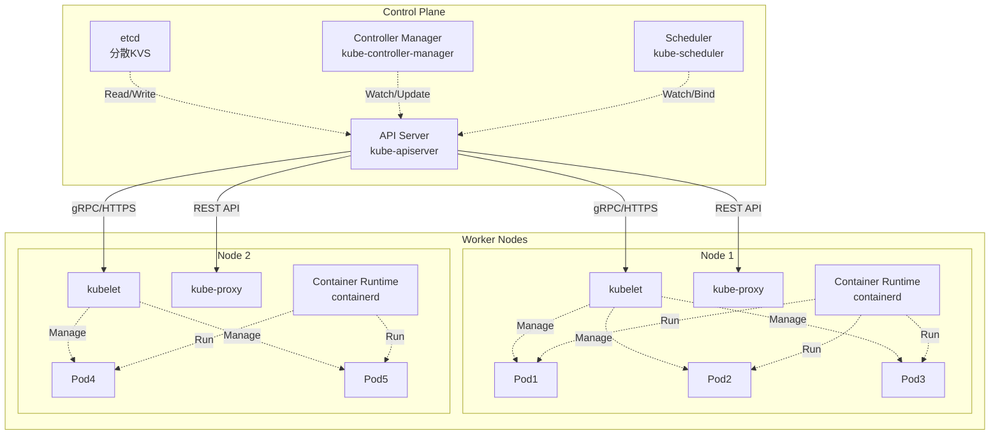
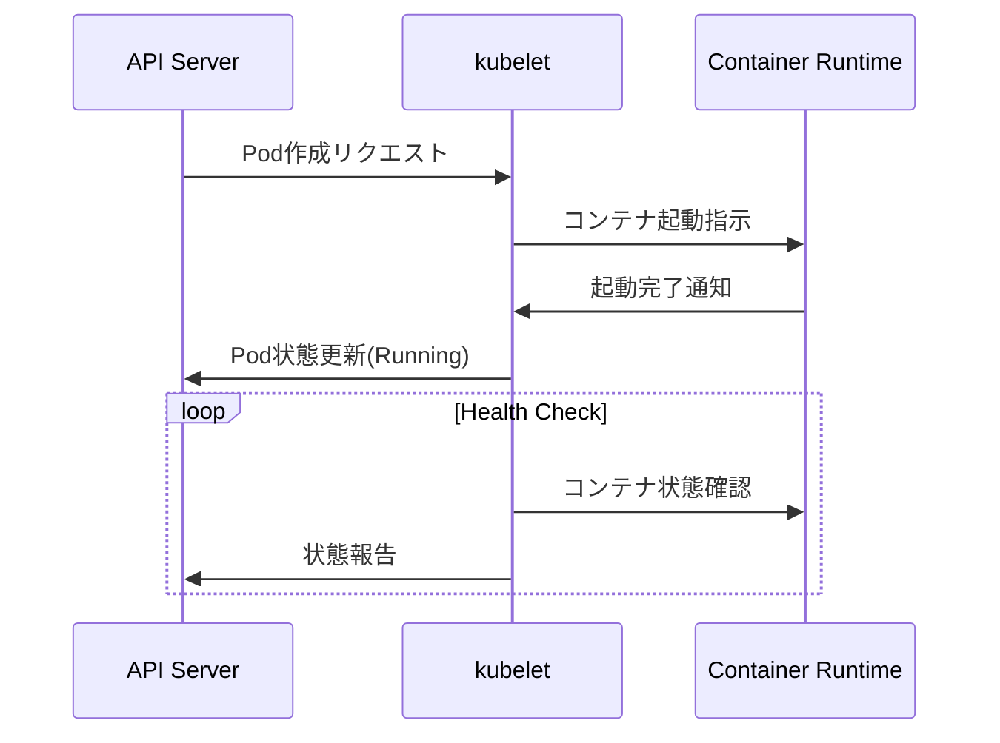
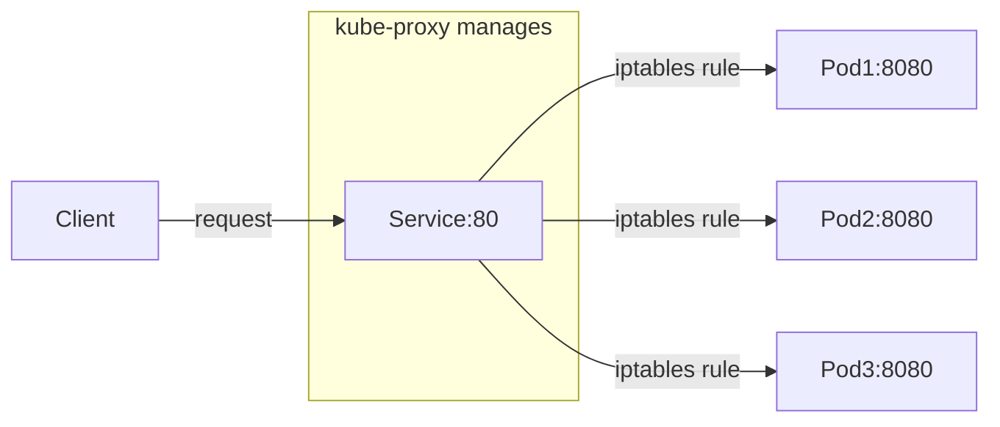
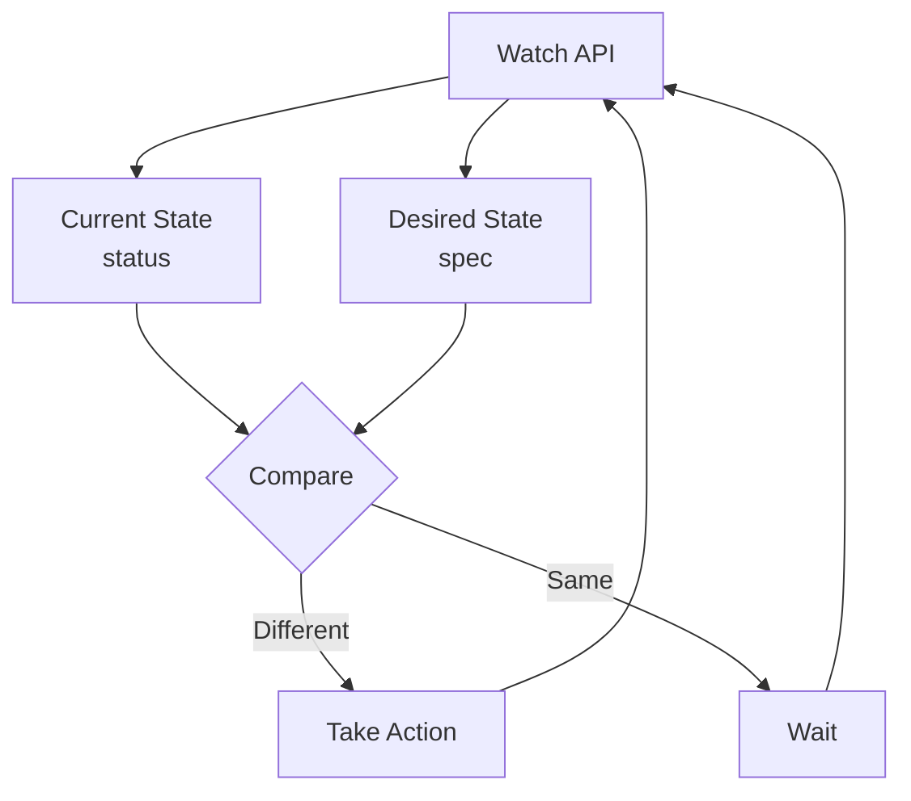

# Kubernetesのアーキテクチャ概説

この章では、Kubernetesクラスタのアーキテクチャと基本概念について学習します。前章で構築したkindクラスタを使用して、理論と実際の動作を合わせて理解を深めていきます。

:::message
この章は理論的な説明が中心です。実際の操作や演習は次章以降で行います。
:::

## Kubernetesクラスタの全体構造

Kubernetesクラスタは大きく分けて、**Control Plane**と**Worker Node**に分かれます。



## Control Planeコンポーネント詳解

Control Planeは、クラスタ全体の管理と制御を担当します。

### 1. API Server ([kube-apiserver](https://github.com/kubernetes/kubernetes/tree/master/cmd/kube-apiserver))

**役割**: Kubernetesの中枢となるRESTful APIサーバー

**主な機能**:
- すべてのコンポーネント間の通信ハブ
- 認証・認可・Admission Controlの実行
- etcdへの唯一のアクセスポイント
- リソースの検証と永続化

**通信フロー例**:
```
kubectl get pods
→ HTTPS Request → API Server → etcd (データ取得)
→ Response → kubectl
```

**kindでの確認方法**:
```bash
# API Serverプロセス確認
docker exec k8s-training-control-plane ps aux | grep kube-apiserver

# API Server健全性チェック
docker exec k8s-training-control-plane curl -k https://localhost:6443/healthz
```

### 2. etcd

**役割**: 分散型のKey-Valueストア

**保存データ**:
- クラスタの全状態（desired state）
- ConfigMap、Secret、Service定義
- RBAC設定、Network Policy
- 全てのKubernetesオブジェクト

**特徴**:
- Raft合意アルゴリズムによる高可用性
- デフォルトで3台以上の奇数構成を推奨
- 強い一貫性を保証

**kindでの確認方法**:
```bash
# etcdプロセス確認
docker exec k8s-training-control-plane ps aux | grep etcd

# etcdデータディレクトリ確認
docker exec k8s-training-control-plane ls -la /var/lib/etcd/
```

### 3. Controller Manager ([kube-controller-manager](https://github.com/kubernetes/kubernetes/tree/master/cmd/kube-controller-manager))

**役割**: 各種コントローラーを実行する管理プロセス

**主要コントローラー**:
- **Deployment Controller**: ReplicaSetの管理
- **ReplicaSet Controller**: Pod数の維持
- **Node Controller**: ノードの監視
- **Service Account Controller**: SA作成
- **Endpoint Controller**: Service/Pod関連付け

**動作原理**: Control Loop（制御ループ）
```
現在の状態(Current State) → 期待する状態(Desired State)との差分検出
→ 差分を解消するアクション実行 → 繰り返し
```

**kindでの確認方法**:
```bash
# Controller Managerプロセス確認
docker exec k8s-training-control-plane ps aux | grep controller-manager

# Leader Election確認
kubectl get endpoints -n kube-system kube-controller-manager
```

### 4. Scheduler ([kube-scheduler](https://github.com/kubernetes/kubernetes/tree/master/cmd/kube-scheduler))

**役割**: Podを適切なWorker Nodeに配置する

**主な機能**:
- 新しく作成されたPodを監視
- リソース要求・制約条件を考慮したNode選択
- Affinity/Anti-affinityルールの適用
- Taints & Tolerationsの考慮

**スケジューリングプロセス**:
1. **Filtering（フィルタリング）**: 条件を満たさないNodeを除外
2. **Scoring（スコアリング）**: 残ったNodeに優先度をつけて最適なNodeを選択

**スケジューリングフロー**:
```
Pod作成リクエスト → Scheduler → Node選択 → API Server → Kubelet(選択されたNode)
```

**kindでの確認方法**:
```bash
# Schedulerプロセス確認
docker exec k8s-training-control-plane ps aux | grep scheduler

# Scheduling イベント確認
kubectl get events --field-selector reason=Scheduled
```

## Worker Nodeコンポーネント詳解

Worker Nodeは、実際のアプリケーションPodを実行します。

### 1. kubelet

**役割**: Node上で実行される主要なKubernetesエージェント

**主な機能**:
- API Serverと通信してPod仕様を取得
- Container Runtimeに指示してコンテナを起動/停止
- Podとコンテナの健全性監視
- Node状態の報告（CPU、メモリ、ディスク使用量等）
- Volumeマウント処理

**動作例**:


**kindでの確認方法**:
```bash
# kubeletプロセス確認
docker exec k8s-training-worker ps aux | grep kubelet

# kubelet設定確認
docker exec k8s-training-worker systemctl status kubelet
```

### 2. Container Runtime

**役割**: 実際にコンテナを実行するランタイム

**主な実装**:
- **containerd**: Docker社が開発、軽量で高性能
- **CRI-O**: Red Hat主導、OCI準拠
- **Docker Engine**: 従来のDockerデーモン（非推奨）

**機能**:
- イメージのプル（registryからのダウンロード）
- コンテナの作成・起動・停止・削除
- ネットワーク設定
- ストレージマウント

**kindでの確認方法**:
```bash
# containerdプロセス確認
docker exec k8s-training-worker ps aux | grep containerd

# イメージ一覧確認
docker exec k8s-training-worker crictl images
```

### 3. kube-proxy

**役割**: Kubernetesネットワークの実装を担当

**主な機能**:
- Serviceの仮想IP（ClusterIP）を実現
- 負荷分散（ServiceのEndpointsへのトラフィック分散）
- ネットワークルールの管理（iptables/IPVS）

**動作モード**:
- **iptablesモード**: iptablesルールでトラフィック転送（デフォルト）
- **IPVSモード**: IPVS（IP Virtual Server）を使用、高性能
- **userspaceモード**: ユーザー空間でProxy実行（非推奨）

**ネットワークフロー**:


**kindでの確認方法**:
```bash
# kube-proxyプロセス確認
kubectl get pods -n kube-system -l k8s-app=kube-proxy

# iptablesルール確認
docker exec k8s-training-worker iptables -t nat -L | grep kubernetes
```

## Kubernetesオブジェクトモデル

Kubernetesは、すべてのリソースを「オブジェクト」として扱う宣言的システムです。

### オブジェクトの基本構造

すべてのKubernetesオブジェクトは以下の構造を持ちます：

```yaml
apiVersion: apps/v1        # APIのバージョン
kind: Deployment          # リソースの種類
metadata:                 # メタデータ（名前、ラベルなど）
  name: nginx-deployment
  namespace: default
  labels:
    app: nginx
spec:                    # 期待する状態（Desired State）
  replicas: 3
  selector:
    matchLabels:
      app: nginx
  template:
    metadata:
      labels:
        app: nginx
    spec:
      containers:
      - name: nginx
        image: nginx:1.21
status:                  # 現在の状態（Current State）※システム管理
  replicas: 3
  readyReplicas: 3
  updatedReplicas: 3
```

### 主要フィールドの説明

**1. apiVersion**
- リソースが属するAPIグループとバージョン
- 例: `v1`, `apps/v1`, `networking.k8s.io/v1`

**2. kind**
- リソースタイプを指定
- 例: `Pod`, `Service`, `Deployment`, `ConfigMap`

**3. metadata**
- `name`: リソース名（namespace内で一意）
- `namespace`: 所属するnamespace（省略時は`default`）
- `labels`: キー/バリューペアのメタデータ（Selectorで使用）
- `annotations`: 任意のメタデータ（ツールが使用）

**4. spec**
- ユーザーが定義する「期待する状態」
- リソースタイプごとに異なる構造

**5. status**
- システムが管理する「現在の状態」
- ユーザーは直接編集不可（Controllerによって更新）

### Control Loop（制御ループ）

Kubernetesの核となる概念です：



**制御ループの例（Deployment Controller）**:
1. Deploymentの`spec.replicas: 3`を監視
2. 現在のPod数を確認（status）
3. 期待値と現実値を比較
4. 差分があればReplicaSetを作成/更新してPod数を調整
5. 繰り返し

### 主要オブジェクトタイプ

| オブジェクト   | 役割                                        | 例                           |
| -------------- | ------------------------------------------- | ---------------------------- |
| **Pod**        | 最小実行単位（1つ以上のコンテナ）           | アプリケーションプロセス     |
| **Service**    | Pod群への安定したネットワークエンドポイント | ロードバランサー             |
| **Deployment** | Podのレプリカ管理とローリングアップデート   | Webアプリケーション          |
| **ConfigMap**  | アプリケーション設定データ                  | 環境変数、設定ファイル       |
| **Secret**     | 機密データ（パスワード、証明書など）        | DB接続情報                   |
| **Namespace**  | リソースの論理的分離                        | 環境分離（dev/staging/prod） |

### ラベルとセレクター

オブジェクト間の関連付けに使用されます：

```yaml
# ラベル付きPod
metadata:
  labels:
    app: nginx
    version: v1.0
    tier: frontend

# Serviceでラベルセレクター使用
spec:
  selector:
    app: nginx      # app=nginx ラベルを持つPodを対象
    tier: frontend
```

## kindクラスタでの基本確認

前章で作成したkindクラスタで、実際にアーキテクチャを確認してみましょう：

### クラスタ全体の確認

```bash
# クラスタ情報表示
kubectl cluster-info --context kind-k8s-training

# ノード一覧表示
kubectl get nodes

# システムPod一覧
kubectl get pods -n kube-system
```

### Control Planeコンポーネントの確認

```bash
# Control Planeコンポーネント（静的Pod）
kubectl get pods -n kube-system -o wide | grep -E "(etcd|apiserver|controller|scheduler)"

# 各コンポーネントのログ確認
kubectl logs -n kube-system kube-apiserver-k8s-training-control-plane --tail=10
```

### Worker Nodeコンポーネントの確認

```bash
# DaemonSetの確認（kube-proxy、CNIなど）
kubectl get daemonsets -n kube-system

# kube-proxyの確認
kubectl get pods -n kube-system -l k8s-app=kube-proxy -o wide
```

### オブジェクトモデルの確認

```bash
# サンプルDeployment作成
kubectl create deployment nginx --image=nginx

# オブジェクト構造確認
kubectl get deployment nginx -o yaml

# 制御ループの観察
kubectl scale deployment nginx --replicas=3
kubectl get pods -l app=nginx --watch
```

## kindと本番環境の違い

kindクラスタでの学習において理解しておくべき点：

### kind環境の特徴
- **シングルマシン**: すべてのノードが同一マシン上のDockerコンテナ
- **静的Pod**: Control PlaneコンポーネントがDockerコンテナ内の静的Pod
- **ネットワーク**: Docker bridgeネットワークを使用
- **ストレージ**: HostPathベースの簡単なストレージ

### 本番環境との主な違い
- **分散配置**: 物理的に異なるマシン上にノード配置
- **高可用性**: 複数のControl Planeノード構成
- **ネットワーク**: 本格的なCNIプラグイン（Calico、Flannel等）
- **ストレージ**: 外部ストレージシステム（CSI対応）

## まとめ

この章では、Kubernetesの基本的なアーキテクチャと概念について学習しました。

### 重要なポイント
- **Control Plane**: クラスタ全体の管理（API Server、etcd、Controller Manager、Scheduler）
- **Worker Node**: アプリケーション実行（kubelet、Container Runtime、kube-proxy）
- **オブジェクトモデル**: 宣言的な設定管理と制御ループ
- **kindクラスタ**: 学習・開発に適した軽量Kubernetes環境

### 次の章へ

次の章では、実際にkindクラスタを使用してクラスタの状態を詳しく確認し、各コンポーネントの動作を観察します。理論で学んだ内容を実際の操作を通じて理解を深めていきましょう。
